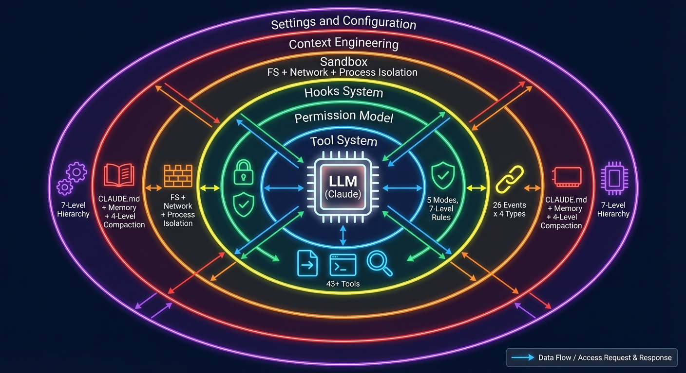
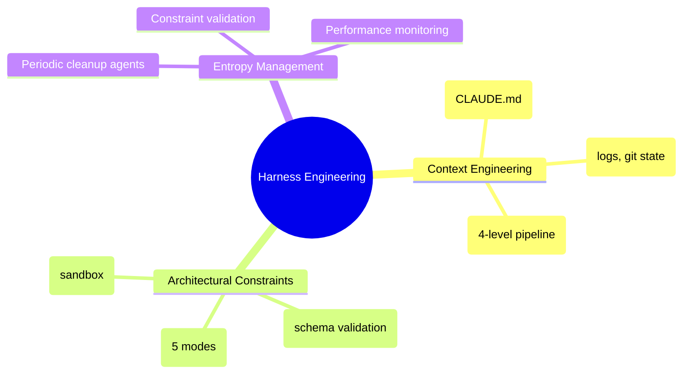
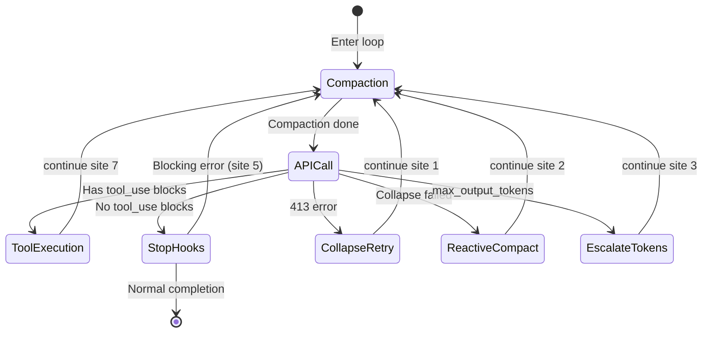
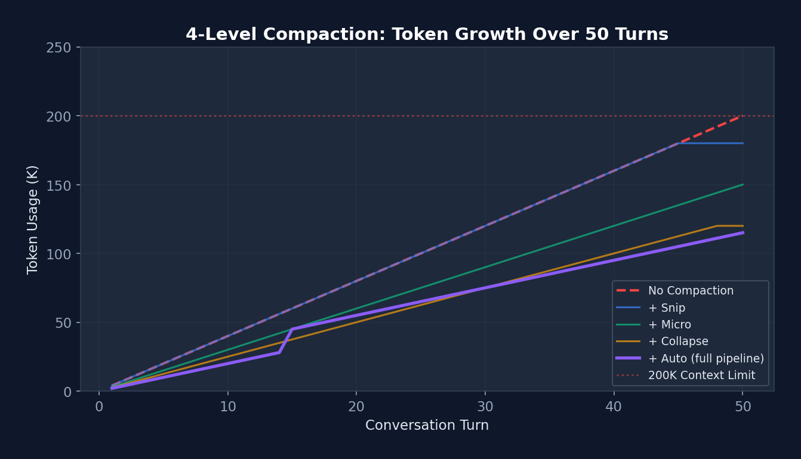

# Harness Engineering: The Definitive Guide

**A Comprehensive Textbook on AI Agent Infrastructure Design**

> **"The model is the agent. The code is the harness. Build great harnesses. The agent will do the rest."**

This textbook is based on reverse engineering Claude Code's source (~512,664 lines of TypeScript), deeply dissecting every design decision and implementation detail of AI Agent Harness infrastructure. All code references point to real source files with line numbers.

**Audience**: AI Engineers, Agent System Architects, LLM Infrastructure Researchers.


*Figure 0-1: Harness Engineering Architecture — The LLM is surrounded by six layers of Harness infrastructure.*

---

## Table of Contents

| Chapter | Title | Key Topics |
|---------|-------|------------|
| 1 | What is Harness Engineering? | Three pillars, ROI data, comparison with related disciplines |
| 2 | Claude Code Architecture | 512K LOC, Bun/TS/React+Ink, 37 directories mapped |
| 3 | The Agent Loop | `queryLoop()`, 7 continue sites, 4-level compaction, error recovery |
| 4 | Tool System | 43+ tools, Tool interface (60+ methods), partition algorithm |
| 5 | Permission Model | 5 modes, 7-level hierarchy, YOLO classifier, defense-in-depth |
| 6 | Hooks System | 26 events × 4 types, async protocol, 70% fast-path optimization |
| 7 | Sandbox & Security | FS/network/process isolation, hardcoded denials |
| 8 | Context Engineering | CLAUDE.md, memory system, compaction pipeline, budget allocation |
| 9 | Settings & Configuration | Merge algorithm, drop-in pattern, defensive cache cloning |
| 10 | MCP Integration | 6 transports, connection lifecycle, auth cache race prevention |
| 11 | Sub-Agent System | 5 agent types, context isolation, worktree, coordinator/swarm |
| 12 | Skills & Plugins | 25+ frontmatter fields, bundled skills registry, MCP skills |
| 13 | Build Your Own Harness | Level 1/2/3 practical guide with real configs |
| 14 | Design Philosophy | 10 design principles from Claude Code's architecture |
| 15 | **Hands-on: Mini Harness** | 200-line Python implementation from scratch |
| 16 | **Competitor Analysis** | Claude Code vs Cursor vs Copilot (12 dimensions) |

---

## Chapter 1: What is Harness Engineering?

### Definition

**Harness Engineering** is the discipline of designing environments, constraints, feedback loops, and infrastructure that make AI agents reliable at scale.

The term was coined by OpenAI's engineering team in early 2026, describing internal systems with "over one million lines of code, none written by humans" — engineers no longer write code directly, but "design the systems that let AI agents write code reliably."

### The Three Pillars



**Pillar 1: Context Engineering** — Managing information accessibility, structure, and timing. Core principle: "information the agent can't access doesn't exist."

**Pillar 2: Architectural Constraints** — Mechanical enforcement over suggestions. Counterintuitive benefit: constraining the solution space makes agents *more* productive by preventing wasted exploration.

**Pillar 3: Entropy Management** — Periodic cleanup addressing codebase degradation: documentation consistency, constraint violation scanning, dependency auditing.


*Figure 1-1: Harness optimization ROI far exceeds model optimization — LangChain improved from 52.8% to 66.5% on Terminal Bench by modifying only the harness.*

### Quantitative Evidence

| Metric | Model Only | Harness Only | Both Combined |
|--------|-----------|-------------|---------------|
| Terminal Bench Score Δ | +3-5% | +14% | +18-20% |
| Dev Cycle Speedup | Negligible | 10x | >10x |
| Engineer Time | Months | 1-2 hours | Months |
| Cross-Model Reuse | Model-specific | Reusable | Partial |

---

## Chapter 3: The Agent Loop — Heart of the Harness

The Agent Loop is the most critical component. Claude Code's implementation lives in `src/query.ts`.

### Architecture: Infinite Loop + Async Generator

```typescript
// src/query.ts — Real function signature
async function* queryLoop(
  params: QueryParams,
  consumedCommandUuids: string[],
): AsyncGenerator<StreamEvent | Message | TombstoneMessage, Terminal> {
  let state: State = {
    messages: params.messages,
    toolUseContext: params.toolUseContext,
    maxOutputTokensRecoveryCount: 0,
    hasAttemptedReactiveCompact: false,
    turnCount: 1,
    transition: undefined,  // Why the previous iteration continued
  }

  while (true) {
    // 1. Compaction pipeline (snip → micro → collapse → auto)
    // 2. Build system prompt + normalize messages
    // 3. Stream API call
    // 4. Execute tools (StreamingToolExecutor)
    // 5. Error recovery (7 continue sites)
    // 6. Stop hooks → terminate or continue
  }
}
```


*Figure 3-1: Minimal (30 LOC) vs Production (1800 LOC) — 60x growth, every line addresses a real production issue.*

### The 7 Continue Sites




*Figure 3-2: 4-level compaction keeps token usage under 200K limit over 50+ turns.*

---

## Chapter 5: Permission Model — Constraint Architecture

### Defense in Depth: Six Layers


*Figure 5-1: Six-layer defense model — from soft constraints (CLAUDE.md, ~95% compliance) to hard constraints (hardcoded denials, 100%).*


*Figure 5-2: Permission decision matrix — 5 modes × 6 tool types. Green=ALLOW, Orange=ASK, Red=DENY.*

### The YOLO Two-Stage Classifier


*Figure 5-3: Stage 1 (Fast Judge, 64 tokens) → Stage 2 (Thinking Judge, 4096 tokens). Assistant text excluded to prevent reward hacking.*

---

## Chapter 15: Build a Mini Harness (Hands-on)

A 200-line Python implementation matching Claude Code's 5-layer architecture:

```python
# Layer 1: Tool System (3 tools: bash, read_file, write_file)
# Layer 2: Permission Rules (regex deny patterns)
# Layer 3: Tool Execution (subprocess with timeout)
# Layer 4: Context Engineering (CLAUDE.md loading)
# Layer 5: Agent Loop (while True + tool chain)

# See full source in the Chinese version (Chapter 15)
```

| Mini Harness (200 LOC) | Claude Code (512K LOC) | Gap |
|------------------------|----------------------|-----|
| 3 tools | 43+ tools | Scale |
| Regex permissions | 7-level + AI classifier | Precision |
| No compression | 4-level pipeline | Long conversations |
| No sub-agents | 5 agent types | Task decomposition |

---

## Chapter 16: Competitor Analysis

| Dimension | Claude Code | Cursor | GitHub Copilot |
|-----------|------------|--------|---------------|
| Environment | Terminal CLI | VS Code fork | VS Code extension |
| Interaction | Autonomous agent | Collaborative editor | Reactive + Agent Mode |
| Tools | 43+ built-in + MCP | Built-in edit + terminal | Built-in edit + terminal |
| Permission | 5 modes + AI classifier | Editor sandbox | GitHub permissions |
| Multi-agent | 5 types + Swarm | 8 parallel (worktree) | Single agent |
| Market share (2026) | 41% | ~15% | 38% |

**Claude Code's Unique Innovations**: Compile-time feature gates, 6-layer defense-in-depth, YOLO two-stage classifier, reversible tool design, prompt cache stability sorting.

---

## References

[1] M. Fowler. "Harness Engineering." martinfowler.com, 2026.

[2] OpenAI. "Harness Engineering: Leveraging Codex in an Agent-First World." openai.com, 2026.

[3] "Building AI Coding Agents for the Terminal." arXiv:2603.05344v1, 2026.

[4] "Evaluation and Benchmarking of LLM Agents: A Survey." arXiv:2507.21504v1, 2025.

[5] Jimenez et al. "SWE-bench: Can Language Models Resolve Real-World GitHub Issues?" ICLR, 2024.

[6] NxCode. "Harness Engineering: Complete Guide." nxcode.io, 2026.

[7] P. Schmid. "The Importance of Agent Harness in 2026." philschmid.de, 2026.

---

*Full version available in [Chinese (中文版)](../zh/) — 4,922 lines with complete source code analysis.*
