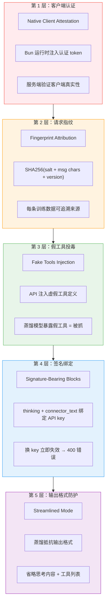
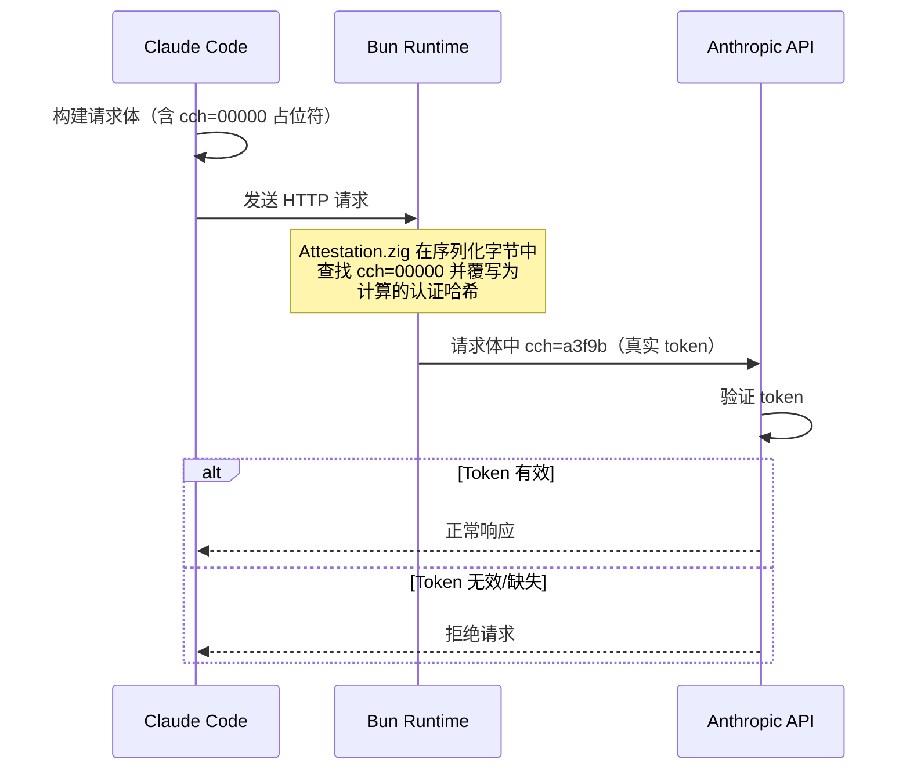
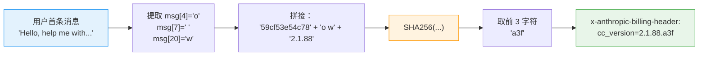
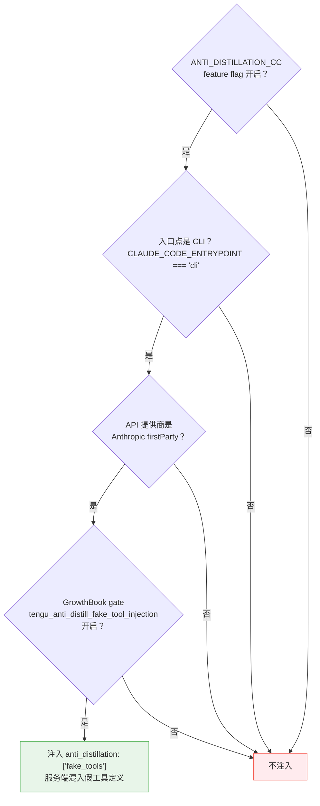
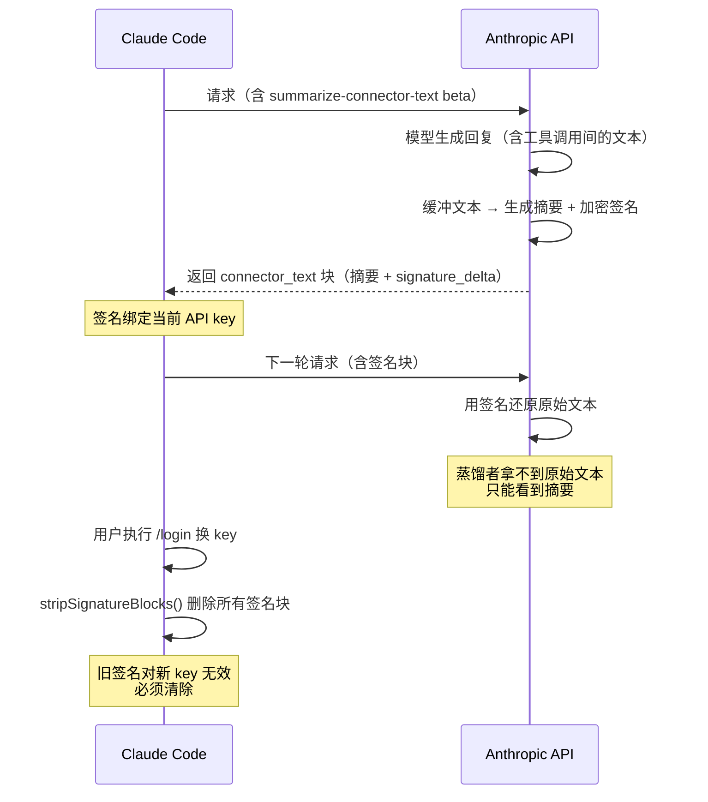
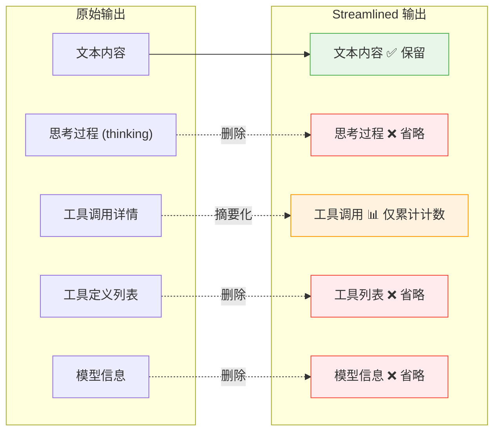
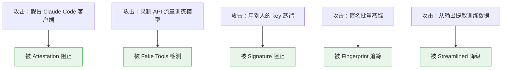

# Claude Code 如何知道你在蒸馏？— 5 层反蒸馏防御体系逆向分析

> 从 512K 行源码中拆解 Anthropic 防止模型被盗的完整工程实现。每一层都有精确的文件路径和行号。

---

## 背景

模型蒸馏（distillation）是 AI 领域最大的商业威胁之一：竞争对手通过录制 API 流量，用大模型的输出训练自己的小模型，以极低成本复制能力。Anthropic 在 Claude Code 客户端中部署了**五层防御体系**来对抗这一威胁。

以下是从源码中逆向出的完整架构。

---

## 总览：五层防御



---

## 第 1 层：Native Client Attestation — "你真的是 Claude Code 吗？"

### 原理

每个 API 请求在发送前，由 Bun 运行时的原生 HTTP 栈在序列化的请求体中注入一个认证 token。服务端验证此 token 来确认请求来自真正的 Claude Code 客户端，而非第三方代理或录制工具。

### 源码

```typescript
// src/constants/system.ts Lines 64-68:
// When NATIVE_CLIENT_ATTESTATION is enabled, includes a `cch=00000` placeholder.
// Before the request is sent, Bun's native HTTP stack finds this placeholder
// in the request body and overwrites the zeros with a computed hash. The
// server verifies this token to confirm the request came from a real Claude
// Code client. See bun-anthropic/src/http/Attestation.zig for implementation.

// Lines 81-82:
const cch = feature('NATIVE_CLIENT_ATTESTATION') ? ' cch=00000;' : ''
```

### 工程细节



**为什么用占位符而不是直接注入？** 源码注释解释："same-length replacement avoids Content-Length changes and buffer reallocation"——5 个字符的占位符被 5 个字符的哈希替换，不改变请求体长度，避免重新分配内存。

**实现语言**：Zig（`bun-anthropic/src/http/Attestation.zig`），运行在 Bun 的原生 HTTP 层。这意味着认证逻辑不在 JavaScript/TypeScript 层面，无法通过简单的代码修改绕过。

---

## 第 2 层：Fingerprint Attribution — "这条数据是谁生成的？"

### 原理

每个 API 请求附带一个 3 字符的指纹，由用户首条消息的特定字符位置 + 版本号通过 SHA256 计算。这使得 Anthropic 可以追踪每条训练数据的来源客户端。

### 源码

```typescript
// src/utils/fingerprint.ts:

// 硬编码盐值（必须与后端验证一致）
export const FINGERPRINT_SALT = '59cf53e54c78'

export function computeFingerprint(
  messageText: string,
  version: string,
): string {
  // 提取用户首条消息的第 4、7、20 个字符
  const indices = [4, 7, 20]
  const chars = indices.map(i => messageText[i] || '0').join('')

  const fingerprintInput = `${FINGERPRINT_SALT}${chars}${version}`

  // SHA256 哈希，取前 3 个十六进制字符
  const hash = createHash('sha256').update(fingerprintInput).digest('hex')
  return hash.slice(0, 3)
}
```

```typescript
// src/constants/system.ts Lines 78-91:
// 指纹被嵌入版本号中发送
const version = `${MACRO.VERSION}.${fingerprint}`
const header = `x-anthropic-billing-header: cc_version=${version};
  cc_entrypoint=${entrypoint};${cch}${workloadPair}`
```

### 计算流程



**源码注释特别强调**："IMPORTANT: Do not change this method without careful coordination with 1P and 3P (Bedrock, Vertex, Azure) APIs."——指纹算法需要跨所有 API 提供商保持一致。

---

## 第 3 层：Fake Tools Injection — "蜜罐工具"

### 原理

这是最精妙的一层。Claude Code 向 API 发送 `anti_distillation: ['fake_tools']` 指令，服务端在正常工具列表中混入**虚假的工具定义**。如果有人录制了 API 流量并用它来训练自己的模型，蒸馏后的模型会"知道"这些假工具——这就是被抓的证据。

### 源码

```typescript
// src/services/api/claude.ts Lines 301-313:
// Anti-distillation: send fake_tools opt-in for 1P CLI only
if (
  feature('ANTI_DISTILLATION_CC')
    ? process.env.CLAUDE_CODE_ENTRYPOINT === 'cli' &&
      shouldIncludeFirstPartyOnlyBetas() &&
      getFeatureValue_CACHED_MAY_BE_STALE(
        'tengu_anti_distill_fake_tool_injection',
        false,
      )
    : false
) {
  result.anti_distillation = ['fake_tools']
}
```

### 触发条件



**关键限制**：仅对 Anthropic 第一方 API 生效。通过 Bedrock、Vertex 或其他第三方代理的请求**不会**注入假工具——因为 `shouldIncludeFirstPartyOnlyBetas()` 排除了这些提供商。

**蜜罐机制**：假工具的具体定义在服务端生成，客户端只发送 opt-in 信号。这意味着假工具的内容可以随时更新，不需要客户端发版。

---

## 第 4 层：Signature-Bearing Blocks — "签名即锁"

### 原理

API 返回的 `thinking`（思考块）和 `connector_text`（连接器文本块）都携带**加密签名**，签名与生成它们的 API key 绑定。换一个 API key，这些签名立即失效，服务端返回 400 错误。

### 源码

```typescript
// src/utils/messages.ts Lines 5060-5064:
// Strip signature-bearing blocks (thinking, redacted_thinking, connector_text)
// from all assistant messages. Their signatures are bound to the API key that
// generated them; after a credential change (e.g. /login) they're invalid and
// the API rejects them with a 400.

export function stripSignatureBlocks(messages: Message[]): Message[] {
  const result = messages.map(msg => {
    if (msg.type !== 'assistant') return msg
    const content = msg.message.content
    const filtered = content.filter(block => {
      if (isThinkingBlock(block)) return false        // 删除 thinking
      if (feature('CONNECTOR_TEXT')) {
        if (isConnectorTextBlock(block)) return false  // 删除 connector_text
      }
      return true
    })
    return { ...msg, message: { ...msg.message, content: filtered } }
  })
  return result
}
```

### Connector Text 的反蒸馏机制

```typescript
// src/utils/betas.ts Lines 279-284:
// POC: server-side connector-text summarization (anti-distillation). The
// API buffers assistant text between tool calls, summarizes it, and returns
// the summary with a signature so the original can be restored on subsequent
// turns — same mechanism as thinking blocks.
```



**当前限制**：Connector Text 仅对 Anthropic 内部用户（`USER_TYPE === 'ant'`）开启，正在测量 TTFT/TTLT/容量影响。Feature gate：`tengu_slate_prism`。

---

## 第 5 层：Streamlined Mode — "蒸馏抵抗输出格式"

### 原理

源码注释直接称其为 **"distillation-resistant output format"**（蒸馏抵抗输出格式）。它通过省略关键信息来降低输出被用于蒸馏训练的价值。

### 源码

```typescript
// src/utils/streamlinedTransform.ts Lines 1-9:
// Streamlined mode is a "distillation-resistant" output format that:
// - Keeps text messages intact
// - Summarizes tool calls with cumulative counts (resets when text appears)
// - Omits thinking content
// - Strips tool list and model info from init messages
```

### 被过滤的信息



**蒸馏者损失了什么？**
- **思考过程**：模型的推理链是最有价值的蒸馏材料，被完全省略
- **工具定义**：43+ 工具的完整 schema 被删除，蒸馏者无法复制工具系统
- **工具调用细节**：只剩 "Searched 3 files, Read 2 files" 这样的摘要，无法学习工具使用策略

---

## 防御矩阵

| 层级 | 防御目标 | 检测/阻止 | 绕过难度 |
|------|---------|----------|---------|
| **Attestation** | 假冒客户端 | 阻止 | 高 — 需逆向 Zig 原生代码 |
| **Fingerprint** | 匿名蒸馏 | 事后追踪 | 中 — 算法已公开 |
| **Fake Tools** | API 流量录制 | 事后检测 | 低 — 不请求 fake_tools 即可 |
| **Signature** | 跨 key 数据复用 | 阻止 | 高 — 签名在服务端验证 |
| **Streamlined** | 输出蒸馏 | 降低价值 | 低 — 仅限 SDK 模式 |

---

## 这套防御体系的弱点在哪里？

从纯技术角度分析（这是安全研究的标准做法——理解防御才能改进防御）：

**1. Fake Tools 仅在 firstParty 生效**

通过 Bedrock/Vertex 调用的请求不会注入假工具，因为 `shouldIncludeFirstPartyOnlyBetas()` 排除了第三方提供商。如果蒸馏者用的是 AWS Bedrock 的 Claude 端点，这一层完全不起作用。

**2. Fingerprint 算法已在源码中公开**

盐值 `59cf53e54c78`、字符位置 `[4, 7, 20]`、哈希算法 SHA256——全部可见。蒸馏者可以伪造指纹（尽管服务端可能还有其他验证）。

**3. Connector Text 仅对内部用户开启**

`process.env.USER_TYPE === 'ant'` 条件意味着外部用户的对话文本没有受到 Connector Text 保护。

**4. Streamlined Mode 仅限 SDK 输出**

正常的 CLI 交互不经过 Streamlined Transform，完整的工具调用详情和思考过程在标准输出中可见。

**5. Attestation 是最强的一层**

原生客户端认证运行在 Zig 层面，不在 JavaScript 可控范围内。但如果蒸馏者直接调用 API（不通过 Claude Code 客户端），这层也不适用——它保护的是"冒充 Claude Code"，不是"直接用 API"。

---

## 关键洞察

Anthropic 的反蒸馏策略不是单点防御，而是**分层、互补**的体系。没有哪一层是完美的，但它们叠加在一起覆盖了不同的攻击面：



**最深层的防御其实不在客户端**：真正的核心推理能力（weights）从未离开 Anthropic 的服务器。客户端防御保护的是**训练数据质量**和**API 使用归属**——即使蒸馏者录制了输出，Anthropic 也能追踪来源并在蒸馏后的模型中检测假工具的痕迹。

---

*本文所有代码引用来自 Claude Code 源码（2026-03-31 snapshot）。文件路径和行号均为实际源码位置。*

*完整教程（16 章 · ~50,000 字）：[GitHub](https://github.com/WanLanglin/-awesome-cc-harness)*

*作者：WanLanglin · 微信: felixwll*
