# Harness Engineering: 基于 Claude Code 的完全指南

**A Comprehensive Textbook on AI Agent Infrastructure Design**

> **"The model is the agent. The code is the harness. Build great harnesses. The agent will do the rest."**

本教程基于 Claude Code 源码（~512,664 行 TypeScript）的逆向工程与系统性分析，以教科书的体例深入剖析 AI Agent Harness 的每一个设计决策、工程取舍与实现细节。全文遵循学术写作规范，在代码分析之上构建理论框架，将零散的实现细节提炼为可复用的设计原则。

**读者对象**：AI 工程师、Agent 系统架构师、对 LLM 应用基础设施感兴趣的研究者。

**前置知识**：TypeScript 基础、LLM API 调用经验、基本的系统设计概念。


*图 0-1: Harness Engineering 架构全景 — LLM 被六层 Harness 基础设施环绕：工具系统（43+）、权限模型（5 种模式）、Hooks 系统（26 事件 x 4 类型）、沙盒（文件+网络+进程隔离）、上下文工程（CLAUDE.md + 记忆 + 四级压缩）、设置与配置（7 级层级）。*

---

## 目录

- [第一章：什么是 Harness Engineering？](#第一章什么是-harness-engineering)
- [第二章：Claude Code 架构全景](#第二章claude-code-架构全景)
- [第三章：Agent Loop — Harness 的心脏](#第三章agent-loop--harness-的心脏)
- [第四章：Tool System — Agent 的双手](#第四章tool-system--agent-的双手)
- [第五章：Permission Model — 约束架构](#第五章permission-model--约束架构)
- [第六章：Hooks System — 生命周期可扩展性](#第六章hooks-system--生命周期可扩展性)
- [第七章：Sandbox & Security — 安全网](#第七章sandbox--security--安全网)
- [第八章：Context Engineering — 信息管理的艺术](#第八章context-engineering--信息管理的艺术)
- [第九章：Settings & Configuration — Harness 的可调性](#第九章settings--configuration--harness-的可调性)
- [第十章：MCP Integration — 扩展 Harness 的边界](#第十章mcp-integration--扩展-harness-的边界)
- [第十一章：Sub-Agent System — 多智能体编排](#第十一章sub-agent-system--多智能体编排)
- [第十二章：Skills & Plugins — 扩展生态](#第十二章skills--plugins--扩展生态)
- [第十三章：构建你自己的 Harness — 实战指南](#第十三章构建你自己的-harness--实战指南)
- [第十四章：高级模式与设计哲学](#第十四章高级模式与设计哲学)
- [结语：从读者到构建者](#结语从读者到构建者)
- [附录 A：Claude Code 源码文件索引](#附录-aclaude-code-源码文件索引)
- [附录 B：参考资源](#附录-b参考资源)
- [附录 C：ToolUseContext 完整类型定义](#附录-ctoolUsecontext-完整类型定义)
- [附录 D：13 条防护规则参考模型](#附录-d13-条防护规则参考模型)

---

## 第一章：什么是 Harness Engineering？

> 想象你要训练一匹野马。你不会直接骑上去——你会先搭建围栏、准备缰绳、铺好跑道。这些"基础设施"不是马本身，但没有它们，再好的马也只是一匹野马。
>
> AI Agent 也是如此。模型（LLM）是那匹马——强大但未被驯化。Harness Engineering 就是搭围栏、做缰绳、铺跑道的工程学科。

### 1.1 定义

**Harness Engineering**（线束工程）是设计环境、约束、反馈循环和基础设施以使 AI Agent 在规模化场景下可靠运行的工程学科。

这个术语在 2026 年初由 OpenAI 工程团队正式提出。他们描述了内部系统"用超过一百万行代码，没有一行是人类写的"——工程师不再直接写代码，而是"设计让 AI Agent 可靠编写代码的系统"。

一个简单的类比帮助你理解：

```
┌─────────────────────────────────────────────────┐
│                                                 │
│   Agent = Model (LLM)                          │
│   Harness = Everything Else                     │
│                                                 │
│   ┌──────────┐     ┌────────────────────────┐  │
│   │  Claude   │ ←── │  Tools, Permissions,   │  │
│   │  Opus/    │ ──→ │  Hooks, Sandbox,       │  │
│   │  Sonnet   │     │  Memory, Settings,     │  │
│   │          │     │  MCP, Skills, Agents   │  │
│   └──────────┘     └────────────────────────┘  │
│      Model              Harness                 │
│                                                 │
└─────────────────────────────────────────────────┘
```

### 1.2 三大支柱

要理解 Harness Engineering，把它拆成三根柱子来看最清晰。你可以把它想象成盖房子：Context Engineering 是打地基（确保信息到位），Architectural Constraints 是承重墙（确保结构不塌），Entropy Management 是物业维护（确保房子不老化）。

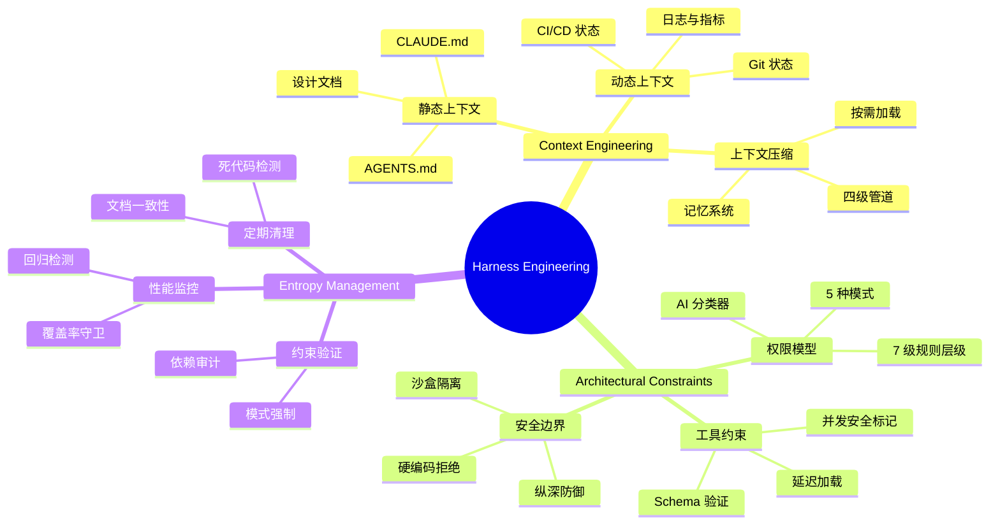
```mermaid
mindmap
  root((Harness Engineering))
    Context Engineering
      静态上下文
        CLAUDE.md
        AGENTS.md
        设计文档
      动态上下文
        日志与指标
        Git 状态
        CI/CD 状态
      上下文压缩
        四级管道
        按需加载
        记忆系统
    Architectural Constraints
      权限模型
        5 种模式
        7 级规则层级
        AI 分类器
      工具约束
        Schema 验证
        并发安全标记
        延迟加载
      安全边界
        沙盒隔离
        硬编码拒绝
        纵深防御
    Entropy Management
      定期清理
        死代码检测
        文档一致性
      约束验证
        依赖审计
        模式强制
      性能监控
        覆盖率守卫
        回归检测
```

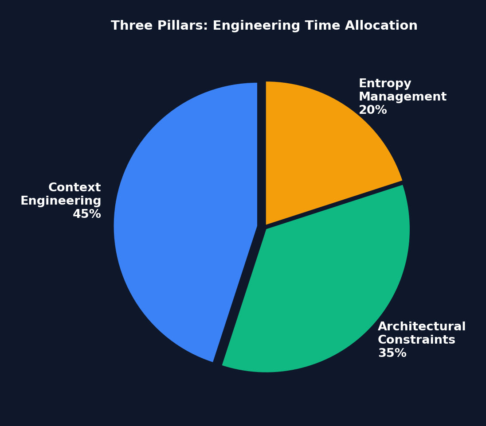
*图 1-2: 三大支柱的工程时间分配 — Context Engineering 占据最大比例（45%），因为"Agent 看不到的信息等于不存在"；Architectural Constraints 次之（35%）；Entropy Management 占 20% 但对长期稳定性至关重要。*

#### 支柱一：Context Engineering（上下文工程）

管理信息的可访问性、结构和时机。关键技术包括：

- **静态上下文**：仓库文档、CLAUDE.md/AGENTS.md 文件、设计文档
- **动态上下文**：日志、指标、目录映射、CI/CD 状态
- **核心原则**："Agent 无法在上下文中访问的信息不存在"

#### 支柱二：Architectural Constraints（架构约束）

通过机械执行而非建议来建立边界：

- 依赖层级（Types → Config → Repo → Service → Runtime → UI）
- 确定性 Linter 执行自定义规则
- 基于 LLM 的审计员审查 Agent 合规性
- 结构性测试和 pre-commit hooks

**反直觉的收益**：约束解空间让 Agent 更高效，而非更低效——通过阻止无用探索。

#### 支柱三：Entropy Management（熵管理）

定期清理 Agent 解决代码退化：

- 文档一致性验证
- 约束违规扫描
- 模式强制执行
- 依赖审计

### 1.3 Harness Engineering vs 相关学科

| 学科 | 关系 |
|------|------|
| **Prompt Engineering** | Context Engineering 的子集（单次交互 vs 系统） |
| **ML Engineering** | 独立学科；假设模型已部署 |
| **Agent Engineering** | 互补；Harness 工程师为 Agent 构建基础设施 |
| **DevOps** | 重叠的基础设施技能，应用于 AI 上下文 |

### 1.4 停下来想一想

在继续之前，试着回答这个问题：

> 如果你今天要构建一个 AI 编码助手，你会把 80% 的工程时间花在哪里——改进模型，还是改进模型周围的系统？

如果你的回答是"模型"，那么 Harness Engineering 会挑战你的直觉。LangChain 的案例证明，仅改变 Harness 就能在基准测试上提升 14 个百分点。模型是"给定的"，Harness 才是你能控制的。

### 1.5 定量证据：Harness 的投资回报率

在深入"为什么现在"之前，让我们用数据说话：

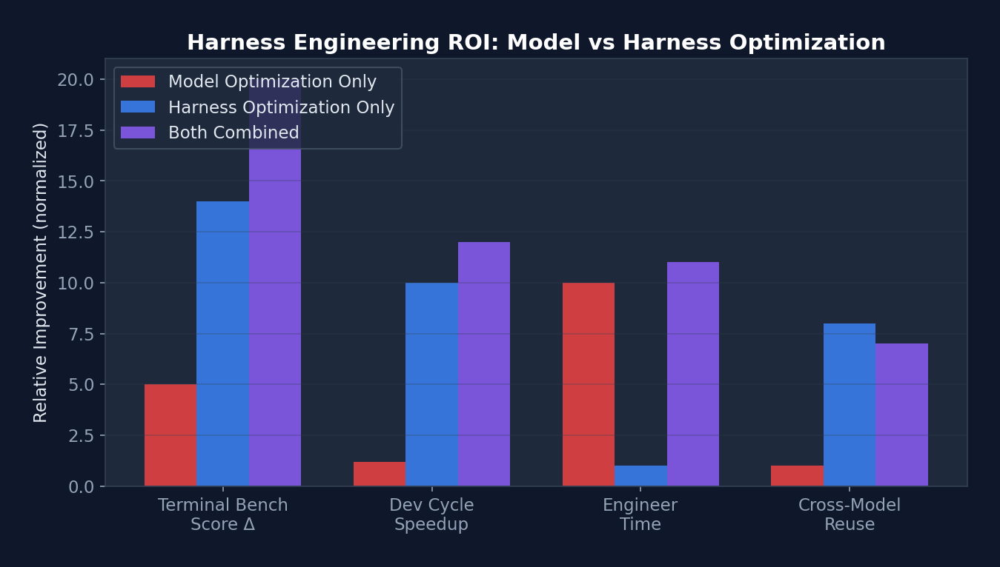
*图 1-1: Harness 优化 vs 模型优化的投资回报率对比 — 在 Terminal Bench 得分和开发周期缩短上，Harness 优化的收益远超模型优化，且所需工程时间仅为后者的十分之一。*

| 指标 | 仅模型优化 | 仅 Harness 优化 | 两者结合 |
|------|-----------|----------------|---------|
| Terminal Bench 2.0 得分 | +3-5% (模型升级) | +14% (LangChain 案例) | +18-20% |
| 开发周期缩短 | 微不足道 | 10x (OpenAI 百万行案例) | >10x |
| 工程师投入时间 | 数月（训练/微调） | 1-2 小时（Level 1 Harness） | 数月 |
| 可迁移性 | 模型特定 | 跨模型复用 | 部分复用 |

> **关键洞察**：Harness 优化的投资回报率（ROI）远高于模型优化。一个精心设计的 CLAUDE.md 文件只需 30 分钟，但可以将 Agent 在特定项目上的表现提升 20-40%。相比之下，模型微调需要数周时间和大量计算资源，且只对特定任务有效。

### 1.6 为什么现在？

三个趋同因素催生了需求：

1. **模型商品化** — 竞争优势从模型转向系统
2. **生产部署** — Agent 从演示走向面向客户的可靠性要求
3. **基准局限** — 标准指标无法衡量多小时、多步骤的 Agent 稳定性

实际影响：LangChain 仅修改 Harness 架构（不换模型），在 Terminal Bench 2.0 上从 52.8% 提升到 66.5%，从 Top 30 跃升至 Top 5。

### 1.5 实施层级

| 层级 | 范围 | 投入 | 内容 |
|------|------|------|------|
| Level 1 | 个人 | 1-2 小时 | CLAUDE.md + pre-commit hooks + 测试套件 |
| Level 2 | 小团队 | 1-2 天 | AGENTS.md 规范 + CI 约束 + 共享模板 |
| Level 3 | 组织 | 1-2 周 | 自定义中间件 + 可观测性 + 调度 Agent |

---

## 第二章：Claude Code 架构全景

> 在上一章我们建立了理论框架。从这一章开始，我们将用一个真实的、正在生产环境运行的系统来验证这些理论。这个系统就是 Claude Code——Anthropic 的官方 AI 编码助手 CLI，拥有超过 50 万行 TypeScript 代码，是目前最完整的生产级 Agent Harness 参考实现。
>
> 为什么选择 Claude Code？因为它不是一个教学项目——它是每天被数以万计的开发者使用的真实产品。它的每一个设计决策背后，都有真实的用户痛点和工程取舍。通过逆向工程它的架构，我们能学到"课本上不会写"的实战智慧。

### 2.1 技术栈

| 类别 | 技术 |
|------|------|
| **Runtime** | Bun（TypeScript 原生，高性能） |
| **Language** | TypeScript（严格模式） |
| **UI Framework** | React + Ink（终端组件） |
| **CLI Parser** | Commander.js（@commander-js/extra-typings） |
| **Schema Validation** | Zod v4 |
| **Search Engine** | ripgrep（通过 BashTool 调用） |
| **API Client** | @anthropic-ai/sdk |
| **Protocols** | MCP SDK, LSP |
| **State Management** | 自定义 Zustand-like Store + React Context |
| **Telemetry** | OpenTelemetry + gRPC |
| **Feature Flags** | GrowthBook + Bun `bun:bundle` |
| **Auth** | OAuth 2.0, JWT, macOS Keychain |

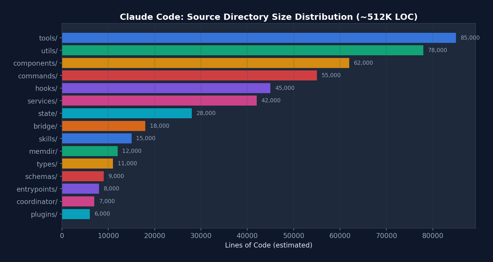
*图 2-1: Claude Code 各目录代码行数分布 — tools/ 和 utils/ 是最大的两个目录，合计占约 32% 的代码量，反映出工具系统和基础设施工具是 Harness 的核心。*

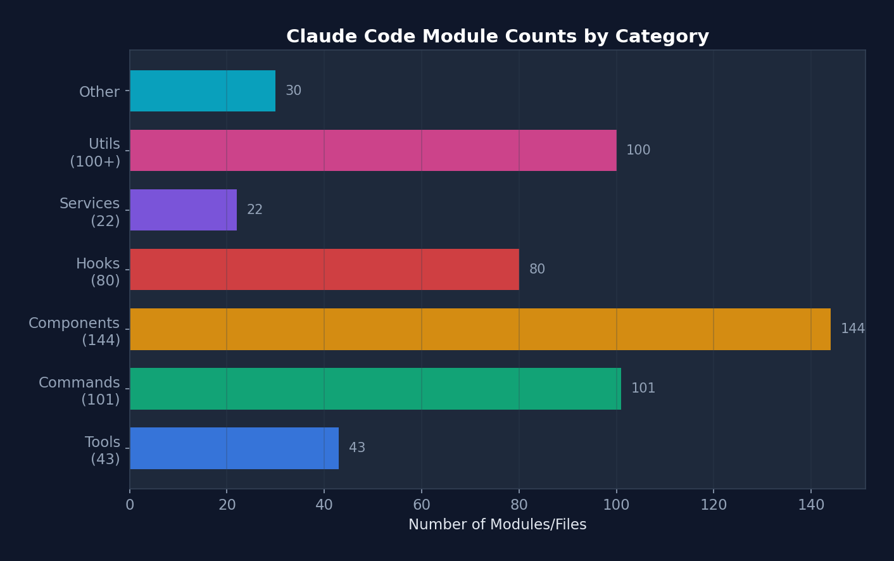
*图 2-2: 各类别模块数量 — components（144）和 commands（101）数量最多，体现了 Claude Code 作为终端 UI 应用的特征。*

### 2.2 规模

- **~1,884** TypeScript/TSX 文件
- **512,664** 行代码
- **43+** 工具
- **100+** Slash 命令
- **80+** React Hooks
- **144+** UI 组件
- **22+** 服务模块
- **26+** Hook 事件

### 2.3 目录结构

```
src/
├── main.tsx                    # 入口点，CLI 引导（803 KB）
├── query.ts                    # 核心 Agent 循环（68 KB）
├── QueryEngine.ts              # LLM 查询引擎（46 KB）
├── Tool.ts                     # Tool 基础接口（29 KB）
├── tools.ts                    # Tool 注册表（25 KB）
├── Task.ts                     # 任务类型定义
├── commands.ts                 # 命令注册
│
├── tools/                      # 43 个工具目录
│   ├── BashTool/              # Shell 命令执行
│   ├── FileReadTool/          # 文件读取
│   ├── FileWriteTool/         # 文件创建
│   ├── FileEditTool/          # 部分文件修改
│   ├── GlobTool/              # 文件模式匹配
│   ├── GrepTool/              # ripgrep 内容搜索
│   ├── AgentTool/             # 子 Agent 生成
│   ├── SkillTool/             # Skill 执行
│   ├── MCPTool/               # MCP 服务器调用
│   ├── WebFetchTool/          # URL 内容抓取
│   ├── WebSearchTool/         # 网页搜索
│   └── ...                    # 更多工具
│
├── commands/                   # ~101 个命令目录
│   ├── commit/                # Git 提交
│   ├── review/                # 代码审查
│   ├── mcp/                   # MCP 管理
│   ├── skills/                # Skill 管理
│   └── ...
│
├── components/                 # 144+ React/Ink 终端组件
├── hooks/                      # 80+ 自定义 React Hooks
├── services/                   # 22 个服务子目录
│   ├── api/                   # Anthropic API 客户端
│   ├── mcp/                   # MCP 协议连接
│   ├── oauth/                 # OAuth 认证
│   ├── lsp/                   # 语言服务器协议
│   ├── compact/               # 对话压缩
│   ├── plugins/               # 插件加载
│   └── ...
│
├── utils/                      # 33+ 子目录，100+ 文件
│   ├── permissions/           # 权限逻辑
│   ├── hooks.ts               # Hook 执行引擎
│   ├── hooks/                 # Hook 配置管理
│   ├── sandbox/               # 沙盒适配器
│   ├── settings/              # 设置管理
│   ├── bash/                  # Shell 工具
│   ├── memdir/                # 持久记忆目录
│   └── ...
│
├── state/                      # 应用状态管理
├── entrypoints/                # CLI/MCP/SDK 入口
├── bridge/                     # IDE 双向通信
├── coordinator/                # 多 Agent 编排
├── skills/                     # Skill 系统
├── plugins/                    # 插件系统
├── memdir/                     # 记忆目录系统
├── schemas/                    # Zod 验证 Schema
├── types/                      # 类型定义
└── constants/                  # 应用常量
```

### 2.4 入口点流程

```
main.tsx → 并行预取（MDM设置 + Keychain + API预连接）
    ↓
Commander.js CLI 解析器初始化
    ↓
preAction Hook: init() → 遥测 → 插件 → 迁移 → 远程设置
    ↓
React/Ink 渲染器启动
    ↓
交互式 REPL/对话循环
```

**设计哲学**：Claude Code 的入口点 `main.tsx`（803 KB）采用**延迟加载**策略。重型模块（OpenTelemetry, gRPC, analytics）在需要时才加载，而关键路径（MDM 设置、Keychain）则并行预取，确保启动速度。

### 2.5 核心数据流全景图

```
┌─────────────────────────────────────────────────────────────────────┐
│                    Claude Code 数据流全景                             │
│                                                                      │
│  用户输入 ──→ UserPromptSubmit Hook ──→ Slash Command 解析           │
│     │                                                                │
│     v                                                                │
│  QueryEngine.submitMessage()                                         │
│     │                                                                │
│     ├─→ 系统提示构建: base + tools + CLAUDE.md + MCP + memory       │
│     ├─→ 消息规范化: normalizeMessagesForAPI()                        │
│     │   ├─ 重排序 attachment 消息                                    │
│     │   ├─ 合并连续 user/assistant 消息                              │
│     │   ├─ 剥离 PDF/图片错误的重复内容                                │
│     │   ├─ 规范化工具名称（别名→正式名）                              │
│     │   └─ 工具搜索引用块处理                                        │
│     │                                                                │
│     v                                                                │
│  queryLoop() [while(true)]                                           │
│     │                                                                │
│     ├─→ 压缩管道: snip → micro → collapse → auto                    │
│     ├─→ API 调用: deps.sample() [流式]                               │
│     │                                                                │
│     ├─→ 工具执行: StreamingToolExecutor (并发) / runTools (顺序)     │
│     │   │                                                            │
│     │   ├─→ 工具分区: partitionToolCalls()                           │
│     │   │   ├─ isConcurrencySafe=true → 并发执行                     │
│     │   │   └─ isConcurrencySafe=false → 串行执行                    │
│     │   │                                                            │
│     │   └─→ 每个工具:                                                │
│     │       ├─ Zod schema 验证                                       │
│     │       ├─ tool.validateInput()                                  │
│     │       ├─ PreToolUse Hook                                       │
│     │       ├─ 权限检查 (rules → mode → classifier)                 │
│     │       ├─ Sandbox 包装 (BashTool)                               │
│     │       ├─ tool.call() [实际执行]                                │
│     │       └─ PostToolUse Hook                                      │
│     │                                                                │
│     ├─→ 错误恢复: 7 个 continue 站点                                │
│     └─→ Stop Hook → 终止或继续                                      │
│                                                                      │
│  终止 → SessionEnd Hook → 转录保存 → 退出                           │
└─────────────────────────────────────────────────────────────────────┘
```

### 2.6 消息类型系统

Claude Code 定义了丰富的消息类型系统，每种类型在 Agent Loop 中有不同的处理路径：

```typescript
// src/types/message.ts — 消息类型层次
type Message =
  | UserMessage           // 人类输入（或工具结果）
  | AssistantMessage      // 模型响应（文本 + 工具调用）
  | AttachmentMessage     // 记忆/资源附件
  | SystemMessage         // 系统消息
  | SystemLocalCommandMessage  // 本地工具结果（bash, read 等）
  | ToolUseSummaryMessage // 压缩后的工具历史
  | TombstoneMessage      // 已删除消息标记
  | ProgressMessage       // 流式进度更新
```

消息规范化（`normalizeMessagesForAPI`）是一个复杂的管道，处理包括：

- **连续用户消息合并**：Bedrock 不支持多个连续 user 消息，API 层面将它们合并
- **PDF/图片错误内容剥离**：如果上传的 PDF 太大触发错误，后续轮次中自动剥离该内容，防止重复发送
- **工具名称规范化**：别名（如旧名称）映射到当前正式名称
- **Tool Reference 处理**：当 Tool Search 启用时保留引用块，禁用时剥离
- **虚拟消息过滤**：REPL 内部工具调用的显示消息不发送给 API

---

## 第三章：Agent Loop — Harness 的心脏

> 如果 Harness 是一辆汽车，Agent Loop 就是它的发动机。不管你的座椅多豪华、安全气囊多先进，没有发动机车就不能跑。
>
> 本章是全书最重要的一章。我们将逐行拆解 Claude Code 的核心循环——`queryLoop()`——看它如何用一个 `while(true)` 驱动整个 AI 编码助手。读完本章，你会对"Agent 是如何工作的"有一个从底层到顶层的完整理解。

Agent Loop 是整个 Harness 最核心的组件。Claude Code 的实现位于 `src/query.ts` 的 `queryLoop()` 函数。

### 3.1 基本架构：无限循环 + Async Generator

以下是 Claude Code **真实源码**中 `queryLoop` 的签名和初始化（`src/query.ts`）：

```typescript
// src/query.ts — 真实的函数签名
async function* queryLoop(
  params: QueryParams,
  consumedCommandUuids: string[],
): AsyncGenerator<
  | StreamEvent
  | RequestStartEvent
  | Message
  | TombstoneMessage
  | ToolUseSummaryMessage,
  Terminal
> {
  // ===== 不可变参数 — 循环期间永不重新赋值 =====
  const {
    systemPrompt, userContext, systemContext,
    canUseTool, fallbackModel, querySource,
    maxTurns, skipCacheWrite,
  } = params
  const deps = params.deps ?? productionDeps()

  // ===== 可变跨迭代状态 =====
  // 循环体在每次迭代开始时解构此对象以保持裸名读取。
  // Continue 站点写入 `state = { ... }` 而不是 9 个独立赋值。
  let state: State = {
    messages: params.messages,
    toolUseContext: params.toolUseContext,
    maxOutputTokensOverride: params.maxOutputTokensOverride,
    autoCompactTracking: undefined,
    stopHookActive: undefined,
    maxOutputTokensRecoveryCount: 0,
    hasAttemptedReactiveCompact: false,
    turnCount: 1,
    pendingToolUseSummary: undefined,
    transition: undefined,  // 为什么上次迭代 continue 了
  }

  // 预算跟踪跨压缩边界（循环局部，不在 State 上）
  let taskBudgetRemaining: number | undefined = undefined

  // 查询配置快照（一次性捕获环境/statsig/会话状态）
  const config = buildQueryConfig()

  // 记忆预取（使用 `using` 确保在生成器退出时清理）
  using pendingMemoryPrefetch = startRelevantMemoryPrefetch(
    state.messages, state.toolUseContext,
  )

  while (true) {
    // ... 循环体（下文详解）
  }
}
```

**State 类型定义**（这是循环的"骨架"）：

```typescript
type State = {
  messages: Message[]
  toolUseContext: ToolUseContext
  autoCompactTracking: AutoCompactTrackingState | undefined
  maxOutputTokensRecoveryCount: number
  hasAttemptedReactiveCompact: boolean
  maxOutputTokensOverride: number | undefined
  pendingToolUseSummary: Promise<ToolUseSummaryMessage | null> | undefined
  stopHookActive: boolean | undefined
  turnCount: number
  transition: Continue | undefined  // 上次迭代为何 continue
}
```

下面用状态图展示 `queryLoop` 的完整生命周期——每个状态对应循环中的一个阶段，每条边对应一个 transition reason：

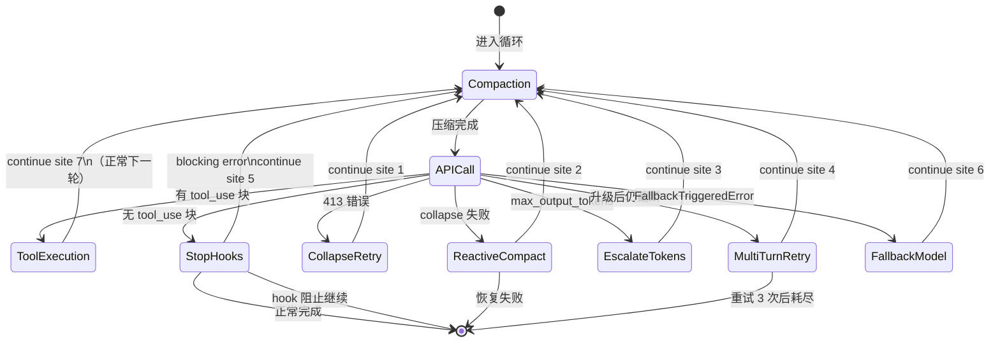
```mermaid
stateDiagram-v2
    [*] --> Compaction: 进入循环
    Compaction --> APICall: 压缩完成
    APICall --> ToolExecution: 有 tool_use 块
    APICall --> StopHooks: 无 tool_use 块
    APICall --> CollapseRetry: 413 错误
    APICall --> ReactiveCompact: collapse 失败
    APICall --> EscalateTokens: max_output_tokens
    APICall --> MultiTurnRetry: 升级后仍截断
    APICall --> FallbackModel: FallbackTriggeredError

    CollapseRetry --> Compaction: continue site 1
    ReactiveCompact --> Compaction: continue site 2
    EscalateTokens --> Compaction: continue site 3
    MultiTurnRetry --> Compaction: continue site 4
    FallbackModel --> Compaction: continue site 6

    ToolExecution --> Compaction: continue site 7\n（正常下一轮）

    StopHooks --> [*]: 正常完成
    StopHooks --> Compaction: blocking error\ncontinue site 5
    StopHooks --> [*]: hook 阻止继续

    ReactiveCompact --> [*]: 恢复失败
    MultiTurnRetry --> [*]: 重试 3 次后耗尽
```

**简化后的逻辑流（帮助理解）**：

```typescript
while (true) {
    // 1. 解构状态
    const { messages, toolUseContext, ... } = state;

    // 2. 压缩管道
    // 3. 构建系统提示 + 规范化消息
    // 4. 调用 LLM API（流式）
    // 5. 收集 tool_use 块
    // 6. 错误恢复（7 个 continue 站点）
    // 7. 工具执行
    // 8. Stop Hook → 终止或继续
    // 9. 更新状态 → continue
}
```

**设计哲学**：

- **Async Generator**：不是返回最终结果，而是 `yield` 每一个中间事件（流式事件、消息、墓碑消息）。这使客户端可以在 API 调用完成前就开始渲染。
- **无限循环 + 显式退出**：循环只在 `return Terminal` 时退出。这比有限循环更灵活，因为很多恢复路径需要重新迭代。
- **单一 State 对象**：每次迭代开始时解构 State，在 continue 站点整体重新赋值，维护伪不可变语义。

### 3.2 循环的七个 Continue 站点

Claude Code 的 queryLoop 有 **7+ 个 continue 站点**，每个对应不同的恢复场景：

```
┌─────────────────────────────────────────────────┐
│                 queryLoop()                      │
│                                                  │
│  ┌──────────────────────────────────────────┐   │
│  │ Continue Site 1: Proactive Compaction     │   │
│  │ 触发: token 超过阈值                      │   │
│  │ 动作: autocompact → 新消息 → continue     │   │
│  └──────────────────────────────────────────┘   │
│                                                  │
│  ┌──────────────────────────────────────────┐   │
│  │ Continue Site 2: Prompt Too Long          │   │
│  │ 触发: API 返回 prompt-too-long 错误       │   │
│  │ 动作: context-collapse → reactive compact │   │
│  └──────────────────────────────────────────┘   │
│                                                  │
│  ┌──────────────────────────────────────────┐   │
│  │ Continue Site 3: Max Output Tokens        │   │
│  │ 触发: 模型输出截断                        │   │
│  │ 动作: 升级 8k→64k → 多轮重试（最多3次）   │   │
│  └──────────────────────────────────────────┘   │
│                                                  │
│  ┌──────────────────────────────────────────┐   │
│  │ Continue Site 4: Fallback Model           │   │
│  │ 触发: FallbackTriggeredError             │   │
│  │ 动作: 切换模型 → 重试请求                 │   │
│  └──────────────────────────────────────────┘   │
│                                                  │
│  ┌──────────────────────────────────────────┐   │
│  │ Continue Site 5: Stop Hook Blocking       │   │
│  │ 触发: 用户 Hook 要求额外轮次              │   │
│  │ 动作: 注入 Hook 消息 → continue           │   │
│  └──────────────────────────────────────────┘   │
│                                                  │
│  ┌──────────────────────────────────────────┐   │
│  │ Continue Site 6: Image/Media Errors       │   │
│  │ 触发: ImageSizeError / ImageResizeError   │   │
│  │ 动作: 反应式压缩（移除图片）→ continue    │   │
│  └──────────────────────────────────────────┘   │
│                                                  │
│  ┌──────────────────────────────────────────┐   │
│  │ Continue Site 7: Tool Execution           │   │
│  │ 触发: 正常工具执行完成                    │   │
│  │ 动作: 收集结果 → 更新状态 → continue      │   │
│  └──────────────────────────────────────────┘   │
│                                                  │
│  ┌──────────────────────────────────────────┐   │
│  │ return Terminal — 唯一的退出点             │   │
│  │ 条件: 无工具调用 + Stop Hook 不阻止        │   │
│  └──────────────────────────────────────────┘   │
└─────────────────────────────────────────────────┘
```

### 3.3 压缩管道（Compaction Pipeline）

上下文窗口是有限的——即使是 1M token 的窗口，在长对话中也会被填满。Claude Code 实现了一个四级压缩管道，这是它最精巧的子系统之一。

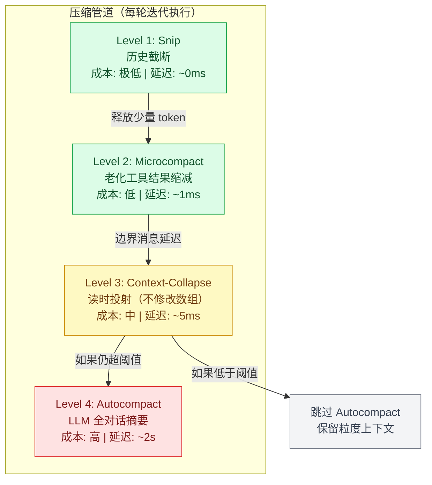
```mermaid
flowchart TD
    subgraph Pipeline["压缩管道（每轮迭代执行）"]
        direction TB
        S["Level 1: Snip\n历史截断\n成本: 极低 | 延迟: ~0ms"]
        MC["Level 2: Microcompact\n老化工具结果缩减\n成本: 低 | 延迟: ~1ms"]
        CC["Level 3: Context-Collapse\n读时投射（不修改数组）\n成本: 中 | 延迟: ~5ms"]
        AC["Level 4: Autocompact\nLLM 全对话摘要\n成本: 高 | 延迟: ~2s"]
    end

    S -->|"释放少量 token"| MC
    MC -->|"边界消息延迟"| CC
    CC -->|"如果仍超阈值"| AC
    CC -->|"如果低于阈值"| Skip["跳过 Autocompact\n保留粒度上下文"]

    classDef light fill:#dcfce7,stroke:#16a34a,color:#14532d
    classDef medium fill:#fef9c3,stroke:#ca8a04,color:#713f12
    classDef heavy fill:#fee2e2,stroke:#dc2626,color:#7f1d1d
    classDef skip fill:#f3f4f6,stroke:#6b7280,color:#374151

    class S,MC light
    class CC medium
    class AC heavy
    class Skip skip
```

> **源码批注分析**：关于 Microcompact 和 Snip 的执行顺序，源码注释道：*"Apply snip before microcompact (both may run — they are not mutually exclusive)... snipTokensFreed is plumbed to autocompact: snip's threshold check must reflect what snip removed."* 这揭示了一个微妙的数据流依赖：Snip 释放的 token 数必须传递给 Autocompact 的阈值检查，否则 Autocompact 会低估已释放的空间，导致不必要的全对话摘要。
>
> 关于 Context-Collapse，注释道：*"Nothing is yielded — the collapsed view is a read-time projection... summary messages live in the collapse store, not the REPL array."* 这意味着 Level 3 不修改任何数据结构——它只是改变了"读取方式"。这种设计使得 collapse 可以跨轮次持久化，而且完全可逆。

每级独立运作，但有**严格的执行顺序约束**：

```
┌────────────────────────────────────────────────────────┐
│                  Compaction Pipeline                     │
│                                                         │
│  Level 1: Snip Compact（每轮）                          │
│  ├─ Feature-gated 历史截断                              │
│  ├─ 追踪释放的 token 数                                  │
│  └─ 最轻量，几乎无延迟                                   │
│                                                         │
│  Level 2: Microcompact（每轮）                           │
│  ├─ 将 3 轮前的工具结果替换为 "[Previous: used {tool}]"  │
│  ├─ 缓存压缩结果                                        │
│  └─ 延迟边界消息直到 API 响应（知道 cache_deleted_input） │
│                                                         │
│  Level 3: Context-Collapse（读时投射）                   │
│  ├─ 不修改消息数组，而是在读取时投射                      │
│  ├─ 按粒度排空可折叠上下文                               │
│  └─ 低成本，渐进式                                      │
│                                                         │
│  Level 4: Autocompact（>50k tokens 时触发）              │
│  ├─ 保存完整转录到磁盘                                   │
│  ├─ LLM 总结所有消息                                     │
│  ├─ 用摘要替换所有消息                                   │
│  └─ 最重量级，但释放最多空间                              │
│                                                         │
│  执行顺序: snip → micro → context-collapse → auto        │
│  各级互不排斥，可组合运行                                 │
└────────────────────────────────────────────────────────┘
```

**设计哲学**：

- **渐进式**：先尝试轻量操作，只在必要时升级到重量操作
- **边界延迟**：Microcompact 的边界消息延迟到 API 响应后，因为此时才知道缓存命中情况
- **预算追踪跨压缩边界**：`taskBudgetRemaining` 在压缩前捕获最终窗口，累计跨多次压缩

### 3.4 工具执行编排

Claude Code 有两种工具执行模式，实际生产中两者共存：

#### 模式 1: StreamingToolExecutor（默认 — 边流式边执行）

```typescript
// src/services/tools/toolOrchestration.ts — 真实代码
export class StreamingToolExecutor {
  private tools: TrackedTool[] = []
  private toolUseContext: ToolUseContext
  private hasErrored = false
  // 子 AbortController：当一个 Bash 工具出错时，
  // 兄弟子进程立即死亡，但不中止父级查询
  private siblingAbortController: AbortController
  private discarded = false

  addTool(block: ToolUseBlock, assistantMessage: AssistantMessage): void {
    const toolDefinition = findToolByName(this.toolDefinitions, block.name)
    if (!toolDefinition) {
      // 工具不存在 → 立即创建错误结果
      this.tools.push({
        id: block.id, block, assistantMessage,
        status: 'completed',
        isConcurrencySafe: true,
        pendingProgress: [],
        results: [createUserMessage({
          content: [{
            type: 'tool_result',
            content: `<tool_use_error>Error: No such tool: ${block.name}</tool_use_error>`,
            is_error: true,
            tool_use_id: block.id,
          }],
        })],
      })
      return
    }

    // 解析输入并判断是否可并发
    const parsedInput = toolDefinition.inputSchema.safeParse(block.input)
    const isConcurrencySafe = parsedInput?.success
      ? Boolean(toolDefinition.isConcurrencySafe(parsedInput.data))
      : false

    this.tools.push({
      id: block.id, block, assistantMessage,
      status: 'queued', isConcurrencySafe,
      pendingProgress: [],
    })

    void this.processQueue()  // 立即开始处理
  }

  // 当流式回退发生时，丢弃所有待处理和进行中的工具
  discard(): void { this.discarded = true }
}
```

**关键设计**：`addTool()` 在模型流式生成过程中被调用。每当识别到一个完整的 `tool_use` JSON 块，该工具**立即**排队执行。模型还在生成第二个工具调用时，第一个已经在运行了。

#### 模式 2: runTools()（回退 — 分区后执行）

```typescript
// src/services/tools/toolOrchestration.ts — 真实代码
export async function* runTools(
  toolUseMessages: ToolUseBlock[],
  assistantMessages: AssistantMessage[],
  canUseTool: CanUseToolFn,
  toolUseContext: ToolUseContext,
): AsyncGenerator<MessageUpdate, void> {
  let currentContext = toolUseContext

  // 核心设计：工具分区
  for (const { isConcurrencySafe, blocks } of partitionToolCalls(
    toolUseMessages, currentContext,
  )) {
    if (isConcurrencySafe) {
      // ===== 只读批次：并发执行 =====
      const queuedContextModifiers: Record<string, ((ctx) => ctx)[]> = {}
      for await (const update of runToolsConcurrently(blocks, ...)) {
        if (update.contextModifier) {
          // 收集上下文修改器，延迟应用
          queuedContextModifiers[update.contextModifier.toolUseID]
            ?.push(update.contextModifier.modifyContext)
        }
        yield { message: update.message, newContext: currentContext }
      }
      // 批次完成后，按顺序应用所有上下文修改
      for (const block of blocks) {
        for (const modifier of queuedContextModifiers[block.id] ?? []) {
          currentContext = modifier(currentContext)
        }
      }
    } else {
      // ===== 写入批次：串行执行 =====
      for await (const update of runToolsSerially(blocks, ...)) {
        if (update.newContext) currentContext = update.newContext
        yield { message: update.message, newContext: currentContext }
      }
    }
  }
}
```

**工具分区算法** (`partitionToolCalls`)：

```
输入: [Read("a.ts"), Read("b.ts"), Write("c.ts"), Read("d.ts")]

分区结果:
  批次 1: { isConcurrencySafe: true,  blocks: [Read("a.ts"), Read("b.ts")] }
  批次 2: { isConcurrencySafe: false, blocks: [Write("c.ts")] }
  批次 3: { isConcurrencySafe: true,  blocks: [Read("d.ts")] }

执行顺序: 批次 1 并发 → 批次 2 串行 → 批次 3 并发
```

**设计哲学**：只读工具（Read, Glob, Grep）天然可并发——它们不修改状态。写入工具（Write, Edit, Bash）必须串行，因为它们可能依赖前一个工具的副作用。分区算法将连续的同类工具分组，在安全性和性能之间取得最优平衡。上下文修改器（`contextModifier`）被收集并延迟应用，确保并发执行期间的上下文一致性。

> **为什么这很重要？** 假设 Agent 要读取 10 个文件来回答一个架构问题。如果没有工具分区，这 10 个 Read 会一个接一个串行执行——每个可能需要几十毫秒。有了分区，它们并发执行，总时间约等于最慢的那一个。在实际使用中，这让"读取代码库"这类操作从秒级降到毫秒级。这种优化对用户来说是"感觉上的流畅"——你不需要知道原理，但你会注意到它快。

### 3.5 错误恢复级联（含真实源码）

Claude Code 对可恢复错误实现了**级联恢复策略**。以下是 `src/query.ts` 中的真实代码：

#### Prompt Too Long (413) 恢复

```typescript
// src/query.ts — 真实的 413 恢复代码
if (isWithheld413) {
  // 第 1 步: 排空 context-collapse 队列
  // 只有在上次 transition 不是 collapse_drain_retry 时才尝试
  // （如果已经排空过但仍然 413，跳过直接进入 reactive compact）
  if (feature('CONTEXT_COLLAPSE') && contextCollapse
      && state.transition?.reason !== 'collapse_drain_retry') {
    const drained = contextCollapse.recoverFromOverflow(messagesForQuery, querySource)
    if (drained.committed > 0) {
      state = { ...state,
        messages: drained.messages,
        transition: { reason: 'collapse_drain_retry', committed: drained.committed },
      }
      continue  // ← Continue Site 1
    }
  }
}

// 第 2 步: Reactive Compact（完整摘要）
if ((isWithheld413 || isWithheldMedia) && reactiveCompact) {
  const compacted = await reactiveCompact.tryReactiveCompact({
    hasAttempted: hasAttemptedReactiveCompact,  // 防止无限循环
    querySource,
    aborted: toolUseContext.abortController.signal.aborted,
    messages: messagesForQuery,
    cacheSafeParams: { systemPrompt, userContext, systemContext, ... },
  })

  if (compacted) {
    // 预算跟踪：捕获压缩前的最终上下文窗口
    if (params.taskBudget) {
      const preCompactContext = finalContextTokensFromLastResponse(messagesForQuery)
      taskBudgetRemaining = Math.max(0,
        (taskBudgetRemaining ?? params.taskBudget.total) - preCompactContext)
    }

    const postCompactMessages = buildPostCompactMessages(compacted)
    for (const msg of postCompactMessages) { yield msg }

    state = { ...state,
      messages: postCompactMessages,
      hasAttemptedReactiveCompact: true,
      transition: { reason: 'reactive_compact_retry' },
    }
    continue  // ← Continue Site 2
  }

  // 第 3 步: 所有恢复失败 → 向用户报告
  // 关键：不要进入 Stop Hooks！模型从未产生有效响应，
  // Stop Hooks 无法有意义地评估。运行 Stop Hooks 会造成死亡螺旋：
  // error → hook blocking → retry → error → ...
  yield lastMessage
  void executeStopFailureHooks(lastMessage, toolUseContext)
  return { reason: 'prompt_too_long' }
}
```

#### Max Output Tokens 恢复

```typescript
// src/query.ts — 真实的 max_output_tokens 恢复代码
if (isWithheldMaxOutputTokens(lastMessage)) {

  // 升级重试：如果使用了默认的 8k 上限，升级到 64k 重试 **同一请求**
  // 无 meta 消息，无多轮交互
  const capEnabled = getFeatureValue_CACHED_MAY_BE_STALE('tengu_otk_slot_v1', false)
  if (capEnabled && maxOutputTokensOverride === undefined
      && !process.env.CLAUDE_CODE_MAX_OUTPUT_TOKENS) {
    logEvent('tengu_max_tokens_escalate', { escalatedTo: ESCALATED_MAX_TOKENS })
    state = { ...state,
      maxOutputTokensOverride: ESCALATED_MAX_TOKENS,  // 64k
      transition: { reason: 'max_output_tokens_escalate' },
    }
    continue  // ← Continue Site 3
  }

  // 多轮恢复：注入恢复消息，要求模型从断点继续
  if (maxOutputTokensRecoveryCount < MAX_OUTPUT_TOKENS_RECOVERY_LIMIT) {  // 限制 3 次
    const recoveryMessage = createUserMessage({
      content: `Output token limit hit. Resume directly — no apology, no recap. ` +
        `Pick up mid-thought if that is where the cut happened. ` +
        `Break remaining work into smaller pieces.`,
      isMeta: true,
    })

    state = { ...state,
      messages: [...messagesForQuery, ...assistantMessages, recoveryMessage],
      maxOutputTokensRecoveryCount: maxOutputTokensRecoveryCount + 1,
      transition: {
        reason: 'max_output_tokens_recovery',
        attempt: maxOutputTokensRecoveryCount + 1,
      },
    }
    continue  // ← Continue Site 4
  }

  // 恢复耗尽 → 展示被截断的错误
  yield lastMessage
}
```

#### Stop Hook 恢复

```typescript
// src/query.ts — Stop Hook 阻止后的恢复
const stopHookResult = yield* handleStopHooks(
  messagesForQuery, assistantMessages, systemPrompt,
  userContext, systemContext, toolUseContext, querySource, stopHookActive,
)

if (stopHookResult.preventContinuation) {
  return { reason: 'stop_hook_prevented' }
}

if (stopHookResult.blockingErrors.length > 0) {
  state = { ...state,
    messages: [...messagesForQuery, ...assistantMessages, ...stopHookResult.blockingErrors],
    maxOutputTokensRecoveryCount: 0,
    // 关键：保留 hasAttemptedReactiveCompact 标志！
    // 如果 compact 已经运行但无法恢复 prompt-too-long，
    // 重置此标志会导致无限循环：
    // compact → 仍然太长 → error → stop hook → compact → ...
    hasAttemptedReactiveCompact,
    stopHookActive: true,
    transition: { reason: 'stop_hook_blocking' },
  }
  continue  // ← Continue Site 5
}
```

#### 所有终止原因

```typescript
// query.ts 中的 10 种终止原因
return { reason: 'completed' }           // 正常完成（无工具调用 + Stop Hook 不阻止）
return { reason: 'blocking_limit' }      // 硬性 token 限制
return { reason: 'stop_hook_prevented' } // Stop Hook 阻止继续
return { reason: 'aborted_streaming' }   // 用户中断（模型响应中）
return { reason: 'aborted_tools' }       // 用户中断（工具执行中）
return { reason: 'hook_stopped' }        // Hook 附件停止继续
return { reason: 'max_turns', turnCount }// 达到最大轮次限制
return { reason: 'prompt_too_long' }     // 413 恢复耗尽
return { reason: 'image_error' }         // 图片/PDF 太大
return { reason: 'model_error', error }  // 意外异常
```

**源码批注深度分析**：

以下洞察来自 Claude Code 源码中的内部开发者注释，揭示了生产环境中的真实工程挑战：

**1. 错误扣留（Error Withholding）策略**

源码注释写道：*"yielding early would leak intermediate errors to consumers like cowork/desktop that terminate on any `error` field, even though recovery is still running."*

这意味着 queryLoop 不是在发现错误时立即 `yield`，而是**扣留错误**（withheld），等恢复流程走完后才决定是否展示。这防止了下游消费者（IDE 扩展、桌面应用）看到中间态的错误就提前终止。

**2. 压缩边界的预算跟踪**

源码注释写道：*"remaining is undefined until first compact fires — before compact the server sees full history and counts down from {total} itself (see api/api/sampling/prompt/renderer.py:292); after compact, server only sees summary and would under-count spend."*

这揭示了一个精妙的服务端-客户端协同设计：压缩前，服务端能看到完整历史并自己计算预算消耗；压缩后，服务端只能看到摘要，所以客户端必须告诉服务端"你看不到的那部分消耗了多少"。

**3. hasAttemptedReactiveCompact 不重置的原因**

注意 Stop Hook 恢复中 `hasAttemptedReactiveCompact` 标志被**保留**而非重置。源码注释解释：*如果 compact 已经运行但无法恢复 prompt-too-long，重置此标志会导致无限循环：compact → 仍然太长 → error → stop hook → compact → …*。这是一个真实的生产 bug 修复。

**4. 记忆预取的 `using` 语义**

`using pendingMemoryPrefetch = startRelevantMemoryPrefetch(...)` 使用了 TC39 的 Explicit Resource Management 提案（`using` 关键字）。源码注释道：*"Fired once per user turn — the prompt is invariant across loop iterations, so per-iteration firing would ask sideQuery the same question N times."* `using` 确保在生成器退出（正常或异常）时自动清理预取资源。

> **教学要点**：这些细节揭示了一个核心原则——**生产级 Agent Loop 的复杂性不在于"循环本身"，而在于"循环失败时如何优雅恢复"**。一个 30 行的 while(true) 就能实现基本的 Agent Loop，但处理好所有边界情况需要 1800+ 行。这中间的差距就是 Harness Engineering 的全部价值。

### 3.6 停下来想一想

读完 Agent Loop，试着回答：

> 1. 为什么 queryLoop 用 `while(true)` 而不是递归？（提示：考虑内存和栈深度）
> 2. 为什么压缩管道有 4 级而不是 1 级？（提示：考虑成本和延迟的权衡）
> 3. 如果你要给循环添加一个新的恢复路径（比如"API 密钥过期"），你需要修改哪些地方？

这些问题没有标准答案，但思考它们会帮助你理解"为什么"而不仅仅是"怎么做"。

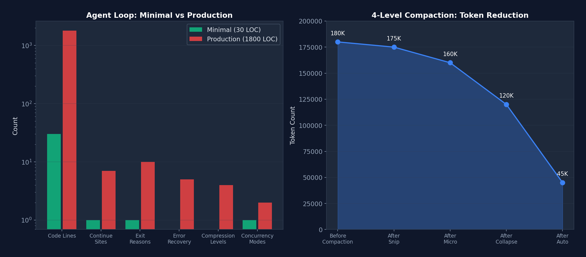
*图 3-2: (左) 最小实现 vs 生产实现的复杂性对比（对数刻度）— 代码行数增长 60 倍，但每个维度的增长都对应真实的生产需求。(右) 四级压缩管道的 Token 释放效率 — 从 180K 逐级降至 45K。*

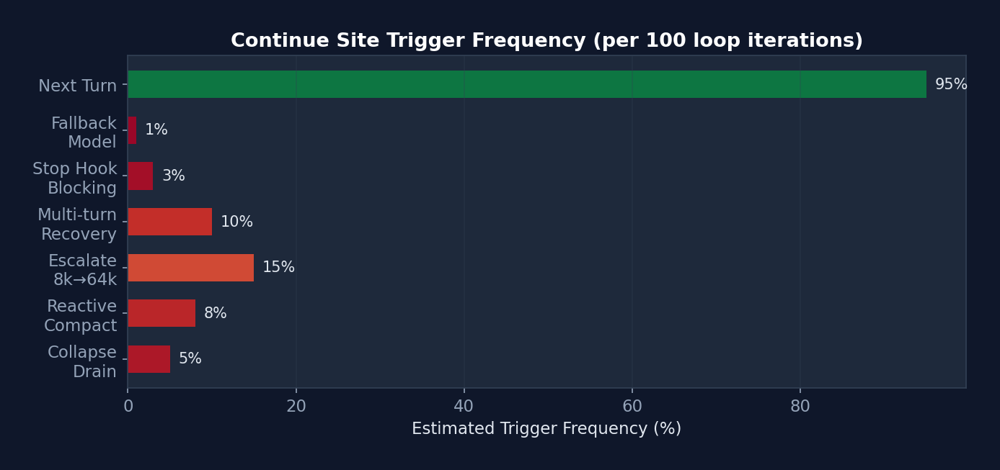
*图 3-3: 7 个 continue 站点的触发频率估计 — "Next Turn"（正常推进）占 95%，错误恢复站点合计约 5%，但正是这 5% 的代码（约 500 行）防止了会话中断和成本失控。*

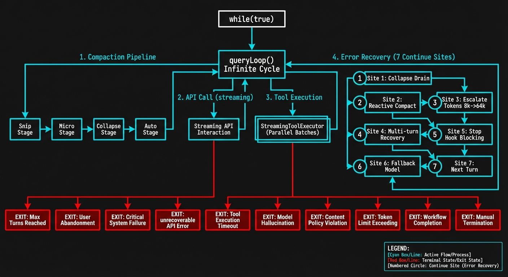
*图 3-1: queryLoop() 状态机 — 展示 7 个 continue 站点、4 级压缩管道、StreamingToolExecutor 并行执行和 10 种终止原因的完整流转。*

### 3.7 定量分析：Agent Loop 的复杂性度量

为了量化"最小 Agent Loop"和"生产 Agent Loop"之间的差距，我们对 `src/query.ts` 进行了代码度量分析：

| 度量指标 | 最小实现 (s01) | Claude Code 生产实现 |
|----------|---------------|---------------------|
| **代码行数** | 30 行 | 1,800+ 行 |
| **Continue 站点** | 1 个 | 7 个 |
| **终止原因** | 1 个 (completed) | 10 个 |
| **错误恢复路径** | 0 个 | 5 个级联恢复 |
| **压缩策略** | 0 级 | 4 级管道 |
| **并发模式** | 串行 | 2 种 (Streaming + Sequential) |
| **状态字段** | 1 个 (messages) | 10 个 (State 类型) |
| **Analytics 埋点** | 0 个 | 15+ 个 |
| **Feature Gates** | 0 个 | 8+ 个 |

> **复杂性增长分析**：从 30 行到 1,800 行是 60 倍的增长。但这不是"过度工程"——每一行都对应一个真实的生产问题。例如：
> - `hasAttemptedReactiveCompact` 标志只有 1 行，但它防止了一个会消耗数千美元 API 费用的无限循环 bug。
> - `taskBudgetRemaining` 跟踪逻辑约 20 行，但它是唯一能在压缩边界后正确计算 Token 消耗的机制。
> - StreamingToolExecutor 约 200 行，但它将多工具执行延迟从 O(n) 降到 O(1)（最慢工具的时间）。

### 3.8 Agent Loop 的设计哲学总结

1. **弹性优于刚性**：7+ 个 continue 站点允许从几乎任何错误中恢复
2. **渐进式降级**：每种错误先尝试最轻量的恢复，逐步升级
3. **流式优先**：Async Generator 使每个中间状态都可观察
4. **状态显式化**：单一 State 对象，无隐式全局状态
5. **可观测性内建**：每个恢复点都有 analytics 和 profiling

---

## 第四章：Tool System — Agent 的双手

> Agent Loop 是发动机，那工具系统就是方向盘和油门。发动机再强大，如果不能操控方向、调节速度，车也到不了目的地。
>
> 在 Claude Code 中，模型（LLM）本身**不能**读文件、不能运行命令、不能搜索代码。它唯一能做的就是生成文本。但通过工具系统，这些文本被翻译成真实的操作——读一个文件、编辑一行代码、运行一个测试。
>
> 本章我们来看 Claude Code 如何设计一个 43+ 工具的系统，每个工具既是独立的、又是统一管理的。这套设计模式你可以直接复用到自己的 Agent 项目中。

工具系统是 Harness 中 Agent 与外部世界交互的唯一通道。Claude Code 实现了一个 43+ 工具的系统，每个工具都是自包含模块。

### 4.1 Tool 接口定义

位于 `src/Tool.ts`，这是所有工具的基础类型：

```typescript
type Tool<
  Input extends AnyObject = AnyObject,
  Output = unknown,
  P extends ToolProgressData = ToolProgressData,
> = {
  // ===== 核心标识 =====
  name: string;                    // 工具名称（主标识符）
  aliases?: string[];              // 别名（向后兼容）
  userFacingName(): string;        // 显示名称

  // ===== Schema & 验证 =====
  inputSchema: ZodType<Input>;     // Zod 输入验证
  inputJSONSchema?: JSONSchema;    // 可选 JSON Schema（MCP 工具）
  outputSchema?: ZodType<Output>;  // 可选输出类型
  validateInput(input): Promise<ValidationResult>;

  // ===== 执行 =====
  call(
    args: Input,
    context: ToolUseContext,
    canUseTool: CanUseTool,
    parentMessage: AssistantMessage,
    progressCallback?: ProgressCallback<P>,
  ): Promise<ToolResult<Output>>;

  // ===== 权限 & 安全 =====
  checkPermissions(args, context): Promise<PermissionDecision>;
  isConcurrencySafe(args): boolean;      // 能否并行执行
  isDestructive(args): boolean;          // 不可逆操作？
  isReadOnly(): boolean;                 // 只读操作？
  preparePermissionMatcher(args): string; // Hook 模式匹配

  // ===== 行为 =====
  isEnabled(): boolean;                  // 特性门控检查
  interruptBehavior(): 'cancel' | 'block';
  requiresUserInteraction(): boolean;

  // ===== 渲染 =====
  renderToolUseMessage(args): ReactElement;
  renderToolResultMessage(result): ReactElement;
  renderToolUseProgressMessage(progress): ReactElement;

  // ===== 搜索 & 折叠 =====
  searchHint: string;                    // ToolSearch 的 3-10 词关键词
  shouldDefer: boolean;                  // 延迟加载
  alwaysLoad: boolean;                   // 永不延迟

  // ===== 描述（动态生成）=====
  description(isNonInteractive?: boolean): string;
  prompt(context): string;               // 系统提示片段
};
```

**设计哲学**：

- **自描述**：每个工具携带自己的 Schema、描述、权限逻辑和渲染函数
- **双 Schema 支持**：Zod（内部验证） + JSON Schema（MCP 互操作）
- **动态描述**：`description()` 接收交互模式参数，非交互模式下可省略UI相关说明
- **延迟加载**：`shouldDefer` 让不常用工具在第一轮不加载到模型上下文，节省 token

> **初学者常见误区**：很多人设计工具系统时只关注 `call()` 方法——"工具能做什么"。但在生产环境中，**权限检查、输入验证、进度渲染**占了工具代码的 80%。一个好的工具接口不只是"执行"，而是"安全地、可观测地、可中断地执行"。

### 4.2 工具注册表

位于 `src/tools.ts`：

```typescript
// 唯一的工具真实来源
function getAllBaseTools(): Tool[] {
  return [
    // === 始终加载 ===
    AgentTool,
    TaskOutputTool,
    BashTool,
    FileReadTool,
    FileEditTool,
    FileWriteTool,
    WebFetchTool,
    WebSearchTool,
    AskUserQuestionTool,
    SkillTool,
    // ...更多始终可用的工具

    // === 特性门控 ===
    ...(feature('PROACTIVE') ? [SleepTool] : []),
    ...(feature('AGENT_TRIGGERS') ? [ScheduleCronTool] : []),
    ...(feature('COORDINATOR_MODE') ? [TeamCreateTool, TeamDeleteTool] : []),
    ...(isReplModeEnabled() ? [REPLTool] : []),
    // ...更多条件工具
  ];
}
```

**Dead Code Elimination（死代码消除）**：

```typescript
// Bun 的 bun:bundle 在编译时评估 feature() 调用
// 如果 feature('PROACTIVE') 编译为 false:
...(false ? [SleepTool] : [])
// → SleepTool 的全部代码被 tree-shake 移除
// 包括其引用的所有字符串和依赖
```

这是 Claude Code 的一个关键设计模式：**编译时特性门控**。外部发行版可以通过设置 feature flags 来移除整个子系统，而不需要手动删除代码。

### 4.3 工具池组装

```typescript
function assembleToolPool(builtInTools: Tool[], mcpTools: Tool[]): Tool[] {
  // 1. 过滤被 deny 规则禁止的 MCP 工具
  const filteredMcp = mcpTools.filter(t => !getDenyRuleForTool(t));

  // 2. 分别排序（保持 prompt cache 稳定性）
  const sortedBuiltIn = sortBy(builtInTools, t => t.name);
  const sortedMcp = sortBy(filteredMcp, t => t.name);

  // 3. 连接：内置工具在前（作为缓存前缀）
  const combined = [...sortedBuiltIn, ...sortedMcp];

  // 4. 去重（内置优先）
  return uniqBy(combined, t => t.name);
}
```

**Cache Stability（缓存稳定性）设计**：

内置工具按名称排序后形成稳定的**缓存前缀**。当 MCP 工具增减时，前缀不变，Anthropic API 的 prompt cache 不会失效。这是一个微妙但重要的性能优化。

### 4.4 工具执行生命周期

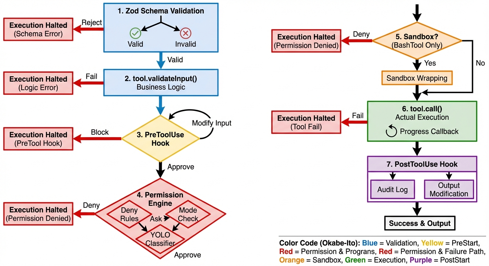
*图 4-1: 工具执行管道的 7 步流程 — 从 Zod Schema 验证到 PostToolUse Hook，每一步都可能改变工具的行为或阻止执行。*

用下面的序列图理解一个工具从请求到执行的完整路径——注意 Hook 如何在关键节点介入：

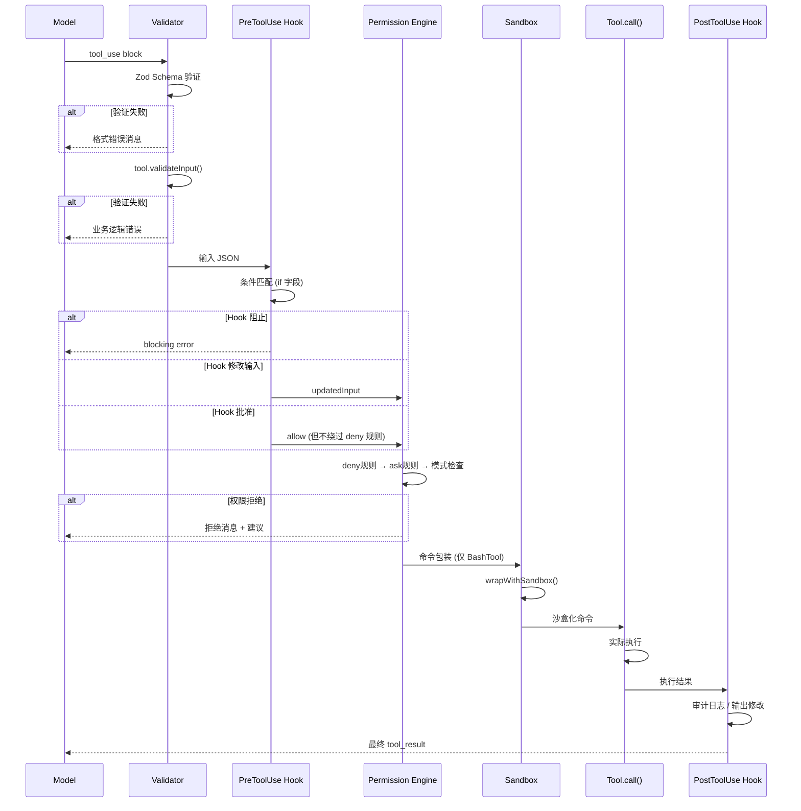
```mermaid
sequenceDiagram
    participant M as Model
    participant V as Validator
    participant PH as PreToolUse Hook
    participant P as Permission Engine
    participant S as Sandbox
    participant T as Tool.call()
    participant AH as PostToolUse Hook

    M->>V: tool_use block
    V->>V: Zod Schema 验证
    alt 验证失败
        V-->>M: 格式错误消息
    end
    V->>V: tool.validateInput()
    alt 验证失败
        V-->>M: 业务逻辑错误
    end
    V->>PH: 输入 JSON
    PH->>PH: 条件匹配 (if 字段)
    alt Hook 阻止
        PH-->>M: blocking error
    else Hook 修改输入
        PH->>P: updatedInput
    else Hook 批准
        PH->>P: allow (但不绕过 deny 规则)
    end
    P->>P: deny规则 → ask规则 → 模式检查
    alt 权限拒绝
        P-->>M: 拒绝消息 + 建议
    end
    P->>S: 命令包装 (仅 BashTool)
    S->>S: wrapWithSandbox()
    S->>T: 沙盒化命令
    T->>T: 实际执行
    T->>AH: 执行结果
    AH->>AH: 审计日志 / 输出修改
    AH-->>M: 最终 tool_result
```

下面用传统流程图展示同样的过程：

```
用户/模型请求工具调用
    │
    v
┌─────────────────────────┐
│ 1. validateInput()       │  结构验证（必填字段、范围）
│    使用 Zod Schema       │
└────────┬────────────────┘
         │ 通过
         v
┌─────────────────────────┐
│ 2. checkPermissions()    │  工具特定的权限逻辑
│    返回 allow/ask/deny   │
└────────┬────────────────┘
         │ 未被拒绝
         v
┌─────────────────────────┐
│ 3. Rule-Based Perms      │  设置中的 allow/deny/ask 规则
│    checkRuleBasedPerms() │
└────────┬────────────────┘
         │ 未被拒绝
         v
┌─────────────────────────┐
│ 4. PreToolUse Hooks      │  用户定义的 Hook
│    可批准或阻止           │
└────────┬────────────────┘
         │ 未被阻止
         v
┌─────────────────────────┐
│ 5. User Prompt/Classifier│  最终审批（或自动分类器）
│    auto 模式：YOLO 分类器│
└────────┬────────────────┘
         │ 批准
         v
┌─────────────────────────┐
│ 6. call()                │  实际执行工具
│    返回 ToolResult       │
└────────┬────────────────┘
         │
         v
┌─────────────────────────┐
│ 7. PostToolUse Hooks     │  执行后回调
│    审计日志、通知等       │
└─────────────────────────┘
```

### 4.5 工具执行管道（含 Hook 集成的真实代码）

工具执行不仅仅是调用 `tool.call()`——它是一个多步管道，每一步都可能改变行为：

```typescript
// src/services/tools/toolExecution.ts — 真实的执行管道
async function checkPermissionsAndCallTool(
  tool: Tool,
  toolUseID: string,
  input: Record<string, unknown>,
  toolUseContext: ToolUseContext,
  canUseTool: CanUseToolFn,
  assistantMessage: AssistantMessage,
  onToolProgress: (progress: ToolProgress) => void,
): Promise<MessageUpdate[]> {

  // ===== 步骤 1: Zod Schema 验证 =====
  const parsedInput = tool.inputSchema.safeParse(input)
  if (!parsedInput.success) {
    return [{ message: createUserMessage({
      content: formatZodValidationError(tool.name, parsedInput.error),
    }) }]
  }

  // ===== 步骤 2: 工具特定验证 =====
  const isValidCall = await tool.validateInput?.(parsedInput.data, toolUseContext)
  if (isValidCall?.result === false) {
    return [{ message: createUserMessage({
      content: isValidCall.message,
    }) }]
  }

  // ===== 步骤 3: PreToolUse Hook =====
  // Hook 可以：批准、阻止、修改输入、注入上下文
  let processedInput = parsedInput.data
  let hookPermissionResult: PermissionResult | undefined
  for await (const result of runPreToolUseHooks(...)) {
    switch (result.type) {
      case 'hookPermissionResult':
        hookPermissionResult = result.hookPermissionResult
        break
      case 'hookUpdatedInput':
        processedInput = result.updatedInput  // Hook 修改了输入！
        break
    }
  }

  // ===== 步骤 4: 权限解析（Hook + Rules 交互）=====
  // 关键设计：Hook 的 'allow' 不绕过 settings.json 的 deny/ask 规则
  const { decision, input: callInput } = await resolveHookPermissionDecision(
    hookPermissionResult, tool, processedInput,
    toolUseContext, canUseTool, assistantMessage, toolUseID,
  )
  if (decision.behavior !== 'allow') {
    return [/* 权限被拒绝的消息 */]
  }

  // ===== 步骤 5: 实际执行工具 =====
  let toolResult = await tool.call(
    callInput, toolUseContext, canUseTool,
    assistantMessage, onToolProgress,
  )

  // ===== 步骤 6: PostToolUse Hook =====
  // Hook 可以：修改 MCP 工具输出、注入额外上下文
  for await (const result of runPostToolUseHooks(...)) {
    if (result.updatedMCPToolOutput) {
      toolResult = { ...toolResult, data: result.updatedMCPToolOutput }
    }
  }

  // ===== 步骤 7: 转换为 API 格式并返回 =====
  return resultingMessages
}
```

**Hook 权限决策解析**（这是最微妙的部分）：

```typescript
// src/services/tools/toolHooks.ts — 真实代码
export async function resolveHookPermissionDecision(
  hookPermissionResult, tool, input, toolUseContext,
  canUseTool, assistantMessage, toolUseID,
) {
  if (hookPermissionResult?.behavior === 'allow') {
    // Hook 说"允许"——但这不是最终判决！
    // deny/ask 规则仍然适用（安全不可变量）

    // 如果工具需要用户交互，且 Hook 提供了 updatedInput，
    // 那么 Hook 就是"用户交互"（如 headless 包装器）
    const interactionSatisfied =
      tool.requiresUserInteraction?.() &&
      hookPermissionResult.updatedInput !== undefined

    // 即使 Hook 允许，仍检查规则
    const ruleCheck = await checkRuleBasedPermissions(tool, input, toolUseContext)
    if (ruleCheck?.behavior === 'deny') {
      // Deny 规则覆盖 Hook 的 allow！
      return { decision: ruleCheck, input }
    }
    if (ruleCheck?.behavior === 'ask') {
      // Ask 规则仍需要对话框
      return { decision: await canUseTool(...), input }
    }

    // 无规则阻止 → Hook 的 allow 生效
    return { decision: hookPermissionResult, input }
  }
  // ... deny 和 ask 处理
}
```

**核心安全不变量**：`deny > settings rules > hook allow`。即使 Hook 批准了操作，settings.json 中的 deny 规则仍然阻止它。这防止了恶意 Hook 绕过安全策略。

> **为什么 Hook allow 不能绕过 deny 规则？** 这是一个真实的安全考量。想象你安装了一个第三方 MCP 服务器，它提供了一个 PreToolUse Hook，对所有操作返回 `allow`。如果 Hook allow 能绕过 deny 规则，这个第三方代码就获得了超越你安全策略的权限——它可以让 Agent 执行你明确禁止的操作。Claude Code 的设计保证了：**你在 settings.json 中写的 deny 规则是不可绕过的底线**，无论有什么 Hook 介入。

### 4.6 FileEditTool 字符串替换算法

FileEditTool 的核心算法值得单独分析——它处理了**智能引号匹配**，这是一个真实的工程挑战：

```typescript
// src/tools/FileEditTool/utils.ts — 真实代码

// 问题：模型有时生成 "curly quotes"（智能引号）
// 但文件中是 "straight quotes"（直引号），或反之
const LEFT_DOUBLE_CURLY_QUOTE = '\u201C'   // "
const RIGHT_DOUBLE_CURLY_QUOTE = '\u201D'  // "

function normalizeQuotes(str: string): string {
  return str
    .replaceAll('\u2018', "'")   // ' → '
    .replaceAll('\u2019', "'")   // ' → '
    .replaceAll('\u201C', '"')   // " → "
    .replaceAll('\u201D', '"')   // " → "
}

// 三阶段查找算法
function findActualString(fileContent: string, searchString: string): string | null {
  // 阶段 1: 精确匹配
  if (fileContent.includes(searchString)) return searchString

  // 阶段 2: 引号规范化匹配
  const normalizedSearch = normalizeQuotes(searchString)
  const normalizedFile = normalizeQuotes(fileContent)
  const searchIndex = normalizedFile.indexOf(normalizedSearch)
  if (searchIndex !== -1) {
    // 返回文件中的 **原始** 字符串（保留原始引号风格）
    return fileContent.substring(searchIndex, searchIndex + searchString.length)
  }

  return null
}

// 替换算法
function applyEditToFile(
  originalContent: string,
  oldString: string,
  newString: string,
  replaceAll: boolean = false,
): string {
  const f = replaceAll
    ? (content, search, replace) => content.replaceAll(search, () => replace)
    : (content, search, replace) => content.replace(search, () => replace)

  if (newString !== '') return f(originalContent, oldString, newString)

  // 边界情况：删除操作
  // 如果 oldString 不以换行结尾，但文件中 oldString 后面紧跟换行，
  // 同时删除那个换行（防止留下空行）
  const stripTrailingNewline =
    !oldString.endsWith('\n') && originalContent.includes(oldString + '\n')

  return stripTrailingNewline
    ? f(originalContent, oldString + '\n', newString)
    : f(originalContent, oldString, newString)
}
```

**设计智慧**：使用 `() => replace` 而非直接传递 `replace` 字符串。这防止了替换字符串中的 `$1`, `$&` 等特殊模式被 JavaScript 的正则替换机制误解释。一个微妙但关键的防御。

### 4.7 定量分析：工具执行的性能特征

| 执行模式 | 场景 | 延迟模型 | 实际表现 |
|----------|------|---------|---------|
| **StreamingToolExecutor 并发** | 10 个 Read 工具 | O(max(t_i)) | ~50ms（最慢文件读取时间） |
| **StreamingToolExecutor 串行** | 1 个 Write 后 1 个 Read | O(Σt_i) | ~80ms（写+读顺序） |
| **runTools 并发批次** | 5 Read + 1 Write + 3 Read | O(max(5)) + O(1) + O(max(3)) | ~130ms |
| **内部回调 Hook 快速路径** | PostToolUse（全为内部 Hook） | O(n) 但极快 | ~1.8µs（优化后） |
| **外部 Hook 执行** | PreToolUse command Hook | O(hook_timeout) | 5-30s（取决于脚本） |

> **源码批注**：关于内部 Hook 快速路径，源码注释道：*"Fast-path: all hooks are internal callbacks (sessionFileAccessHooks, attributionHooks). These return {} and don't use the abort signal... Measured: 6.01µs → ~1.8µs per PostToolUse hit (-70%)."* 这个 70% 的性能提升来自跳过 span/progress/abortSignal/JSON 解析——对于每次工具调用都要触发的 PostToolUse Hook，这种微优化累积效果显著。

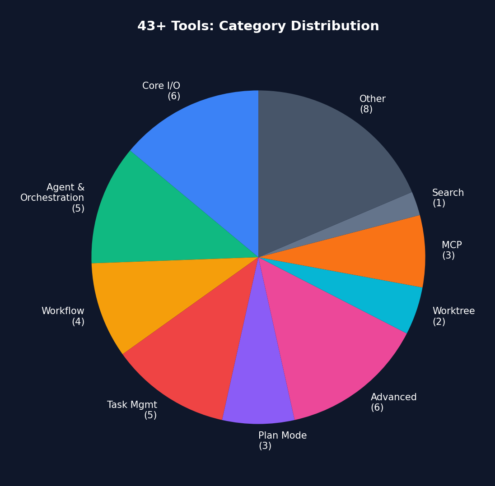
*图 4-2: 43+ 工具的类别分布 — Core I/O（6 个）是使用频率最高的工具，Advanced（6 个）则通过 feature gate 按需加载。*

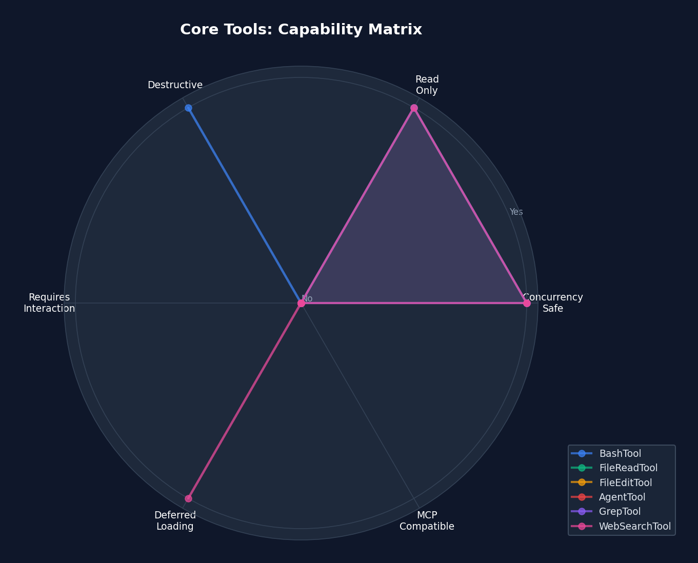
*图 4-3: 核心工具能力雷达图 — 展示并发安全性、只读性、破坏性等维度。FileReadTool 和 GrepTool 是"最安全"的工具（并发安全 + 只读），BashTool 是"最危险"的（可破坏 + 非只读 + 非并发安全）。*

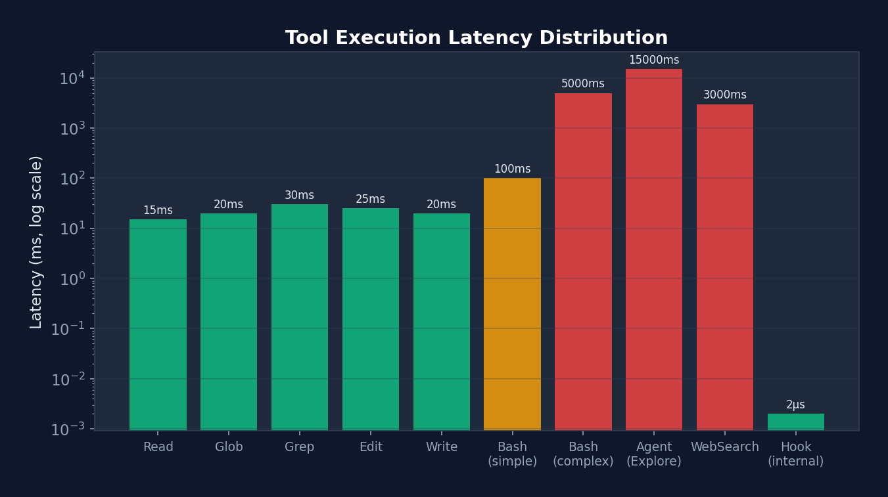
*图 4-4: 工具执行延迟分布（对数刻度）— 从内部 Hook 的 2µs 到 Agent Explore 的 15 秒，延迟跨越 7 个数量级。这解释了为什么 StreamingToolExecutor 的并发优化如此重要——在多工具场景下，它将总延迟从所有工具之和降为最慢工具的时间。*

### 4.8 工具分类

| 类别 | 工具 | 特性 |
|------|------|------|
| **核心 I/O** | BashTool, FileReadTool, FileWriteTool, FileEditTool, GlobTool, GrepTool | 始终加载 |
| **Agent** | AgentTool, SendMessageTool, TeamCreateTool, TeamDeleteTool | 子 Agent 生成与管理 |
| **工作流** | WebFetchTool, WebSearchTool, NotebookEditTool | 外部资源访问 |
| **任务** | TaskCreateTool, TaskUpdateTool, TaskListTool, TaskOutputTool, TaskStopTool | 任务管理 |
| **计划** | EnterPlanModeTool, ExitPlanModeTool, TodoWriteTool | 计划模式 |
| **高级** | ScheduleCronTool, SleepTool, MonitorTool, REPLTool | 特性门控 |
| **Worktree** | EnterWorktreeTool, ExitWorktreeTool | Git worktree 隔离 |
| **MCP** | MCPTool, ListMcpResourcesTool, ReadMcpResourceTool | MCP 协议 |
| **搜索** | ToolSearchTool | 延迟工具发现 |

### 4.6 工具延迟加载（Tool Deferral）

```typescript
// 并非所有工具都在第一轮加载
// shouldDefer = true 的工具不发送给模型
// 直到 ToolSearchTool 被调用发现它们

// 例：NotebookEditTool
{
  name: 'NotebookEdit',
  shouldDefer: true,        // 第一轮不加载
  searchHint: 'jupyter notebook cell edit insert',
  alwaysLoad: false,
}

// 例：BashTool
{
  name: 'Bash',
  shouldDefer: false,       // 始终加载
  alwaysLoad: true,         // 永不延迟
}
```

**设计哲学**：

模型的工具定义占用 token 预算。43+ 个工具全部加载会消耗大量上下文空间。通过延迟加载，第一轮只加载核心工具（~15 个），其余通过 ToolSearch 按需发现。这是**上下文工程**的典型应用。

---

## 第五章：Permission Model — 约束架构

> 回想一下第一章的"驯马"比喻。到目前为止，我们的马（Agent）有了发动机（Loop）和操控系统（Tools）。但如果它能自由奔跑、随意踩踏庄稼呢？我们需要围栏——这就是权限模型。
>
> 这是 Harness Engineering 最核心的"约束"支柱。一个设计良好的权限模型不是给 Agent "加限制"——而是给 Agent "减少犯错的可能性"。Claude Code 的权限系统是业界最成熟的实现之一，它揭示了一个反直觉的真理：**约束越精确，Agent 越自由**。因为当你能精确控制风险时，你敢让 Agent 做更多事情。

权限模型是 Harness 的"安全阀"。它决定 Agent 能做什么、不能做什么、需要询问什么。

### 5.1 五种权限模式

```typescript
type PermissionMode =
  | 'default'            // 敏感操作始终询问
  | 'acceptEdits'        // 自动批准文件编辑，其他询问
  | 'bypassPermissions'  // 自动批准一切（危险）
  | 'dontAsk'           // 自动拒绝需要询问的操作
  | 'plan'              // 计划模式限制（只读 + 计划文件）
  | 'auto'              // AI 分类器自动审批（实验性）
  | 'bubble';           // 冒泡到父 Agent（子 Agent 用）
```

**设计哲学**：

模式不是二元的（允许/禁止），而是一个**光谱**。`default` 是最安全的，适合新用户；`bypassPermissions` 适合信任环境中的自动化；`auto` 是最有趣的——它使用一个两阶段 AI 分类器来判断操作是否安全。

> **类比**：权限模式就像开车时的驾驶辅助系统。`default` 相当于新手模式——每次变道都要你确认。`acceptEdits` 相当于自适应巡航——直行自动，转弯手动。`bypassPermissions` 相当于完全自动驾驶——你完全信任系统。`auto` 最有趣——它是一个AI驾驶员在帮你开车，但它自己也有一个"安全员"（YOLO 分类器）在监督它。

### 5.2 三级规则系统

```typescript
type PermissionRule = {
  source: PermissionRuleSource;  // 规则来源
  ruleBehavior: 'allow' | 'deny' | 'ask';
  ruleValue: {
    toolName: string;       // 例: "Bash", "Write", "mcp__server"
    ruleContent?: string;   // 例: "git *", "*.ts", "prefix:npm *"
  };
};
```

**规则语法示例**：

```
# 允许所有 git 命令
Bash(git *)

# 允许写入 TypeScript 文件
Write(*.ts)

# 拒绝所有 MCP 服务器工具
mcp__*

# 允许读取任何文件
Read

# 拒绝 rm -rf 命令
Bash(rm -rf *)

# 允许特定 MCP 服务器的所有工具
mcp__my-server(*)
```

### 5.3 纵深防御模型

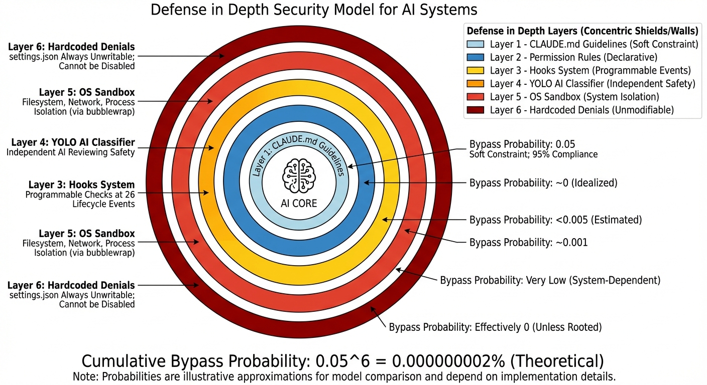
*图 5-1: 纵深防御六层安全模型 — 从软约束（CLAUDE.md，~95% 遵守率）到硬约束（硬编码拒绝，100% 不可绕过），层层叠加使整体绕过概率趋近于零。*

在深入具体的权限规则之前，先从宏观视角理解 Claude Code 的六层安全架构。这是整个 Harness 最重要的设计模式之一：

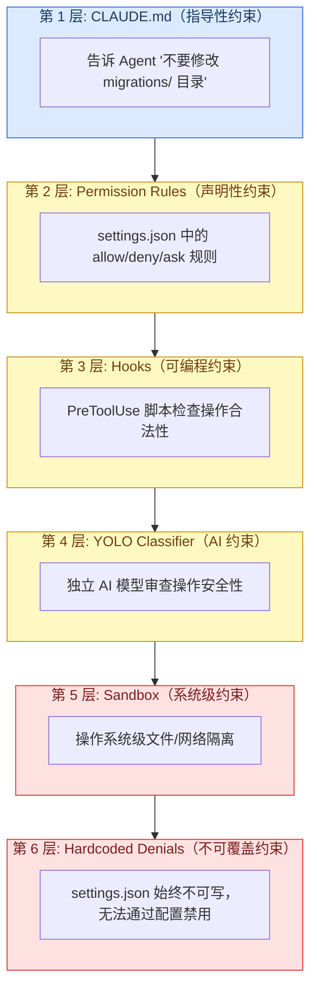
```mermaid
flowchart TB
    subgraph Layer1["第 1 层: CLAUDE.md（指导性约束）"]
        direction LR
        L1["告诉 Agent '不要修改 migrations/ 目录'"]
    end
    subgraph Layer2["第 2 层: Permission Rules（声明性约束）"]
        direction LR
        L2["settings.json 中的 allow/deny/ask 规则"]
    end
    subgraph Layer3["第 3 层: Hooks（可编程约束）"]
        direction LR
        L3["PreToolUse 脚本检查操作合法性"]
    end
    subgraph Layer4["第 4 层: YOLO Classifier（AI 约束）"]
        direction LR
        L4["独立 AI 模型审查操作安全性"]
    end
    subgraph Layer5["第 5 层: Sandbox（系统级约束）"]
        direction LR
        L5["操作系统级文件/网络隔离"]
    end
    subgraph Layer6["第 6 层: Hardcoded Denials（不可覆盖约束）"]
        direction LR
        L6["settings.json 始终不可写，无法通过配置禁用"]
    end

    Layer1 --> Layer2 --> Layer3 --> Layer4 --> Layer5 --> Layer6

    classDef soft fill:#dbeafe,stroke:#2563eb,color:#1e3a5f
    classDef medium fill:#fef9c3,stroke:#ca8a04,color:#713f12
    classDef hard fill:#fee2e2,stroke:#dc2626,color:#7f1d1d

    class Layer1 soft
    class Layer2,Layer3 medium
    class Layer4 medium
    class Layer5,Layer6 hard
```

> **分析**：注意颜色渐变——从蓝色（软约束，可被忽略）到黄色（中等约束，可被配置覆盖）到红色（硬约束，不可绕过）。在工程实践中，第 1 层（CLAUDE.md）的遵守率约 95%——模型有时会"忘记"。但第 6 层的遵守率是 100%，因为它在代码中硬编码。这种渐变设计意味着：**你不需要每一层都完美，只要层层叠加的概率足够低**。如果每一层有 5% 的绕过率，6 层叠加后绕过概率是 0.05^6 ≈ 0.000000002%。

### 5.4 设置层级（7 级优先级）

规则来自多个来源，按优先级从高到低：

```
优先级最高
    ↓
1. CLI 参数 (cliArg)              — 命令行覆盖
2. 会话命令 (command)              — /permissions 命令
3. Flag 设置 (flagSettings)        — CLAUDE_CODE_FLAG_SETTINGS
4. 策略设置 (policySettings)       — 组织策略
5. 本地设置 (localSettings)        — .claude/settings.json.local
6. 项目设置 (projectSettings)      — .claude/settings.json
7. 用户设置 (userSettings)         — ~/.claude/settings.json
    ↓
优先级最低
```

**加上企业管理设置**：

```
Managed Settings（MDM/企业）:
├── /managed/managed-settings.json        — 基础管理设置
├── /managed/managed-settings.d/*.json    — Drop-in 覆盖
└── macOS plutil / Windows Registry       — 操作系统级 MDM
```

**设计哲学**：

层级化设置允许在**不修改用户设置**的情况下在组织层面施加策略。企业管理员可以通过 MDM（移动设备管理）锁定某些权限，项目维护者可以在项目设置中定义合理默认值，而个人用户可以在此基础上微调。

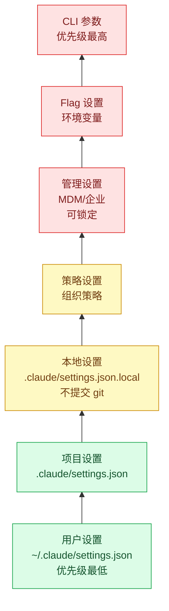
```mermaid
flowchart BT
    U["用户设置\n~/.claude/settings.json\n优先级最低"] --> P["项目设置\n.claude/settings.json"]
    P --> L["本地设置\n.claude/settings.json.local\n不提交 git"]
    L --> Po["策略设置\n组织策略"]
    Po --> M["管理设置\nMDM/企业\n可锁定"]
    M --> F["Flag 设置\n环境变量"]
    F --> C["CLI 参数\n优先级最高"]

    classDef low fill:#dcfce7,stroke:#16a34a,color:#14532d
    classDef mid fill:#fef9c3,stroke:#ca8a04,color:#713f12
    classDef high fill:#fee2e2,stroke:#dc2626,color:#7f1d1d

    class U,P low
    class L,Po mid
    class M,F,C high
```

> **分析：信任层级与覆盖方向**
>
> 注意箭头方向是从下到上——低优先级在底部，高优先级在顶部。这不是偶然的：**越接近"运行时"的设置，优先级越高**。用户设置是"最远的"（编辑一次，长期使用），CLI 参数是"最近的"（每次运行都可以不同）。这种设计让你可以用 CLI 参数临时覆盖任何设置，而不用修改文件。
>
> 另一个关键设计：`lockedByPolicy: true` 可以让管理员锁定沙盒设置，使得用户无法禁用。源码注释提到这是*"Added to unblock NVIDIA enterprise rollout"*——一个真实的企业客户需求驱动了这个特性。

### 5.4 权限决策管道（真实源码）

以下是 `src/utils/permissions/permissions.ts` 中真实的权限管道，注释揭示了每个决策的原因：

```typescript
// src/utils/permissions/permissions.ts — 真实代码
async function hasPermissionsToUseToolInner(
  tool: Tool, input: Record<string, unknown>, context: ToolUseContext,
): Promise<PermissionDecision> {

  if (context.abortController.signal.aborted) throw new AbortError()

  let appState = context.getAppState()

  // ===== 1a. 整个工具被 Deny =====
  const denyRule = getDenyRuleForTool(appState.toolPermissionContext, tool)
  if (denyRule) {
    return { behavior: 'deny', decisionReason: { type: 'rule', rule: denyRule },
      message: `Permission to use ${tool.name} has been denied.` }
  }

  // ===== 1b. 整个工具被 Ask =====
  const askRule = getAskRuleForTool(appState.toolPermissionContext, tool)
  if (askRule) {
    // 特殊情况：沙盒自动允许
    // 当 autoAllowBashIfSandboxed 开启时，沙盒化的命令跳过 ask 规则
    // 不会沙盒化的命令（排除命令、dangerouslyDisableSandbox）仍遵守 ask
    const canSandboxAutoAllow =
      tool.name === BASH_TOOL_NAME &&
      SandboxManager.isSandboxingEnabled() &&
      SandboxManager.isAutoAllowBashIfSandboxedEnabled() &&
      shouldUseSandbox(input)
    if (!canSandboxAutoAllow) {
      return { behavior: 'ask', decisionReason: { type: 'rule', rule: askRule } }
    }
    // 落入下方让 Bash 的 checkPermissions 处理命令级规则
  }

  // ===== 1c. 工具特定权限检查 =====
  let toolPermissionResult: PermissionResult = { behavior: 'passthrough' }
  try {
    const parsedInput = tool.inputSchema.parse(input)
    toolPermissionResult = await tool.checkPermissions(parsedInput, context)
  } catch (e) {
    if (e instanceof AbortError) throw e
    logError(e)
  }

  // ===== 1d. 工具实现拒绝 =====
  if (toolPermissionResult?.behavior === 'deny') return toolPermissionResult

  // ===== 1e. 需要用户交互的工具 =====
  if (tool.requiresUserInteraction?.() && toolPermissionResult?.behavior === 'ask') {
    return toolPermissionResult
  }

  // ===== 1f. 内容级 ask 规则（重要！）=====
  // 当用户配置了内容级 ask 规则如 Bash(npm publish:*)，
  // tool.checkPermissions 返回 {behavior:'ask', decisionReason:{type:'rule', ruleBehavior:'ask'}}
  // 这必须被尊重，即使在 bypassPermissions 模式下！
  if (toolPermissionResult?.behavior === 'ask' &&
      toolPermissionResult.decisionReason?.type === 'rule' &&
      toolPermissionResult.decisionReason.rule.ruleBehavior === 'ask') {
    return toolPermissionResult
  }

  // ===== 1g. 安全检查（不可绕过）=====
  // .git/, .claude/, .vscode/, shell 配置等路径
  // 即使 bypassPermissions 模式也必须提示
  if (toolPermissionResult?.behavior === 'ask' &&
      toolPermissionResult.decisionReason?.type === 'safetyCheck') {
    return toolPermissionResult
  }

  // ===== 2a. 模式检查 =====
  appState = context.getAppState()  // 重新获取最新状态
  const shouldBypassPermissions =
    appState.toolPermissionContext.mode === 'bypassPermissions' ||
    (appState.toolPermissionContext.mode === 'plan' &&
     appState.toolPermissionContext.isBypassPermissionsModeAvailable)
  if (shouldBypassPermissions) {
    return { behavior: 'allow', decisionReason: { type: 'mode', mode: '...' } }
  }

  // ===== 2b. 整个工具被 Allow =====
  const allowRule = toolAlwaysAllowedRule(appState.toolPermissionContext, tool)
  if (allowRule) {
    return { behavior: 'allow', decisionReason: { type: 'rule', rule: allowRule } }
  }

  // ===== 3. passthrough → ask =====
  return toolPermissionResult.behavior === 'passthrough'
    ? { ...toolPermissionResult, behavior: 'ask' }
    : toolPermissionResult
}

// ===== 外层包装：模式转换 =====
export const hasPermissionsToUseTool: CanUseToolFn = async (...) => {
  const result = await hasPermissionsToUseToolInner(...)

  // 允许 → 重置连续拒绝计数器
  if (result.behavior === 'allow') {
    if (feature('TRANSCRIPT_CLASSIFIER') && context.mode === 'auto') {
      persistDenialState(context, recordSuccess(currentDenialState))
    }
    return result
  }

  // ask → 模式转换
  if (result.behavior === 'ask') {
    if (appState.toolPermissionContext.mode === 'dontAsk') {
      return { behavior: 'deny', decisionReason: { type: 'mode', mode: 'dontAsk' } }
    }
    // auto 模式 → AI 分类器（见 5.5 节）
  }
  return result
}
```

**权限决策顺序图**：

```
                    工具调用请求
                        │
          ┌─────────────┼─────────────┐
          │             │             │
     Deny 规则?    Ask 规则?     Allow 规则?
       │ 是            │ 是           │ 是
       v              │             v
     拒绝          沙盒可以        允许
                  自动允许?
                   │ 否
                   v
               tool.checkPermissions()
                   │
          ┌────────┼────────┐
          │        │        │
        deny     ask      allow/
          │        │      passthrough
          v        │        │
        拒绝    内容级规则?   │
                 │ 是       │
                 v         │
               拒绝/询问   │
                           │
                 安全检查?──┤
                  │ 是     │
                  v        │
                 询问      │
                           │
              bypassPermissions?
                  │ 是     │ 否
                  v        v
                允许    Allow 规则?
                         │ 是  │ 否
                         v     v
                       允许   ask → 模式转换
                              ├─ dontAsk → deny
                              ├─ auto → AI 分类器
                              └─ default → 用户提示
```

### 5.5 权限规则解析器（真实源码）

规则字符串的解析比看上去复杂——需要处理转义的括号：

```typescript
// src/utils/permissions/permissionRuleParser.ts — 真实代码

// 输入: "Bash(python -c \"print\\(1\\)\")"
// 输出: { toolName: "Bash", ruleContent: "python -c \"print(1)\"" }
export function permissionRuleValueFromString(ruleString: string): PermissionRuleValue {
  // 找到第一个 **未转义** 的左括号
  const openParenIndex = findFirstUnescapedChar(ruleString, '(')
  if (openParenIndex === -1) {
    return { toolName: normalizeLegacyToolName(ruleString) }
  }

  // 找到最后一个 **未转义** 的右括号
  const closeParenIndex = findLastUnescapedChar(ruleString, ')')
  if (closeParenIndex === -1 || closeParenIndex <= openParenIndex) {
    return { toolName: normalizeLegacyToolName(ruleString) }
  }

  // 右括号必须在末尾
  if (closeParenIndex !== ruleString.length - 1) {
    return { toolName: normalizeLegacyToolName(ruleString) }
  }

  const toolName = ruleString.substring(0, openParenIndex)
  const rawContent = ruleString.substring(openParenIndex + 1, closeParenIndex)

  // 空内容 "Bash()" 或通配符 "Bash(*)" → 工具级规则
  if (rawContent === '' || rawContent === '*') {
    return { toolName: normalizeLegacyToolName(toolName) }
  }

  // 反转义: \\( → (, \\) → ), \\\\ → \\
  const ruleContent = unescapeRuleContent(rawContent)
  return { toolName: normalizeLegacyToolName(toolName), ruleContent }
}

// 判断字符是否被转义（前面有奇数个反斜杠）
function findFirstUnescapedChar(str: string, char: string): number {
  for (let i = 0; i < str.length; i++) {
    if (str[i] === char) {
      let backslashCount = 0
      let j = i - 1
      while (j >= 0 && str[j] === '\\') { backslashCount++; j-- }
      if (backslashCount % 2 === 0) return i  // 偶数个反斜杠 = 未转义
    }
  }
  return -1
}
```

**MCP 服务器级规则匹配**：

```typescript
// 规则 "mcp__server1" 匹配工具 "mcp__server1__tool1"
// 规则 "mcp__server1__*" 匹配 server1 的所有工具
function toolMatchesRule(tool, rule): boolean {
  if (rule.ruleValue.ruleContent !== undefined) return false  // 内容规则不匹配整个工具

  const nameForRuleMatch = getToolNameForPermissionCheck(tool)
  if (rule.ruleValue.toolName === nameForRuleMatch) return true

  // MCP 服务器级匹配
  const ruleInfo = mcpInfoFromString(rule.ruleValue.toolName)
  const toolInfo = mcpInfoFromString(nameForRuleMatch)
  return ruleInfo !== null && toolInfo !== null &&
    (ruleInfo.toolName === undefined || ruleInfo.toolName === '*') &&
    ruleInfo.serverName === toolInfo.serverName
}
```

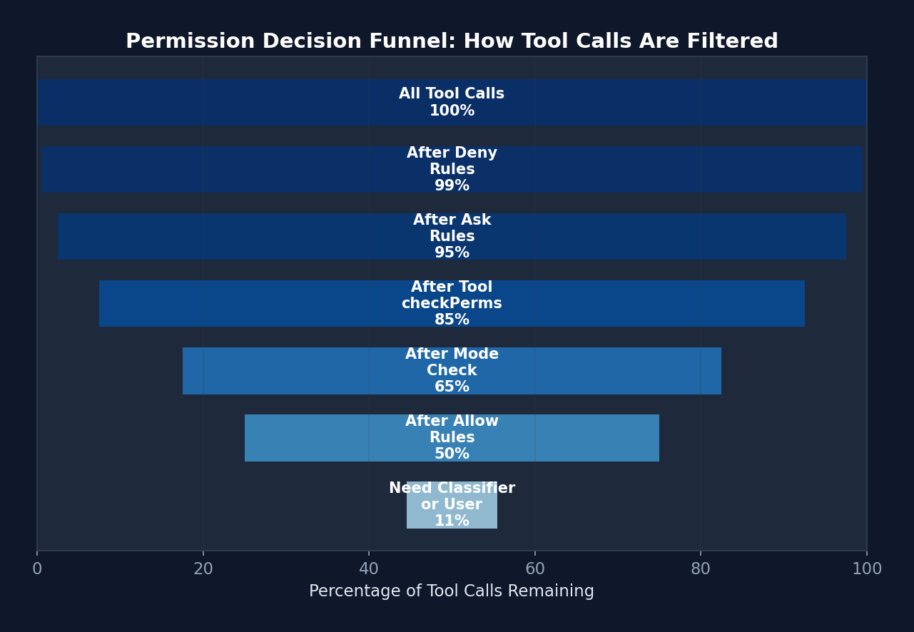
*图 5-2: 权限决策漏斗 — 100% 的工具调用经过逐层过滤，最终只有 ~11% 需要昂贵的分类器或用户确认。前 4 步过滤掉了 89% 的调用，全部是零成本的规则匹配。*

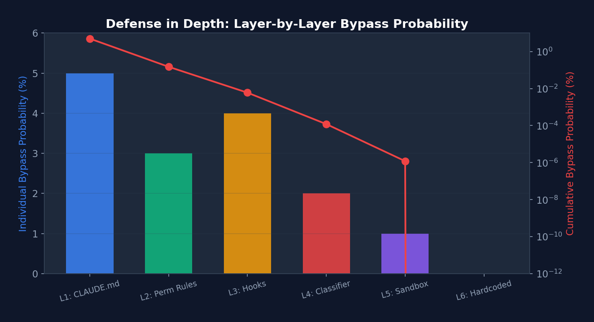
*图 5-3: 纵深防御逐层绕过概率（蓝色柱：单层概率，红色线：累积概率，对数刻度）— 6 层叠加后，累积绕过概率趋近于零。注意第 6 层（硬编码拒绝）的单层概率为 0，使累积概率归零。*

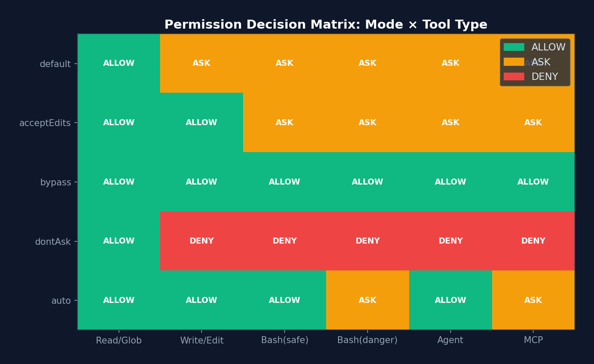
*图 5-4: 权限决策矩阵热力图 — 5 种权限模式 × 6 种工具类型的决策结果。绿色=ALLOW，橙色=ASK，红色=DENY。注意 `auto` 模式下 Bash(danger) 仍为 ASK——分类器对高风险操作采取保守策略。*

### 5.6 定量分析：权限决策的分布

基于 Claude Code 源码中的 analytics 埋点和注释，我们可以推断权限决策的典型分布：

| 决策路径 | 占比（估计） | 延迟 | 成本 |
|----------|------------|------|------|
| **Rule-based Allow** (整个工具) | ~40% | <1ms | 0 |
| **Mode-based Allow** (bypassPermissions) | ~20% | <1ms | 0 |
| **Safe-tool Allowlist** (auto mode) | ~15% | <1ms | 0 |
| **Tool checkPermissions Allow** | ~10% | 1-5ms | 0 |
| **YOLO Classifier Allow** (fast stage) | ~8% | 50-200ms | ~$0.001 |
| **YOLO Classifier Allow** (thinking stage) | ~3% | 500ms-2s | ~$0.01 |
| **User Prompt** (interactive) | ~3% | 1-30s | 0（等待用户） |
| **Deny** (rule or classifier) | ~1% | varies | varies |

> **源码批注**：关于分类器的优化，源码注释道：*"Before running the auto mode classifier, check if acceptEdits mode would allow this action. This avoids expensive classifier API calls for safe operations like file edits."* 这个快速路径检查估计跳过了 ~35% 的分类器调用。另一段注释提到：*"Allowlisted tools are safe and don't need YOLO classification."* 这进一步跳过 ~15%。两者叠加意味着只有约 11% 的工具调用真正需要分类器 API 调用。

> **性能启示**：权限检查的平均延迟约 5-10ms（加权平均），但方差极大。Rule-based 路径几乎无延迟，而分类器路径可能需要 2 秒。这就是为什么 Claude Code 在 `toolExecution.ts` 中实现了**推测性预取**——在 PreToolUse Hook 运行的同时，并行启动 Bash 分类器检查。源码注释道：*"Speculatively start the bash allow classifier check early so it runs in parallel with pre-tool hooks."*

### 5.7 YOLO 分类器（Auto 模式）

`auto` 模式使用一个两阶段 AI 分类器来自动审批工具调用：

```
阶段 1: Fast 分类器
├─ 使用较小/快速模型
├─ 检查：这个操作安全吗？
├─ 返回 confidence: high/medium/low
├─ 如果 high confidence + shouldBlock=false → 直接批准
└─ 如果不确定 → 进入阶段 2

阶段 2: Thinking 分类器
├─ 使用更大/更深思考的模型
├─ 分析完整上下文（对话历史 + 工具输入）
├─ 返回最终判断
└─ 如果仍不确定 → 降级为用户询问

安全工具快速路径:
├─ Read, Glob, Grep 等只读工具
├─ 跳过 API 调用（节省延迟和成本）
└─ 直接返回 allow

连续拒绝跟踪:
├─ 如果分类器连续拒绝多次
├─ 回退到用户提示
└─ 防止分类器过度保守时卡住
```

**设计哲学**：

YOLO 分类器体现了 Harness 工程的核心理念——**不信任模型自己判断操作是否安全**。即使主模型认为操作是正确的，一个独立的"看门人"模型会进行二次审查。两阶段设计在速度和安全性之间取得平衡。

### 5.6 权限决策理由追踪

每个权限决策都附带详细的理由，用于审计和调试：

```typescript
type PermissionDecisionReason =
  | { type: 'rule'; rule: PermissionRule }
  | { type: 'mode'; mode: PermissionMode }
  | { type: 'classifier'; classifier: string; reason: string }
  | { type: 'hook'; hookName: string; reason?: string }
  | { type: 'safetyCheck'; reason: string; classifierApprovable: boolean }
  // ... 更多变体
```

---

## 第六章：Hooks System — 生命周期可扩展性

> 权限模型告诉 Agent "能不能做"，而 Hooks 让你在 Agent "做之前"和"做之后"插入自己的逻辑。
>
> 你可以把 Hooks 想象成机场的安检通道。旅客（工具调用）要通过安检（PreToolUse Hook），通过后可能被贴上标签（PostToolUse Hook），如果行李有问题会被拦下（blocking error）。安检人员可以是人工的（command Hook），也可以是 AI 的（agent Hook），甚至可以是远程的（http Hook）。
>
> Claude Code 定义了 26 种 Hook 事件和 4 种 Hook 类型——这是目前开源可见的最完整的 Agent 生命周期扩展系统。理解它，你就掌握了让 Harness "可定制"的关键。

Hooks 是 Harness 的**扩展点**。它们允许用户在 Agent 生命周期的关键时刻注入自定义逻辑。

### 6.1 26 个 Hook 事件

```typescript
// src/types/hooks.ts — 完整的 Hook 事件列表
type HookEvent =
  // 工具相关
  | 'PreToolUse'        // 工具执行前
  | 'PostToolUse'       // 工具执行后
  | 'PostToolUseFailure'// 工具执行失败后

  // 权限
  | 'PermissionRequest' // 权限请求
  | 'PermissionDenied'  // 权限被拒绝

  // 会话
  | 'SessionStart'      // 会话开始
  | 'SessionEnd'        // 会话结束
  | 'Stop'              // 模型停止
  | 'StopFailure'       // 停止失败

  // 用户输入
  | 'UserPromptSubmit'  // 用户提交提示

  // Agent
  | 'SubagentStart'     // 子 Agent 启动
  | 'SubagentStop'      // 子 Agent 停止
  | 'TeammateIdle'      // 队友空闲

  // 任务
  | 'TaskCreated'       // 任务创建
  | 'TaskCompleted'     // 任务完成

  // 压缩
  | 'PreCompact'        // 压缩前
  | 'PostCompact'       // 压缩后

  // 其他
  | 'Setup'             // 初始设置
  | 'Notification'      // 通知
  | 'Elicitation'       // 信息请求
  | 'ElicitationResult' // 信息请求结果
  | 'ConfigChange'      // 配置变更
  | 'CwdChanged'        // 工作目录变更
  | 'FileChanged'       // 文件变更
  | 'WorktreeCreate'    // Worktree 创建
  | 'WorktreeRemove'    // Worktree 移除
  | 'InstructionsLoaded'; // 指令加载完成
```

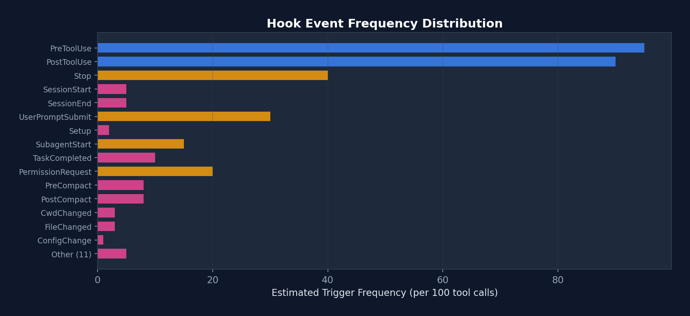
*图 6-1: 26 个 Hook 事件的触发频率估计 — PreToolUse 和 PostToolUse 是最频繁的事件（每次工具调用都触发），SessionStart/End 只在会话边界触发。这解释了为什么 PostToolUse 的内部 Hook 有专门的快速路径优化（-70% 延迟）。*

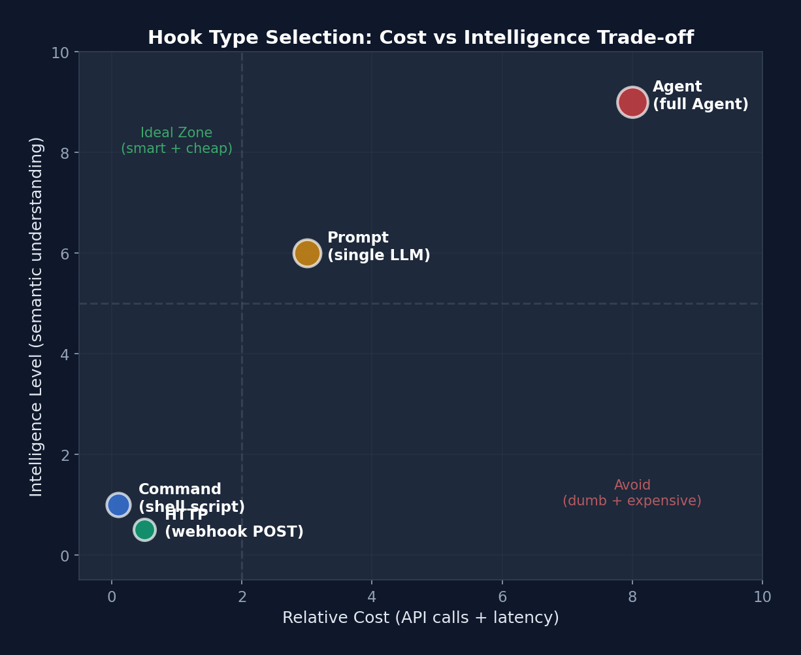
*图 6-2: Hook 类型的成本-智能度散点图 — Command Hook 在左下角（便宜但简单），Agent Hook 在右上角（昂贵但智能）。虚线分隔四个象限：左上是"理想区域"（智能且便宜），右下是"避免区域"（愚蠢且昂贵）。*

### 6.2 Hook 生命周期与类型选择

选择正确的 Hook 类型是 Harness 定制的关键决策。下图帮助你根据场景选择：

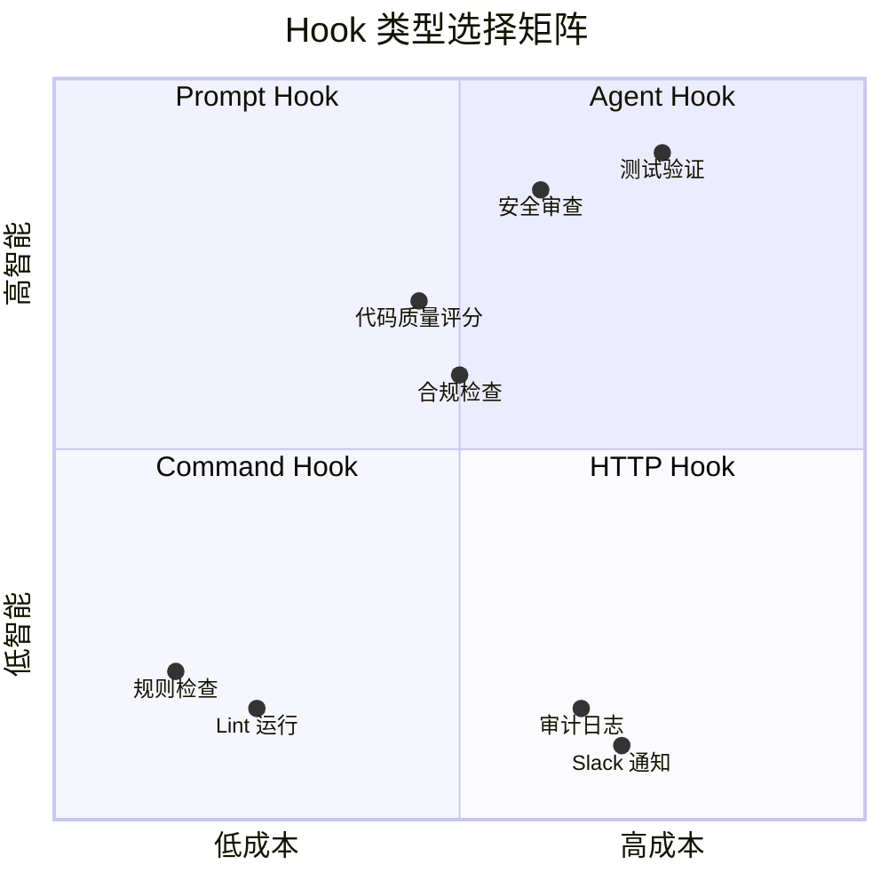
```mermaid
quadrantChart
    title Hook 类型选择矩阵
    x-axis "低成本" --> "高成本"
    y-axis "低智能" --> "高智能"
    quadrant-1 "Agent Hook"
    quadrant-2 "Prompt Hook"
    quadrant-3 "Command Hook"
    quadrant-4 "HTTP Hook"
    "规则检查": [0.15, 0.2]
    "Lint 运行": [0.25, 0.15]
    "安全审查": [0.6, 0.85]
    "测试验证": [0.75, 0.9]
    "Slack 通知": [0.7, 0.1]
    "审计日志": [0.65, 0.15]
    "代码质量评分": [0.45, 0.7]
    "合规检查": [0.5, 0.6]
```

> **解读**：左下角是 Command Hook 的领地——简单、便宜、确定性强（如 lint、grep 检查）。右上角是 Agent Hook——最聪明但最贵（需要完整的 Claude 调用来理解代码语义）。HTTP Hook 在右下——成本中等（网络延迟），但智能低（只是 POST 数据）。Prompt Hook 在中间偏上——单次 LLM 判断，比 Agent 便宜但比脚本聪明。

### 四种 Hook 类型

#### 类型 1: Command Hook（Shell 命令）

```json
{
  "type": "command",
  "command": "npm test -- --bail",
  "if": "Bash(npm *)",
  "shell": "bash",
  "timeout": 30,
  "statusMessage": "Running tests...",
  "once": false,
  "async": false,
  "asyncRewake": false
}
```

**执行流程**：
1. 路径转换（Windows: `C:\Users\foo` → `/c/Users/foo`）
2. 变量替换（`${CLAUDE_PROJECT_DIR}`, `${CLAUDE_PLUGIN_ROOT}`）
3. Shell 选择（Bash 或 PowerShell）
4. JSON 输入写入 stdin
5. 逐行解析 stdout（检测异步信号和 prompt 请求）
6. 退出码判断结果

**退出码语义**：
- `0`: 成功，stdout 内容可选展示
- `2`: 阻止性错误，stderr 展示给模型和用户
- 其他: 非阻止性错误，stderr 仅展示给用户

#### 类型 2: Prompt Hook（LLM 评估）

```json
{
  "type": "prompt",
  "prompt": "Review this code change for security vulnerabilities: $ARGUMENTS",
  "model": "claude-sonnet-4-6",
  "timeout": 60
}
```

使用一个独立的 LLM 调用来评估 Hook 输入。适合需要语义理解的检查（如代码安全审查）。

#### 类型 3: HTTP Hook（外部服务）

```json
{
  "type": "http",
  "url": "https://hooks.slack.com/triggers/...",
  "headers": {
    "Authorization": "Bearer $SLACK_TOKEN"
  },
  "allowedEnvVars": ["SLACK_TOKEN"],
  "timeout": 10
}
```

POST JSON 到外部 URL。`headers` 中的 `$VAR_NAME` 语法从白名单环境变量插值。`allowedEnvVars` 限制可访问的环境变量，防止意外泄露。

#### 类型 4: Agent Hook（Agent 验证器）

```json
{
  "type": "agent",
  "prompt": "Verify that the test suite passes and no regressions were introduced",
  "model": "claude-sonnet-4-6",
  "timeout": 120
}
```

使用一个完整的 Claude Agent（带工具访问）来验证操作。成本最高但最强大——Agent 可以读取文件、运行测试、检查结果。

### 6.3 Hook 配置结构

```json
// ~/.claude/settings.json
{
  "hooks": {
    "PreToolUse": [
      {
        "matcher": "Write",
        "hooks": [
          {
            "type": "command",
            "command": "eslint --stdin --stdin-filename=$TOOL_INPUT_FILE_PATH",
            "if": "Write(*.ts)"
          }
        ]
      },
      {
        "matcher": "Bash",
        "hooks": [
          {
            "type": "command",
            "command": "echo '{\"decision\": \"block\", \"reason\": \"sudo is not allowed\"}' ",
            "if": "Bash(sudo *)"
          }
        ]
      }
    ],
    "PostToolUse": [
      {
        "hooks": [
          {
            "type": "http",
            "url": "https://audit.company.com/log",
            "headers": { "Authorization": "Bearer $AUDIT_TOKEN" },
            "allowedEnvVars": ["AUDIT_TOKEN"]
          }
        ]
      }
    ],
    "SessionEnd": [
      {
        "hooks": [
          {
            "type": "command",
            "command": "git stash",
            "timeout": 10
          }
        ]
      }
    ]
  }
}
```

### 6.4 Hook 输入/输出协议

**输入**（通过 stdin 传递的 JSON）：

```typescript
// 所有 Hook 的基础字段
{
  session_id: string,
  transcript_path: string,
  cwd: string,
  permission_mode?: string,
  agent_id?: string,
  agent_type?: string,
}

// PreToolUse 特有字段
{
  tool_name: "Write",
  tool_input: { file_path: "/src/index.ts", content: "..." },
  tool_use_id: "toolu_xxx",
}

// PostToolUse 特有字段
{
  tool_name: "Bash",
  tool_input: { command: "npm test" },
  tool_response: { stdout: "...", exit_code: 0 },
  tool_use_id: "toolu_xxx",
}

// UserPromptSubmit
{
  prompt_text: "Fix the bug in login.ts",
}

// SessionStart
{
  source: "startup" | "resume" | "clear" | "compact",
}
```

**输出**（stdout 返回的 JSON）：

```typescript
type HookJSONOutput = {
  // 全局控制
  continue?: boolean;           // false = 停止对话
  stopReason?: string;
  decision?: 'approve' | 'block';
  reason?: string;
  systemMessage?: string;       // 注入系统消息
  suppressOutput?: boolean;

  // 权限相关
  permissionDecision?: 'allow' | 'deny' | 'ask';

  // 事件特定
  hookSpecificOutput?: {
    updatedInput?: object;           // 修改工具输入（PreToolUse）
    additionalContext?: string;       // 注入额外上下文
    watchPaths?: string[];           // 注册文件监视器
    updatedMCPToolOutput?: unknown;  // 修改 MCP 工具输出
    action?: 'accept' | 'decline' | 'cancel';
  }
};
```

### 6.5 Hook 执行引擎深度剖析

以下是 `src/utils/hooks.ts` 中 Hook 执行引擎的真实实现：

```typescript
// src/utils/hooks.ts — 真实代码（简化但保留关键逻辑）
async function* executeHooks({
  hookInput, toolUseID, matchQuery, signal, timeoutMs,
  toolUseContext, messages, forceSyncExecution, requestPrompt,
}) {
  // 安全检查 1: 全局禁用
  if (shouldDisableAllHooksIncludingManaged()) return
  if (isEnvTruthy(process.env.CLAUDE_CODE_SIMPLE)) return

  // 安全检查 2: 工作空间信任
  // 所有 Hook 都需要工作空间信任（防止 RCE 漏洞）
  if (shouldSkipHookDueToTrust()) return

  // 查找匹配的 Hook
  const matchingHooks = await getMatchingHooks(
    appState, sessionId, hookEvent, hookInput, tools,
  )
  if (matchingHooks.length === 0) return

  // ===== 快速路径优化 =====
  // 如果所有 Hook 都是内部回调（如 sessionFileAccessHooks、attributionHooks）
  // 跳过 span/progress/abortSignal/JSON处理 → 性能提升 70%
  const userHooks = matchingHooks.filter(h => !isInternalHook(h))
  if (userHooks.length === 0) {
    // 6.01µs → ~1.8µs per PostToolUse hit (-70%)
    for (const { hook } of matchingHooks) {
      if (hook.type === 'callback') {
        await hook.callback(hookInput, toolUseID, signal, context)
      }
    }
    return
  }

  // ===== 并行执行所有 Hook =====
  // 每个 Hook 有独立的超时
  // ... 聚合结果 ...
}
```

#### Command Hook 的 Shell 执行

```typescript
// src/utils/hooks.ts — execCommandHook 的关键细节
async function execCommandHook(hook, hookEvent, hookName, jsonInput, signal, ...) {
  // 1. Shell 选择
  // PowerShell: pwsh -NoProfile -NonInteractive -Command
  // Bash: spawn(command, [], { shell: gitBashPath | true })

  // 2. 变量替换
  // ${CLAUDE_PROJECT_DIR} → 项目目录
  // ${CLAUDE_PLUGIN_ROOT} → 插件目录
  // ${CLAUDE_PLUGIN_DATA} → 插件数据目录
  // ${user_config.X} → 插件配置值

  // 3. stdin 写入（UTF-8 编码）
  child.stdin.write(jsonInput + '\n', 'utf8')

  // 4. stdout 逐行解析
  child.stdout.on('data', data => {
    stdout += data

    // ===== Prompt Request 协议 =====
    // Hook 可以请求用户输入！
    // 输出行格式: {"prompt": {"type": "text", "message": "Enter value:"}}
    if (requestPrompt) {
      for (const line of lines) {
        const parsed = jsonParse(line.trim())
        const validation = promptRequestSchema().safeParse(parsed)
        if (validation.success) {
          // 序列化异步 prompt 处理
          promptChain = promptChain.then(async () => {
            const response = await requestPrompt(validation.data)
            child.stdin.write(jsonStringify(response) + '\n', 'utf8')
          })
          continue
        }
      }
    }

    // ===== 异步检测 =====
    // 第一行输出如果是 {"async": true, ...}
    // → 将进程转入后台，主线程继续
    if (!initialResponseChecked) {
      const firstLine = firstLineOf(stdout).trim()
      const parsed = jsonParse(firstLine)
      if (isAsyncHookJSONOutput(parsed) && !forceSyncExecution) {
        executeInBackground({ processId, hookId, ... })
        shellCommandTransferred = true
        resolve({ stdout, stderr, output, status: 0 })
      }
    }
  })

  // 5. 等待完成
  // 关键：等待 stdout 和 stderr 流结束后再认为输出完成
  // 防止 'close' 事件在所有 'data' 事件处理前触发的竞态条件
  await Promise.all([stdoutEndPromise, stderrEndPromise])

  // 6. 剥离已处理的 prompt 请求行
  // 使用内容匹配而非索引，防止索引漂移导致的 prompt JSON 泄露
  const finalStdout = processedPromptLines.size === 0 ? stdout :
    stdout.split('\n').filter(line => !processedPromptLines.has(line.trim())).join('\n')

  return { stdout: finalStdout, stderr, output, status: exitCode }
}
```

**Hook JSON 输出处理**：

```typescript
// Hook 输出被解析为 JSON，提取决策和副作用
function processHookJSONOutput({ json, ... }) {
  const result = {}

  // 全局控制
  if (json.continue === false) result.preventContinuation = true

  // 决策
  if (json.decision === 'approve') result.permissionBehavior = 'allow'
  if (json.decision === 'block') {
    result.permissionBehavior = 'deny'
    result.blockingError = { blockingError: json.reason || 'Blocked by hook' }
  }

  // 事件特定字段
  if (json.hookSpecificOutput?.hookEventName === 'PreToolUse') {
    if (json.hookSpecificOutput.updatedInput) {
      result.updatedInput = json.hookSpecificOutput.updatedInput  // 修改工具输入
    }
    result.additionalContext = json.hookSpecificOutput.additionalContext
  }

  if (json.hookSpecificOutput?.hookEventName === 'PostToolUse') {
    if (json.hookSpecificOutput.updatedMCPToolOutput) {
      result.updatedMCPToolOutput = json.hookSpecificOutput.updatedMCPToolOutput
    }
  }

  return result
}
```

### 6.6 异步 Hook 协议

```typescript
// Hook 可以通过第一行 JSON 信号异步执行：
// stdout 第一行: {"async": true, "asyncTimeout": 60000}
// 此后 Hook 在后台运行

// 或通过配置：
{ type: 'command', command: '...', async: true, asyncRewake: true }

// asyncRewake: 如果退出码为 2，排入通知队列唤醒模型
// 用例：后台运行测试套件，失败时通知 Agent
```

### 6.6 条件执行（if 字段）

Hook 的 `if` 字段使用与权限规则相同的语法：

```json
// 只对 git 命令运行
{ "if": "Bash(git *)" }

// 只对 TypeScript 文件写入运行
{ "if": "Write(*.ts)" }

// 只对 npm 命令运行
{ "if": "Bash(prefix:npm)" }

// 匹配所有 Bash 调用
{ "if": "Bash" }
```

**设计哲学**：

Hook 系统的设计遵循"**数据驱动的可扩展性**"原则。而不是让用户修改源码，所有定制都通过 `settings.json` 中的声明性配置完成。四种 Hook 类型覆盖了从简单的 Shell 脚本到完整 Agent 验证的全部场景，退出码语义统一且简单。

> **实践建议**：如果你是第一次使用 Hooks，从最简单的开始——一个 PreToolUse 的 command hook，打印工具名称和输入。等你熟悉了输入/输出协议，再尝试条件执行（`if` 字段）和 HTTP 回调。Agent hook 是最强大的，但也最昂贵（每次调用都需要一次完整的 Agent 执行），留到你确实需要"理解代码语义"的场景再用。

> **常见陷阱**：不要在 Stop hook 中做太重的操作。如果你的 Stop hook 注入了大量 token（比如一整个测试报告），可能触发 prompt-too-long 错误，而 prompt-too-long 的恢复会跳过 Stop hook（防止死亡螺旋），导致你的逻辑被静默跳过。保持 Stop hook 轻量——如果需要传递大量信息，存到文件里让 Agent 自己读。

---

## 第七章：Sandbox & Security — 安全网

> 如果权限模型是围栏，Hooks 是安检，那沙盒就是**物理隔离墙**。前两者是逻辑层面的控制——它们依赖软件正确执行。但软件可能有 bug，逻辑可能被绕过。沙盒则在操作系统层面做隔离：即使 Agent 的代码有漏洞，它也无法访问不该访问的文件或网络。
>
> 这就是安全工程中经典的"纵深防御"（Defense in Depth）原则：不要把安全押在单一机制上，而是层层叠加。Claude Code 有六层防御，沙盒是倒数第二层（最后一层是硬编码拒绝）。

沙盒是 Harness 的最后一道防线。即使权限模型和 Hook 都被绕过，沙盒仍然限制 Agent 能做的事情。

### 7.1 沙盒架构

```
┌─────────────────────────────────────────────────┐
│                 Claude Code                      │
│                                                  │
│  BashTool.call()                                │
│      │                                           │
│      v                                           │
│  shouldUseSandbox()                              │
│      │                                           │
│      ├─ 沙盒是否启用？                            │
│      ├─ dangerouslyDisableSandbox 是否允许？       │
│      ├─ 命令是否在排除列表中？                     │
│      │                                           │
│      v                                           │
│  SandboxManager.wrapWithSandbox(command)         │
│      │                                           │
│      v                                           │
│  @anthropic-ai/sandbox-runtime                   │
│      │                                           │
│      ├─ 文件系统限制                              │
│      ├─ 网络限制                                  │
│      └─ 进程限制                                  │
│                                                  │
└─────────────────────────────────────────────────┘
```

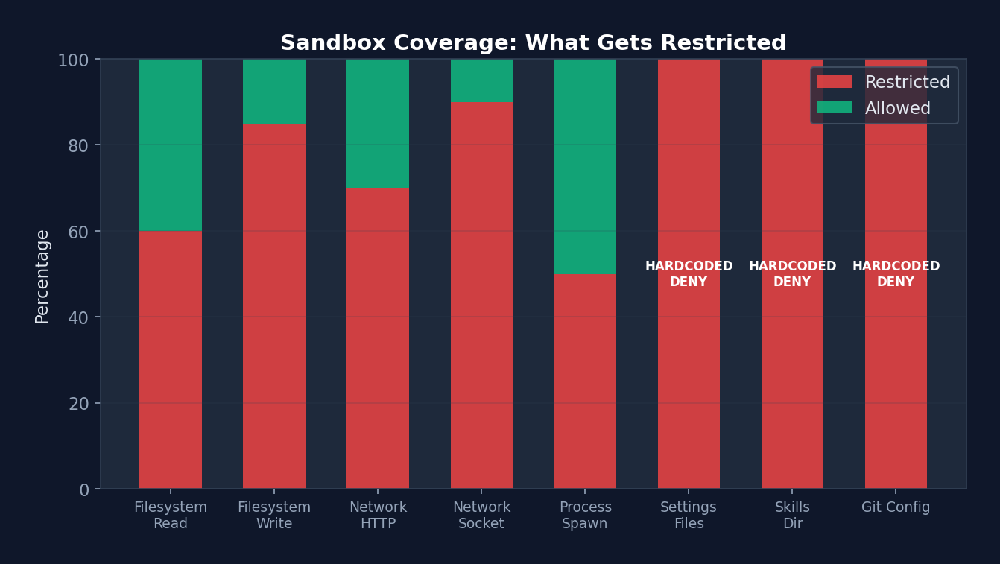
*图 7-1: 沙盒覆盖范围 — Settings Files、Skills Dir 和 Git Config 被 100% 限制（硬编码 DENY），无法通过配置放开。Filesystem Write 限制率 85%（大部分路径受限，仅允许项目目录）。Process Spawn 限制率最低（50%），因为某些命令（如 Docker）需要绕过沙盒。*

### 7.2 三大限制维度

#### 文件系统限制

```typescript
interface FsReadRestrictionConfig {
  allowRead: string[];   // 允许读取的路径模式
  denyRead: string[];    // 禁止读取的路径模式
}

interface FsWriteRestrictionConfig {
  allowWrite: string[];  // 允许写入的路径模式
  denyWrite: string[];   // 禁止写入的路径模式
}

// 路径语法:
// "/path"   — 相对于设置根路径
// "//path"  — 绝对路径（从根目录开始）
// "~/path"  — 用户主目录
// "./path"  — 当前工作目录
// "*.ext"   — 通配符模式
```

**安全硬编码**：
- `.claude/settings*.json` **始终** deny write（防止沙盒逃逸）
- `.claude/skills`, `.claude/commands` **始终** deny write（防止注入恶意代码）
- 检测裸仓库文件（`HEAD`, `objects`, `refs`）并在命令后清除

#### 网络限制

```typescript
interface NetworkRestrictionConfig {
  allowedDomains: string[];     // 允许的域名模式
  deniedDomains: string[];      // 禁止的域名模式
  allowUnixSockets?: boolean;   // Unix socket 访问
  allowLocalBinding?: boolean;  // 本地端口绑定
}
```

#### 命令排除

```typescript
// settings.sandbox.excludedCommands
// 匹配模式:
//   "cmd:"    — 前缀匹配
//   "cmd"     — 精确匹配
//   "cmd*"    — 通配符

// 注意: 这 **不是** 安全边界
// 仅为便利功能（跳过沙盒以避免兼容性问题）
```

### 7.3 路径解析（CC 特有约定）

Claude Code 使用特殊的路径前缀约定，与 sandbox-runtime 的标准路径不同：

```typescript
// src/utils/sandbox/sandbox-adapter.ts — 真实代码
export function resolvePathPatternForSandbox(
  pattern: string, source: SettingSource,
): string {
  // "//" 前缀 → 从文件系统根目录开始的绝对路径
  // "//.aws/**" → "/.aws/**"
  if (pattern.startsWith('//')) {
    return pattern.slice(1)
  }

  // "/" 前缀 → 相对于设置文件目录
  // 权限规则中 "/foo/**" → "${settings_root}/foo/**"
  if (pattern.startsWith('/') && !pattern.startsWith('//')) {
    const root = getSettingsRootPathForSource(source)
    return resolve(root, pattern.slice(1))
  }

  // 其他模式（~/path, ./path, path）直接传递
  // sandbox-runtime 的 normalizePathForSandbox 会处理
  return pattern
}
```

**沙盒初始化流程**：

```typescript
// 沙盒初始化是异步的，但必须在第一个命令执行前完成
async function initialize(sandboxAskCallback?) {
  if (initializationPromise) return initializationPromise
  if (!isSandboxingEnabled()) return

  // 包装回调以强制执行 allowManagedDomainsOnly 策略
  const wrappedCallback = sandboxAskCallback ? async (hostPattern) => {
    if (shouldAllowManagedSandboxDomainsOnly()) {
      logForDebugging(`Blocked: ${hostPattern.host} (allowManagedDomainsOnly)`)
      return false
    }
    return sandboxAskCallback(hostPattern)
  } : undefined

  // 创建 Promise（在任何 await 之前同步创建，防止竞态条件）
  initializationPromise = (async () => {
    // 检测 worktree 主仓库路径（会话期间不变，缓存）
    if (worktreeMainRepoPath === undefined) {
      worktreeMainRepoPath = await detectWorktreeMainRepoPath(getCwdState())
    }

    const settings = getSettings_DEPRECATED()
    const runtimeConfig = convertToSandboxRuntimeConfig(settings)
    await BaseSandboxManager.initialize(runtimeConfig, wrappedCallback)

    // 订阅设置变更，动态更新沙盒配置
    settingsSubscriptionCleanup = settingsChangeDetector.subscribe(() => {
      const newConfig = convertToSandboxRuntimeConfig(getSettings_DEPRECATED())
      BaseSandboxManager.updateConfig(newConfig)
    })
  })()

  return initializationPromise
}
```

### 7.4 权限规则到沙盒配置的转换

Claude Code 将其权限规则语法转换为 sandbox-runtime 的配置格式：

```typescript
// 权限规则 → 沙盒路径转换
// Edit(/path/to/dir/*) → sandbox.filesystem.allowWrite
// Read(/patterns)      → sandbox.filesystem.allowRead
// WebFetch(domain:example.com) → sandbox.network.allowedDomains

function convertToSandboxConfig(
  permissionRules: PermissionRule[],
  sandboxSettings: SandboxSettings,
): SandboxRuntimeConfig {
  // 合并权限规则和沙盒设置
  // 权限规则中的 allow 规则 → sandbox 的 allow 列表
  // 沙盒设置直接映射
  // deny 规则始终包含安全硬编码
}
```

### 7.4 沙盒启用检查

```typescript
function isSandboxingEnabled(): boolean {
  return isSupportedPlatform()           // macOS, Linux, WSL2+
    && checkDependencies().errors.length === 0  // bubblewrap, socat
    && isPlatformInEnabledList()         // sandbox.enabledPlatforms
    && getSandboxEnabledSetting();       // 用户设置
}

// 依赖检查（带缓存）
function checkDependencies(): { errors: string[], warnings: string[] } {
  // 检查: bubblewrap 可执行文件
  // 检查: socat 可执行文件
  // 检查: cap_setfcap capability
}
```

### 7.5 dangerouslyDisableSandbox

```typescript
// BashTool 的输入参数
{
  command: "docker build .",
  dangerouslyDisableSandbox: true  // 跳过沙盒
}

// 仅当设置允许时生效:
// settings.sandbox.allowUnsandboxedCommands = true

// 设计意图: 某些命令（如 Docker）不兼容沙盒
// 但必须显式请求并记录在案
```

**设计哲学**：

沙盒的设计遵循**纵深防御**（Defense in Depth）原则。即使权限模型允许了一个操作，沙盒仍然限制该操作的"爆炸半径"。关键的安全文件（设置、技能）被硬编码为不可写，这是一个**不依赖配置的安全保障**。

> **为什么设置文件被硬编码为不可写？** 想象这个场景：Agent 发现沙盒限制了它的操作，于是它"聪明地"修改 `settings.json` 把沙盒关掉，然后继续。这就是一个**沙盒逃逸**攻击。Claude Code 通过硬编码 deny write `.claude/settings*.json` 来防止这种情况——即使所有其他安全层都被绕过，这条规则依然生效。这是安全工程中"不可信代码不能修改信任边界"原则的体现。

---

## 第八章：Context Engineering — 信息管理的艺术

> 前面五章讲的都是"Agent 做什么"和"Agent 不能做什么"。这一章换个角度——"Agent 知道什么"。
>
> 想象你是一个新员工，第一天上班。如果没人告诉你公司的代码规范、架构决策、已知 bug，你写的代码大概率不符合要求。Agent 也一样——它的表现直接取决于它能"看到"什么信息。
>
> Context Engineering 就是管理 Agent "视野"的学科。它回答三个问题：
> 1. Agent 应该知道什么？（CLAUDE.md、记忆系统）
> 2. 什么时候告诉它？（按需加载、预取）
> 3. 信息太多了怎么办？（四级压缩管道）
>
> Claude Code 在这方面的设计尤为精巧——一个 200 行的记忆索引、一个四级压缩管道、一个并行预取机制，共同构成了业界最精密的 Agent 上下文管理系统。

Context Engineering 是 Harness Engineering 的第一支柱。它管理什么信息在什么时候以什么形式进入模型的上下文窗口。

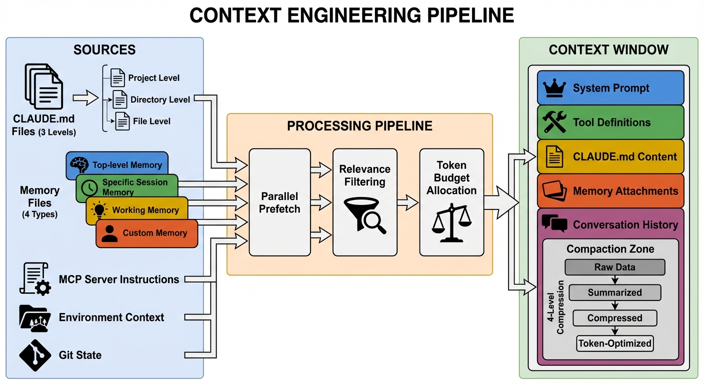
*图 8-1: 上下文工程管道 — 信息从多个来源（CLAUDE.md、记忆文件、MCP 指令、环境上下文）流入模型的上下文窗口，经过并行预取、相关性过滤和 Token 预算分配。右侧展示上下文窗口的组成和四级压缩区域。*

### 8.1 定量分析：上下文窗口的预算分配

Claude Code 的上下文窗口（假设 200K tokens）的典型预算分配：

| 组成部分 | 估计 Token 占比 | 大小 | 是否压缩 |
|----------|----------------|------|---------|
| **系统提示** (base) | ~5-8% | 10-16K | 否（缓存前缀） |
| **工具定义** (15 核心 + N MCP) | ~8-15% | 16-30K | 否（缓存前缀） |
| **CLAUDE.md 内容** | ~2-5% | 4-10K | 否 |
| **MCP 服务器指令** | ~1-3% | 2-6K | 否 |
| **记忆附件** | ~1-2% | 2-4K | 否（按需附加） |
| **对话历史** | ~60-80% | 120-160K | 是（四级管道） |
| **预留空间** (模型输出) | ~5-10% | 10-20K | N/A |

> **关键洞察**：对话历史占 60-80% 的上下文空间，这就是为什么压缩管道如此重要。系统提示和工具定义占 13-23%——这也是为什么工具延迟加载（ToolSearch）有价值：从 43 个工具加载 15 个可以节省 ~8% 的上下文空间，在长对话中这相当于多 16K tokens 的对话历史。
>
> **缓存经济学**：系统提示和工具定义作为缓存前缀（~30-46K tokens）。Anthropic API 的 prompt cache 对前缀匹配的部分不收取输入费用。按 $3/M input tokens 计算，每次 API 调用节省约 $0.0001-0.00014。一个典型会话有 20-50 次 API 调用，总节省约 $0.002-0.007/会话。规模化后（百万级日活），这是显著的成本优化。

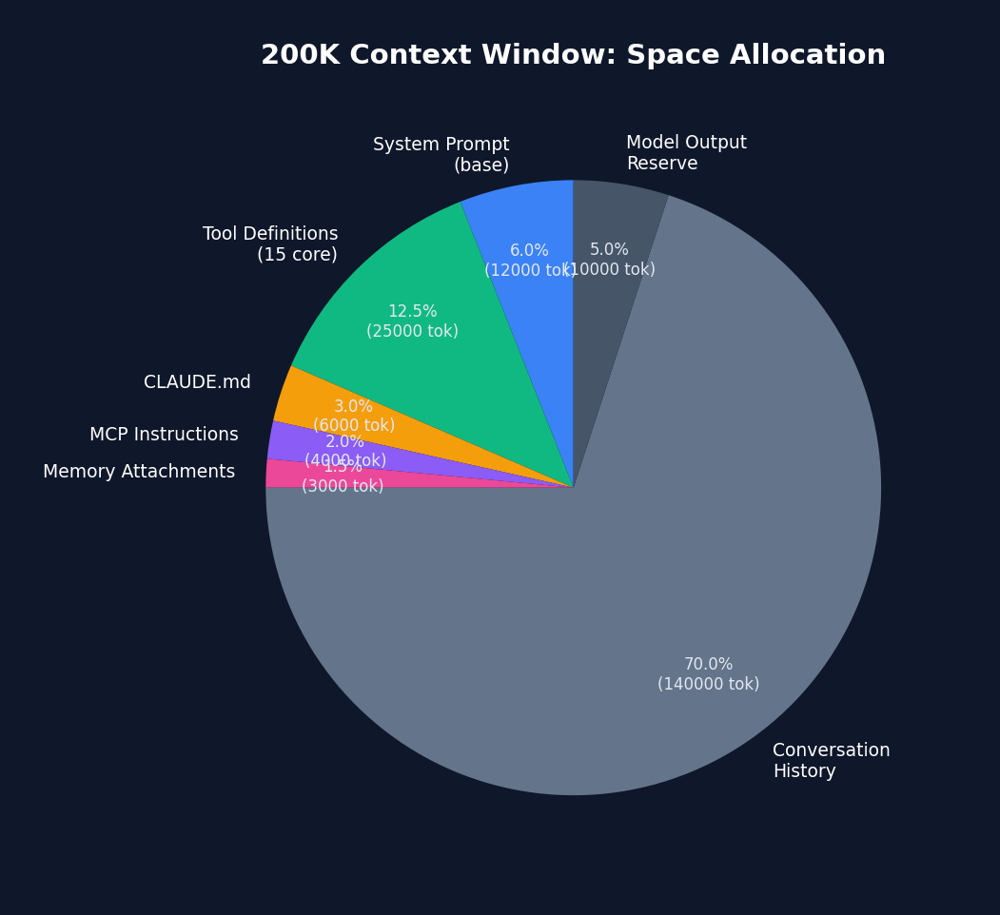
*图 8-2: 200K 上下文窗口的空间分配 — 对话历史占 70%（140K tokens），是压缩管道的主要目标。系统提示 + 工具定义合计 ~18.5%，这是 prompt cache 的主要受益区域。*


*图 8-3: 四级压缩管道的 Token 增长曲线（50 轮对话）— 红色虚线：无压缩时在第 45 轮突破 200K 限制。紫色线（完整管道）：在第 15 轮触发 Autocompact 后 Token 降至 45K，之后缓慢增长。这使得 Claude Code 可以处理 100+ 轮的长对话而不中断。*

### 8.2 CLAUDE.md — 项目级持久上下文

CLAUDE.md 是 Claude Code 的核心上下文机制。它是一个 Markdown 文件，提供项目级的持久上下文：

```markdown
# CLAUDE.md

## 项目概述
这是一个 Next.js 14 应用，使用 TypeScript + Tailwind CSS。

## 架构约束
- 组件放在 src/components/
- API 路由放在 src/app/api/
- 不要使用 class 组件
- 所有 API 调用必须使用 fetch，不要用 axios

## 命名规范
- 组件：PascalCase
- 工具函数：camelCase
- 常量：UPPER_SNAKE_CASE

## 测试
- 运行测试: npm test
- 测试框架: Jest + React Testing Library
- 覆盖率要求: >80%

## 已知问题
- #123: 登录页面在 Safari 下有布局问题
- 不要修改 legacy/ 目录下的文件
```

**加载层级**：
```
~/.claude/CLAUDE.md              # 全局（所有项目）
.claude/CLAUDE.md                # 项目级
.claude/CLAUDE.md.local          # 本地覆盖（不提交 git）
子目录/CLAUDE.md                 # 目录级（进入时加载）
```

### 8.2 系统提示构建管道

```typescript
// src/QueryEngine.ts — 系统提示构建
function buildSystemPrompt(): SystemPrompt {
  const parts = [];

  // 1. 基础系统提示（工具描述、行为指南）
  parts.push(getBaseSystemPrompt());

  // 2. 工具定义
  for (const tool of tools) {
    parts.push(tool.prompt(context));
  }

  // 3. CLAUDE.md 内容
  parts.push(loadClaudeMd());

  // 4. MCP 服务器指令
  for (const mcp of mcpClients) {
    parts.push(mcp.instructions);
  }

  // 5. 自定义系统提示（用户覆盖）
  if (customPrompt) parts.push(customPrompt);

  // 6. 记忆机制提示（如有记忆系统）
  if (memoryEnabled) parts.push(memoryMechanicsPrompt);

  return asSystemPrompt(parts.join('\n'));
}
```

### 8.3 记忆系统

Claude Code 实现了一个文件基的持久记忆系统，位于 `src/memdir/`。

#### 四种记忆类型

```typescript
type MemoryType =
  | 'user'       // 用户角色、偏好、知识水平
  | 'feedback'   // 工作方法指导（什么可做/避免）
  | 'project'    // 正在进行的工作、目标、倒计时
  | 'reference'; // 外部系统指针
```

#### 记忆文件格式

```markdown
---
name: user-prefers-terse-responses
description: 用户不喜欢冗长的总结，希望简洁直接的回复
type: feedback
---

不要在每次回复末尾总结刚做的事情——用户可以自己读 diff。

**Why:** 用户明确表示不喜欢尾部总结。
**How to apply:** 所有回复保持简洁，不加尾部总结段落。
```

#### 记忆索引（MEMORY.md）

```markdown
- [User Role](user_role.md) — 高级 Go 工程师，React 新手
- [Terse Responses](feedback_terse.md) — 不要尾部总结
- [Auth Rewrite](project_auth.md) — 合规驱动的认证中间件重写
- [Bug Tracker](reference_linear.md) — 管道 bug 在 Linear INGEST 项目
```

#### 记忆扫描与附加

```typescript
// src/memdir/memoryScan.ts
function scanMemories(memoryDir: string): MemoryHeader[] {
  // 扫描 ~/.claude/memory/ 目录
  // 读取每个 .md 文件的 frontmatter
  // 按修改时间排序（最新优先）
  // 上限: MAX_MEMORY_FILES = 200
  return headers;
}

// 与查询循环集成
// 1. 在流式响应期间开始记忆扫描（预取）
startRelevantMemoryPrefetch();

// 2. 过滤相关记忆并创建附件消息
const attachments = getAttachmentMessages(memories, userMessage);

// 3. 附加到用户消息
messages.push(...attachments);
```

#### 记忆扫描的真实实现

```typescript
// src/memdir/memoryScan.ts — 真实代码
// 单次遍历：stat + read 合并（减少系统调用）
// 对于常见情况（N ≤ 200），相比先 stat 排序再 read，系统调用减半
export async function scanMemoryFiles(
  memoryDir: string, signal: AbortSignal,
): Promise<MemoryHeader[]> {
  try {
    const entries = await readdir(memoryDir, { recursive: true })
    const mdFiles = entries.filter(
      f => f.endsWith('.md') && basename(f) !== 'MEMORY.md',
    )

    const headerResults = await Promise.allSettled(
      mdFiles.map(async (relativePath): Promise<MemoryHeader> => {
        const filePath = join(memoryDir, relativePath)
        // 只读取前 FRONTMATTER_MAX_LINES 行（优化大文件）
        const { content, mtimeMs } = await readFileInRange(
          filePath, 0, FRONTMATTER_MAX_LINES, undefined, signal,
        )
        const { frontmatter } = parseFrontmatter(content, filePath)
        return {
          filename: relativePath,
          filePath,
          mtimeMs,
          description: frontmatter.description || null,
          type: parseMemoryType(frontmatter.type),
        }
      }),
    )

    return headerResults
      .filter((r): r is PromiseFulfilledResult<MemoryHeader> =>
        r.status === 'fulfilled')
      .map(r => r.value)
      .sort((a, b) => b.mtimeMs - a.mtimeMs)  // 最新优先
      .slice(0, MAX_MEMORY_FILES)  // 上限 200
  } catch {
    return []  // 目录不存在时优雅降级
  }
}
```

**记忆清单格式化**：

```typescript
// 用于记忆选择提示和提取 Agent 提示
export function formatMemoryManifest(memories: MemoryHeader[]): string {
  return memories.map(m => {
    const tag = m.type ? `[${m.type}] ` : ''
    const ts = new Date(m.mtimeMs).toISOString()
    return m.description
      ? `- ${tag}${m.filename} (${ts}): ${m.description}`
      : `- ${tag}${m.filename} (${ts})`
  }).join('\n')
}
```

**设计哲学**：

记忆系统遵循**显式优于隐式**原则。记忆是结构化的 Markdown 文件（不是数据库），有明确的类型和元数据。MEMORY.md 索引限制在 200 行以内，防止记忆膨胀。记忆扫描与 API 调用**并行执行**（预取），不增加延迟。

`Promise.allSettled`（而非 `Promise.all`）确保单个损坏的记忆文件不会导致整个扫描失败——这是防御性编程在 Harness 中的体现。

### 8.4 上下文压缩策略

（详见 3.3 节的四级压缩管道）

关键补充：

```
全转录保存策略:
├─ 每次 autocompact 前保存完整转录到磁盘
├─ 路径: ~/.claude/history/<session_id>/
├─ 用途: --resume 恢复、审计、调试
└─ 不参与压缩决策（仅备份）

预算跟踪跨压缩:
├─ taskBudgetRemaining 在压缩前捕获
├─ 跨多次压缩累计
└─ 确保总支出不超预算
```

### 8.5 动态上下文

```typescript
// src/context.ts — 环境上下文收集
function collectContext(): UserContext {
  return {
    currentDate: new Date(),
    platform: process.platform,
    shell: process.env.SHELL,
    osVersion: getOSVersion(),
    modelInfo: getModelInfo(),
    cwd: process.cwd(),
    gitState: getGitState(),        // 分支、状态、远程
    terminalSize: getTerminalSize(),
    // ...更多环境信息
  };
}
```

---

## 第九章：Settings & Configuration — Harness 的可调性

> 到目前为止我们看到了循环、工具、权限、Hook、沙盒、上下文——所有这些组件都有参数可以调。但这些参数存放在哪里？谁的设置优先级更高？企业管理员能不能锁定某些设置？
>
> 设置系统是 Harness 的"控制面板"。一个好的控制面板既要让新手开箱即用，又要让高级用户精细调节，还要让企业管理员强制执行策略。Claude Code 用 7 级层级化设置完美解决了这个问题。

设置系统决定了 Harness 的行为如何被调整和定制。

### 9.1 settings.json 结构

```json
{
  // ===== 权限 =====
  "permissions": {
    "allow": ["Read", "Glob", "Grep", "Bash(git *)"],
    "deny": ["Bash(sudo *)", "Bash(rm -rf *)"],
    "ask": ["Write(*.env)", "Bash(npm publish)"],
    "defaultMode": "default",
    "additionalDirectories": ["/shared/libs"],
    "disableBypassPermissionsMode": "disable",
    "disableAutoMode": "disable"
  },

  // ===== Hooks =====
  "hooks": {
    "PreToolUse": [
      {
        "matcher": "Bash",
        "hooks": [
          {
            "type": "command",
            "command": "check-safety.sh",
            "if": "Bash(rm *)"
          }
        ]
      }
    ]
  },

  // ===== 沙盒 =====
  "sandbox": {
    "enabled": true,
    "autoAllowBashIfSandboxed": true,
    "allowUnsandboxedCommands": false,
    "fsRead": { "allow": ["**"], "deny": ["/etc/shadow"] },
    "fsWrite": { "allow": ["./**"], "deny": [".env", "*.key"] },
    "network": {
      "allowedDomains": ["*.github.com", "registry.npmjs.org"],
      "deniedDomains": ["*.malware.com"]
    },
    "excludedCommands": ["docker", "podman"],
    "lockedByPolicy": false
  },

  // ===== 其他 =====
  "model": "claude-sonnet-4-6",
  "env": {
    "NODE_ENV": "development"
  },
  "attribution": "Co-Authored-By: Claude",
  "cleanupPeriodDays": 30,
  "defaultShell": "bash",
  "allowedMcpServers": ["@anthropic/mcp-*"],
  "deniedMcpServers": ["*-untrusted"]
}
```

### 9.2 层级化加载

```typescript
// src/utils/settings/settings.ts
function loadSettings(): MergedSettings {
  // 按优先级从低到高合并
  const layers = [
    loadUserSettings(),          // ~/.claude/settings.json
    loadProjectSettings(),       // .claude/settings.json
    loadLocalSettings(),         // .claude/settings.json.local
    loadPolicySettings(),        // 组织策略
    loadManagedSettings(),       // MDM/企业
    loadFlagSettings(),          // 环境变量
    loadCliArgSettings(),        // 命令行参数
  ];

  return deepMerge(layers);  // 后者覆盖前者
}
```

**企业管理设置**：

```
/managed/managed-settings.json
├─ 基础管理设置
├─ 由 MDM（Jamf, Intune 等）分发
└─ 可锁定沙盒: { "sandbox": { "lockedByPolicy": true } }

/managed/managed-settings.d/
├─ security-policy.json      # 安全策略 drop-in
├─ compliance-rules.json     # 合规规则 drop-in
└─ (按字母顺序加载，后者覆盖前者)
```

### 9.3 Schema 验证

```typescript
// src/schemas/ — Zod 验证
const SettingsSchema = z.object({
  permissions: PermissionsSchema.optional(),
  hooks: HooksSchema.optional(),
  sandbox: SandboxSchema.optional(),
  model: z.string().optional(),
  env: z.record(z.string()).optional(),
  // ...
}).passthrough();  // 保留未知字段（向后兼容）
```

`.passthrough()` 是一个关键设计决策：旧版设置文件可能包含新版本不识别的字段。`passthrough()` 保留这些字段而不报错，确保向后兼容。

> **设计模式分析：宽进严出（Postel's Law）**
>
> 这里体现了互联网工程的经典原则——"在接受的东西上要宽容，在发送的东西上要严格"。Settings 文件是用户编辑的，可能包含拼写错误、过时字段、实验性配置。`passthrough()` 让 Claude Code 在面对这些"不完美"输入时不崩溃，而是静默忽略不认识的字段。这在 Harness Engineering 中尤为重要，因为设置文件会跨版本持久化——用户升级 Claude Code 后，旧设置不应该被新版本拒绝。

---

## 第十章：MCP Integration — 扩展 Harness 的边界

> Claude Code 内置了 43+ 工具，但现实世界的需求是无限的——有人要查数据库，有人要操作 Kubernetes，有人要发 Slack 消息。Anthropic 不可能预见所有需求。
>
> MCP（Model Context Protocol）就是解决方案：一个标准协议，让任何人都能写一个"工具服务器"，Claude Code 自动发现并使用它的工具。这就像 USB 协议一样——你不需要为每种外设重新设计电脑，只需要一个统一的接口。
>
> 本章我们来看 Claude Code 如何用 6 种传输协议连接 MCP 服务器，以及它如何将外部工具无缝整合到自己的权限和 Hook 体系中。

MCP（Model Context Protocol）允许 Claude Code 连接到外部工具服务器，极大扩展了 Harness 的能力。

### 10.1 六种传输协议

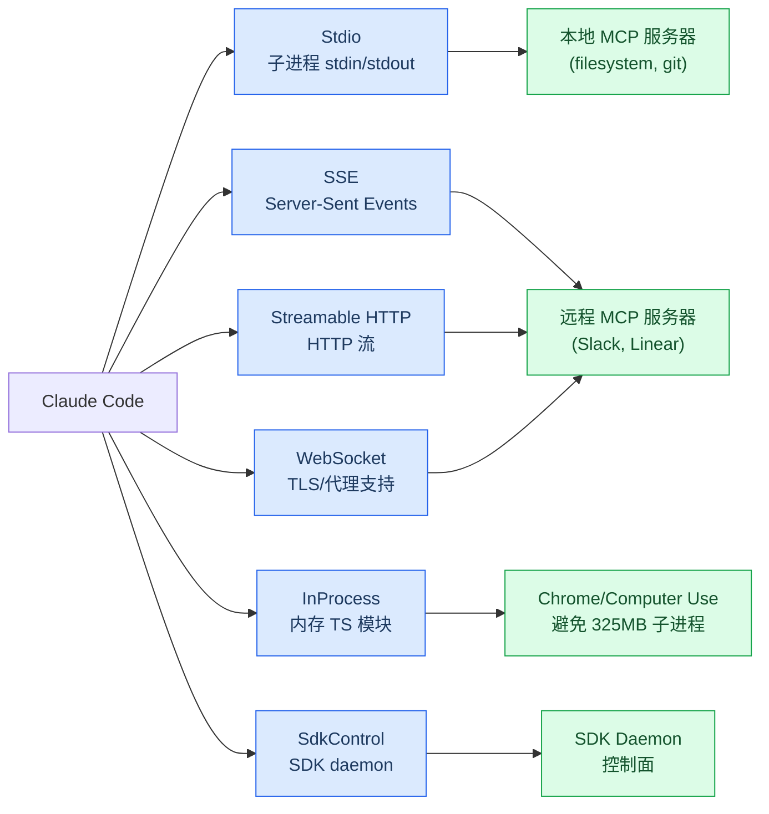
```mermaid
flowchart LR
    CC[Claude Code] --> stdio["Stdio\n子进程 stdin/stdout"]
    CC --> sse["SSE\nServer-Sent Events"]
    CC --> http["Streamable HTTP\nHTTP 流"]
    CC --> ws["WebSocket\nTLS/代理支持"]
    CC --> inproc["InProcess\n内存 TS 模块"]
    CC --> sdk["SdkControl\nSDK daemon"]

    stdio --> local["本地 MCP 服务器\n(filesystem, git)"]
    sse --> remote["远程 MCP 服务器\n(Slack, Linear)"]
    http --> remote
    ws --> remote
    inproc --> chrome["Chrome/Computer Use\n避免 325MB 子进程"]
    sdk --> daemon["SDK Daemon\n控制面"]

    classDef transport fill:#dbeafe,stroke:#2563eb,color:#1e3a5f
    classDef server fill:#dcfce7,stroke:#16a34a,color:#14532d

    class stdio,sse,http,ws,inproc,sdk transport
    class local,remote,chrome,daemon server
```

> **源码批注分析**：MCP 客户端实现中有一段关键注释——*"Run Chrome MCP server in-process to avoid spawning ~325MB subprocess."* 这揭示了 InProcess 传输存在的真正原因：某些 MCP 服务器（如 Chrome 浏览器控制）作为独立进程启动的内存开销过大。通过 InProcess 传输，它们在 Claude Code 进程内运行，共享内存空间。

```typescript
// src/services/mcp/client.ts — 六种传输类型
type MCPTransport =
  | StdioClientTransport       // 子进程（stdin/stdout）
  | SSEClientTransport         // Server-Sent Events
  | StreamableHTTPTransport    // HTTP 流
  | WebSocketTransport         // WebSocket（支持 TLS/代理）
  | InProcessTransport         // 内存（TypeScript 模块）
  | SdkControlTransport;       // SDK daemon 控制
```

### 10.2 MCP 配置

```json
// ~/.claude/mcp.json（全局）
{
  "mcpServers": {
    "filesystem": {
      "command": "npx",
      "args": ["-y", "@modelcontextprotocol/server-filesystem", "/path/to/dir"],
      "env": {}
    },
    "github": {
      "command": "npx",
      "args": ["-y", "@modelcontextprotocol/server-github"],
      "env": { "GITHUB_TOKEN": "ghp_..." }
    }
  }
}

// .claude/mcp.json（项目级，与 mcp.json 合并）
{
  "mcpServers": {
    "database": {
      "command": "python",
      "args": ["mcp_db_server.py"],
      "env": { "DB_URL": "postgresql://..." }
    }
  }
}
```

### 10.3 MCP 工具执行

```typescript
// MCP 工具执行流程
async function callMcpTool(
  server: MCPClient,
  toolName: string,
  input: object,
): Promise<ToolResult> {
  // 1. 调用 MCP 服务器
  const result = await server.callTool(toolName, input);

  // 2. 处理流式进度
  if (result.isStreaming) {
    for await (const progress of result.stream) {
      yield progress;
    }
  }

  // 3. 结果截断和验证
  const truncated = truncateIfNeeded(result);

  // 4. OAuth token 刷新（如需要）
  if (result.error?.type === 'auth_error') {
    await refreshOAuthToken(server);
    return callMcpTool(server, toolName, input);  // 重试
  }

  // 5. 二进制内容持久化（大输出）
  if (isBinaryContent(result)) {
    await persistBinaryContent(result);
  }

  return truncated;
}
```

### 10.4 MCP 工具与内置工具的集成

```typescript
// MCP 工具与内置工具共享同一个工具池
// assembleToolPool() 将两者合并

// 去重规则: 内置工具优先
// 如果 MCP 服务器提供了同名工具，内置版本被保留

// Deny 规则同样适用于 MCP 工具
// 可以在 settings.json 中:
{
  "permissions": {
    "deny": ["mcp__untrusted-server"]  // 禁止整个 MCP 服务器
  },
  "allowedMcpServers": ["@official/*"],
  "deniedMcpServers": ["*-untrusted"]
}
```

### 10.5 MCP Skills 发现

```typescript
// 可选特性: MCP_SKILLS
// 从 MCP 服务器发现并注册 Skills
// skills/mcpSkills.ts

// MCP 服务器可以暴露 Skills（不仅是 Tools）
// Skills 是更高级的工作流抽象
// 通过 skills builder 模式注册
```

---

## 第十一章：Sub-Agent System — 多智能体编排

> 到目前为止，我们的 Harness 只有一个 Agent。但在复杂任务中，一个 Agent 往往不够——它可能需要同时搜索代码库的不同部分，或者让一个专门的"审查员"检查自己写的代码。
>
> 这就像一家公司：CEO 不能亲自做所有事情，需要把任务委派给团队成员。但委派不是简单的"你去做"——需要明确权限范围（你能访问哪些资源）、信息隔离（不要让一个子任务的垃圾信息污染另一个）、结果汇报（只给我摘要，不要原始数据）。
>
> Claude Code 的子 Agent 系统正是按这个思路设计的。每个子 Agent 有自己的消息历史、工具集、权限模式和 Token 预算——完全隔离，完成后只返回摘要。

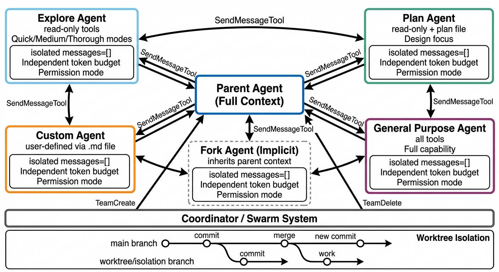
*图 11-1: 多智能体编排架构 — 父 Agent 通过 AgentTool 生成隔离的子 Agent（Explore/Plan/General/Custom/Fork），每个有独立的消息历史、Token 预算和权限模式。底部展示 Coordinator/Swarm 系统和 Worktree 隔离。*

### 11.1 Agent Tool

Agent Tool 是 Claude Code 的子 Agent 生成机制，位于 `src/tools/AgentTool/`。

```typescript
// Agent 定义结构
interface AgentDefinition {
  agentType: string;           // 例: "Explore", "Plan", "general-purpose"
  description: string;         // 用途描述
  whenToUse: string;           // 何时使用
  tools: string[] | '*';       // 可用工具（'*' = 所有）
  maxTurns?: number;           // 最大轮次限制
  model?: string | 'inherit';  // 模型选择
  permissionMode?: PermissionMode;  // 权限模式
  getSystemPrompt(): string;   // 系统提示生成
}
```

### 11.2 Agent 类型

```
┌──────────────────────────────────────────────────┐
│                Agent Types                        │
│                                                   │
│  general-purpose（通用 Agent）                     │
│  ├─ 工具: 所有（*)                                │
│  ├─ 用例: 复杂多步骤任务                          │
│  └─ 模型: 继承父级                                │
│                                                   │
│  Explore（探索 Agent）                             │
│  ├─ 工具: 只读（Read, Glob, Grep, WebFetch, ...）│
│  ├─ 用例: 代码库探索、搜索                        │
│  ├─ 不能: 编辑、写入、运行命令                    │
│  └─ 三种深度: quick, medium, very thorough        │
│                                                   │
│  Plan（规划 Agent）                                │
│  ├─ 工具: 只读 + Plan 文件写入                    │
│  ├─ 用例: 设计实现方案                            │
│  └─ 不能: 执行实际代码修改                        │
│                                                   │
│  custom（自定义 Agent）                            │
│  ├─ 定义: ~/.claude/agents/<name>.md              │
│  ├─ Frontmatter: tools, model, maxTurns           │
│  └─ 系统提示: Markdown 正文                       │
│                                                   │
│  Fork（隐式分叉 Agent）                            │
│  ├─ 实验性功能                                    │
│  ├─ 从父级上下文自动分叉                          │
│  └─ 继承父级的工具和权限                          │
│                                                   │
└──────────────────────────────────────────────────┘
```

### 11.3 子 Agent 生成流程

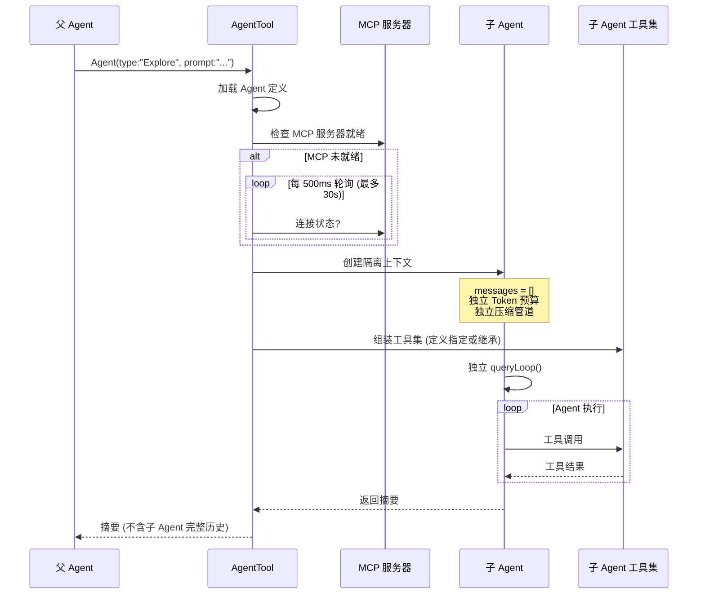
```mermaid
sequenceDiagram
    participant P as 父 Agent
    participant AT as AgentTool
    participant MCP as MCP 服务器
    participant C as 子 Agent
    participant T as 子 Agent 工具集

    P->>AT: Agent(type:"Explore", prompt:"...")
    AT->>AT: 加载 Agent 定义
    AT->>MCP: 检查 MCP 服务器就绪
    alt MCP 未就绪
        loop 每 500ms 轮询 (最多 30s)
            AT->>MCP: 连接状态?
        end
    end
    AT->>C: 创建隔离上下文
    Note over C: messages = []<br/>独立 Token 预算<br/>独立压缩管道
    AT->>T: 组装工具集 (定义指定或继承)
    C->>C: 独立 queryLoop()
    loop Agent 执行
        C->>T: 工具调用
        T-->>C: 工具结果
    end
    C-->>AT: 返回摘要
    AT-->>P: 摘要 (不含子 Agent 完整历史)
```

> **源码批注分析**：AgentTool 源码中有一段关键注释——*"Fork children keep the Agent tool in their pool for cache-identical tool defs, so reject fork attempts at call time."* 这意味着 Fork 子 Agent 虽然有 Agent 工具在它的工具池中（为了保持与父级 cache-identical 的工具定义），但在运行时会拒绝递归 Fork。主要检查机制是 `querySource`（不受压缩影响），消息扫描作为备用。这防止了"Agent 无限生成 Agent"的失控场景。

```
父 Agent 请求: Agent(type: "Explore", prompt: "...")
    │
    v
AgentTool.call()
    │
    ├─ 1. 加载 Agent 定义（内置或自定义）
    ├─ 2. 构建隔离的消息数组（messages = []）
    ├─ 3. 选择工具集（定义中指定或继承）
    ├─ 4. 设置权限模式（bubble / default / 继承）
    ├─ 5. 启动独立的查询循环
    │     └─ 子 Agent 有自己的:
    │        ├─ 消息历史
    │        ├─ 工具上下文
    │        ├─ 压缩管道
    │        └─ Token 预算
    ├─ 6. 收集输出
    └─ 7. 返回摘要给父 Agent
```

**设计哲学**：

子 Agent 的核心设计是**上下文隔离**。每个子 Agent 从空白消息列表开始，完成后只返回摘要。这防止了：
- 子任务的噪音污染父级上下文
- Token 预算被探索性查询耗尽
- 权限泄露（子 Agent 的工具集可以更受限）

### 11.4 自定义 Agent

```markdown
<!-- ~/.claude/agents/code-reviewer.md -->
---
name: code-reviewer
description: Specialized agent for code review
tools: [Read, Grep, Glob]
model: claude-sonnet-4-6
maxTurns: 50
---

You are a code reviewer. Your job is to:
1. Read the changed files
2. Check for bugs, security issues, and style violations
3. Provide actionable feedback

You are READ-ONLY. You cannot modify any files.

Focus on:
- Security vulnerabilities (injection, XSS, etc.)
- Performance issues (N+1 queries, memory leaks)
- Code quality (naming, SRP, test coverage)
```

### 11.5 Coordinator / Swarm 系统

```
┌─────────────────────────────────────────────┐
│            Coordinator System                │
│                                              │
│  src/coordinator/                            │
│  ├─ 多 Agent 编排                            │
│  ├─ 团队创建/删除                            │
│  ├─ 任务分配                                 │
│  └─ 状态同步                                 │
│                                              │
│  utils/swarm/                                │
│  ├─ 协调逻辑                                 │
│  ├─ 队友工具                                 │
│  └─ 通信协议                                 │
│                                              │
│  工具:                                       │
│  ├─ TeamCreateTool  — 创建团队 Agent         │
│  ├─ TeamDeleteTool  — 删除团队 Agent         │
│  ├─ SendMessageTool — Agent 间消息传递       │
│  └─ TaskStopTool    — 停止任务               │
│                                              │
│  服务:                                       │
│  ├─ teamMemorySync/ — 多 Agent 记忆同步      │
│  ├─ AgentSummary/   — Agent 状态摘要         │
│  └─ swarm/          — Swarm 权限轮询         │
│                                              │
└─────────────────────────────────────────────┘
```

### 11.6 定量分析：子 Agent 的隔离开销与收益

| 度量 | 无子 Agent（单 Agent） | 有子 Agent（隔离） |
|------|----------------------|-------------------|
| **上下文污染风险** | 高（所有探索噪音留在历史） | 低（子 Agent 历史丢弃） |
| **Token 消耗** | O(探索 tokens + 工作 tokens) | O(摘要 tokens + 工作 tokens) |
| **探索 10 文件场景** | ~50K tokens（全部留在上下文） | ~2K tokens（仅摘要返回） |
| **Token 节省率** | — | ~96%（上例） |
| **启动开销** | 0 | ~5-10K tokens（系统提示复制） |
| **MCP 就绪等待** | 0 | 0-30s（首次连接） |

> **源码批注**：关于 MCP 就绪等待，源码注释道：*"Avoids a race condition where the agent is invoked before MCP servers finish connecting. Early exit if any required server has already failed — no point waiting if the check will fail anyway."* 这个 30 秒超时和 500ms 轮询间隔是经验值，平衡了等待成本和连接可靠性。
>
> 关于 Fork Agent 的缓存优化，注释道：*"Fork path: child inherits the PARENT's system prompt (not FORK_AGENT's) for CACHE-IDENTICAL API request prefixes."* 这意味着 Fork 子 Agent 复用父级的 prompt cache，首次 API 调用不需要重新构建缓存——节省约 30-46K tokens 的 cache creation 成本。

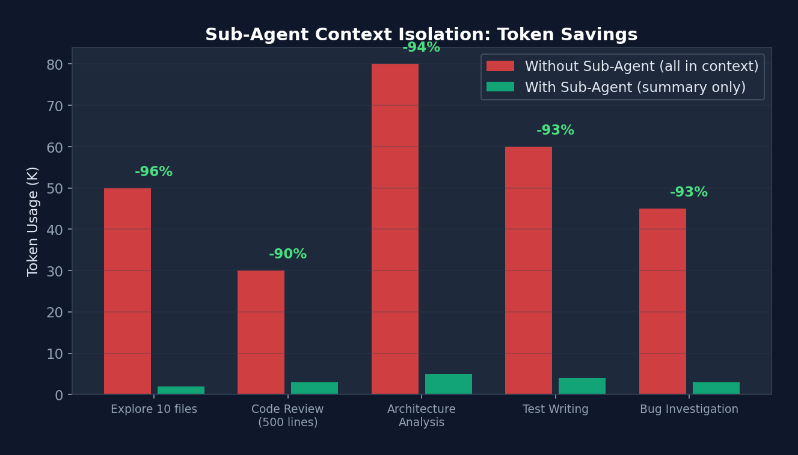
*图 11-2: 子 Agent 上下文隔离的 Token 节省 — 在"探索 10 文件"场景中，不使用子 Agent 需要 50K tokens（全部留在上下文），使用子 Agent 只需 2K tokens（仅摘要返回），节省 96%。这种节省在长对话中累积效果显著。*

### 11.7 任务系统

```typescript
// src/Task.ts — 任务类型
type TaskType =
  | 'local_bash'          // Bash 命令执行
  | 'local_agent'         // 本地 Agent
  | 'remote_agent'        // 远程 Agent（CCR）
  | 'in_process_teammate' // 进程内队友（assistant 模式）
  | 'local_workflow'      // 工作流脚本
  | 'monitor_mcp'         // MCP 监控
  | 'dream';              // Dream 模式任务

interface TaskState {
  id: string;             // 前缀 + 8 位随机字符（base36）
  type: TaskType;
  status: 'pending' | 'running' | 'completed' | 'failed' | 'killed';
  description: string;
  toolUseId?: string;
  startTime: number;
  endTime?: number;
  totalPausedMs: number;
  outputFile: string;     // 磁盘上的输出文件
  outputOffset: number;
  notified: boolean;
}
```

### 11.7 Worktree 隔离

```
Git Worktree 隔离模式:
├─ 每个子 Agent 在独立的 git worktree 中工作
├─ 防止文件冲突（多个 Agent 同时编辑同一文件）
├─ 工具: EnterWorktreeTool / ExitWorktreeTool
├─ 完成后:
│   ├─ 如果有变更: 保留 worktree，返回路径和分支
│   └─ 如果无变更: 自动清理 worktree
└─ 与沙盒集成: worktree 路径加入 sandbox allowWrite
```

---

## 第十二章：Skills & Plugins — 扩展生态

> Tools 是原子操作（读文件、运行命令），Skills 是工作流（"帮我做 Code Review"、"帮我部署到 staging"）。如果说 Tools 是乐高积木，Skills 就是搭好的模型——你可以直接拿来用，也可以拆开重新组合。
>
> Claude Code 的 Skills 系统是它从"编码工具"进化为"工作流平台"的关键。一个 `.md` 文件就能定义一个新的工作流——不需要写 TypeScript，不需要重新编译。

### 12.1 Skills 系统

Skills 是可重用的工作流定义，类似于"高级宏"。

#### 内置 Skills

```typescript
// src/skills/bundled/index.ts
function initBundledSkills(): void {
  registerUpdateConfigSkill();   // /update-config
  registerKeybindingsSkill();    // /keybindings-help
  registerDebugSkill();          // /debug
  registerSimplifySkill();       // /simplify
  registerBatchSkill();          // /batch

  // 特性门控 Skills
  if (feature('AGENT_TRIGGERS_REMOTE')) {
    registerScheduleSkill();     // /schedule
  }
  if (feature('AGENT_TRIGGERS')) {
    registerLoopSkill();         // /loop
  }
  if (feature('BUILDING_CLAUDE_APPS')) {
    registerClaudeApiSkill();    // /claude-api
  }
}
```

#### 自定义 Skills

```markdown
<!-- ~/.claude/skills/my-deploy.md -->
---
name: deploy
description: Deploy the application to staging
args: environment
---

# Deploy Skill

When invoked with /deploy <environment>:

1. Run the test suite: `npm test`
2. Build the application: `npm run build`
3. Deploy to the specified environment:
   - staging: `aws deploy --env staging`
   - production: `aws deploy --env production` (requires confirmation)
4. Verify deployment health check
5. Report results
```

#### Skill 加载

```typescript
// src/skills/loadSkillsDir.ts
function loadSkillsDir(dir: string): SkillDefinition[] {
  // 1. 扫描 ~/.claude/skills/ 目录
  // 2. 读取每个 .md 文件
  // 3. 解析 frontmatter（name, description, args）
  // 4. 创建 SkillDefinition
  // 5. 注册为可用命令
}
```

### 12.2 Plugin 系统

```
src/plugins/          — 插件系统核心
src/services/plugins/ — 插件加载、版本管理、市场
src/utils/plugins/    — 插件工具、缓存

Plugin 特性:
├─ 版本管理（SemVer）
├─ 缓存系统（减少重复加载）
├─ Marketplace 集成
├─ 插件级 Hook 注入
├─ 独立数据目录（${CLAUDE_PLUGIN_DATA}）
└─ 配置隔离（${user_config.X}）
```

---

## 第十三章：构建你自己的 Harness — 实战指南

> 前面 12 章我们解剖了 Claude Code 这个"参考实现"。现在是你动手的时候了。
>
> 不要试图一次性构建一个 50 万行的 Harness——那是 Anthropic 几十名工程师花了几年的成果。好的 Harness 是**长出来的**，不是设计出来的。从最小可用的配置开始，随着你遇到问题逐步添加约束和能力。
>
> 下面的三个层级不是"选择其一"——而是一条渐进路径。先花 1 小时搭好 Level 1，用几周。然后根据真实痛点升级到 Level 2，再用几个月。最后在组织需要时才考虑 Level 3。

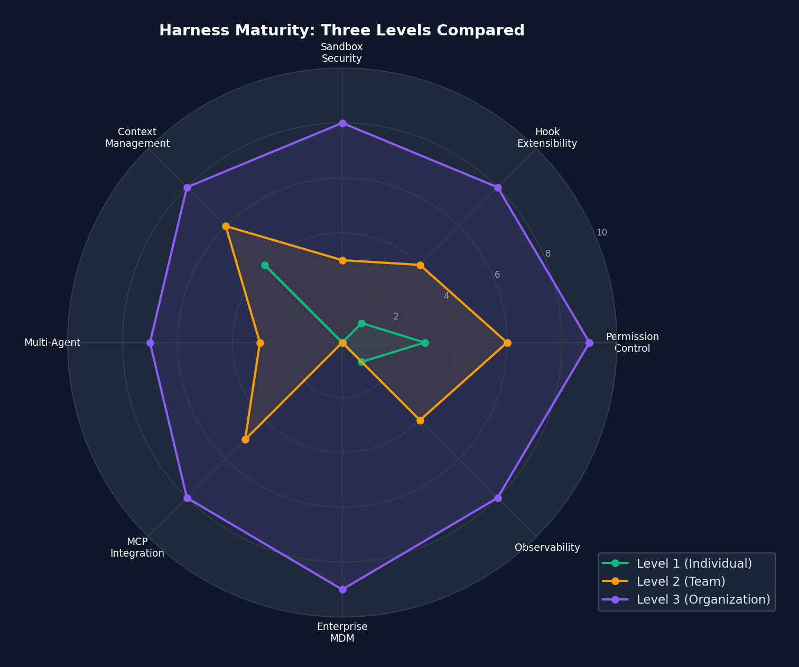
*图 13-1: 三级 Harness 成熟度雷达图 — Level 1（绿色）在 Context Management 和 Permission Control 上有基础能力，但缺乏 Multi-Agent、MCP 和企业 MDM。Level 3（紫色）在所有 8 个维度上接近满分。注意 Level 2（黄色）是大多数团队的"甜蜜点"——投入适中但覆盖面广。*

### 13.1 Level 1: 个人 Harness（1-2 小时）

#### 步骤 1: 创建 CLAUDE.md

```markdown
# CLAUDE.md

## 项目架构
- src/: 源代码
- tests/: 测试文件
- docs/: 文档

## 开发规范
- 语言: TypeScript strict mode
- 测试: vitest
- 格式化: prettier
- 提交: conventional commits

## 重要约束
- 不要修改 migrations/ 目录（已部署的迁移不可变）
- 所有 API 端点必须有认证中间件
- 不要使用 any 类型
```

#### 步骤 2: 配置基本权限

```json
// .claude/settings.json
{
  "permissions": {
    "allow": [
      "Read",
      "Glob",
      "Grep",
      "Bash(npm test *)",
      "Bash(npm run *)",
      "Bash(git status)",
      "Bash(git diff *)",
      "Bash(git log *)"
    ],
    "deny": [
      "Bash(sudo *)",
      "Bash(rm -rf *)",
      "Bash(git push --force *)",
      "Bash(git reset --hard *)"
    ]
  }
}
```

#### 步骤 3: 添加基本 Hooks

```json
// .claude/settings.json（hooks 部分）
{
  "hooks": {
    "PreToolUse": [
      {
        "matcher": "Write",
        "hooks": [
          {
            "type": "command",
            "command": "echo 'Writing file: '$(echo $HOOK_INPUT | jq -r '.tool_input.file_path')",
            "if": "Write(*.ts)"
          }
        ]
      }
    ],
    "PostToolUse": [
      {
        "matcher": "Bash",
        "hooks": [
          {
            "type": "command",
            "command": "npm run lint -- --quiet 2>/dev/null || true",
            "if": "Bash(npm *)",
            "async": true
          }
        ]
      }
    ]
  }
}
```

### 13.2 Level 2: 团队 Harness（1-2 天）

#### 步骤 1: 共享设置

```json
// .claude/settings.json（提交到 git）
{
  "permissions": {
    "allow": [
      "Bash(npm test *)",
      "Bash(npm run lint *)",
      "Bash(git *)"
    ],
    "deny": [
      "Bash(sudo *)",
      "Bash(rm -rf /)",
      "Bash(npm publish *)",
      "Write(*.env*)",
      "Write(*.key)",
      "Write(*.pem)"
    ],
    "defaultMode": "default"
  },
  "sandbox": {
    "enabled": true,
    "fsWrite": {
      "deny": [".env", ".env.*", "*.key", "*.pem", "secrets/"]
    },
    "network": {
      "allowedDomains": [
        "*.github.com",
        "registry.npmjs.org",
        "api.anthropic.com"
      ]
    }
  }
}
```

#### 步骤 2: 定义团队 Agents

```markdown
<!-- .claude/agents/architect.md -->
---
name: architect
description: Reviews architecture decisions and suggests improvements
tools: [Read, Grep, Glob]
model: claude-opus-4-6
maxTurns: 30
---

You are an architecture reviewer. Analyze the codebase and provide:
1. Dependency analysis
2. Coupling/cohesion assessment
3. SOLID principle compliance
4. Suggestions for improvement

Focus on high-level design, not line-by-line code review.
```

```markdown
<!-- .claude/agents/test-writer.md -->
---
name: test-writer
description: Writes comprehensive tests for existing code
tools: [Read, Write, Edit, Bash, Glob, Grep]
model: claude-sonnet-4-6
maxTurns: 100
---

You are a test engineer. For any given code:
1. Analyze the code and identify test cases
2. Write comprehensive tests (unit + integration)
3. Run the tests to verify they pass
4. Ensure >80% coverage for touched files
```

#### 步骤 3: 配置 MCP 服务器

```json
// .claude/mcp.json
{
  "mcpServers": {
    "github": {
      "command": "npx",
      "args": ["-y", "@modelcontextprotocol/server-github"],
      "env": { "GITHUB_TOKEN": "${GITHUB_TOKEN}" }
    },
    "postgres": {
      "command": "npx",
      "args": ["-y", "@modelcontextprotocol/server-postgres"],
      "env": { "DATABASE_URL": "${DATABASE_URL}" }
    }
  }
}
```

#### 步骤 4: 创建团队 Skills

```markdown
<!-- .claude/skills/review-pr.md -->
---
name: review-pr
description: Comprehensive PR review workflow
args: pr_number
---

# PR Review Workflow

1. Fetch the PR diff: `gh pr diff $ARGUMENTS`
2. Read all changed files
3. For each file:
   - Check for security issues
   - Check for performance concerns
   - Check for test coverage
   - Check for style consistency
4. Generate a structured review comment
5. Post the review: `gh pr review $ARGUMENTS --comment --body "..."`
```

### 13.3 Level 3: 组织级 Harness（1-2 周）

#### 步骤 1: 企业 MDM 设置

```json
// /managed/managed-settings.json
{
  "permissions": {
    "deny": [
      "Bash(sudo *)",
      "Bash(curl * | bash)",
      "Bash(wget * | bash)",
      "Write(*.env*)",
      "Write(*.pem)",
      "Write(*.key)"
    ],
    "disableBypassPermissionsMode": "disable"
  },
  "sandbox": {
    "enabled": true,
    "lockedByPolicy": true,
    "network": {
      "deniedDomains": ["*.malware.com", "*.phishing.net"]
    }
  },
  "deniedMcpServers": ["*-untrusted", "*-experimental"]
}
```

#### 步骤 2: 审计 Hook

```json
// /managed/managed-settings.d/audit.json
{
  "hooks": {
    "PostToolUse": [
      {
        "hooks": [
          {
            "type": "http",
            "url": "https://audit.company.com/api/agent-actions",
            "headers": {
              "Authorization": "Bearer $AUDIT_API_KEY",
              "Content-Type": "application/json"
            },
            "allowedEnvVars": ["AUDIT_API_KEY"],
            "async": true
          }
        ]
      }
    ],
    "SessionStart": [
      {
        "hooks": [
          {
            "type": "command",
            "command": "echo '{\"session_started\": true}' | curl -s -X POST -d @- https://audit.company.com/api/sessions",
            "async": true
          }
        ]
      }
    ]
  }
}
```

#### 步骤 3: 实现 Plan→Work→Review 循环

参考 claude-code-harness 项目的 13 条防护规则：

```
R01: 阻止 sudo 命令
R02: 禁止写入 .git/, .env, SSH 密钥
R03: 禁止 Shell 写入受保护文件
R04: 写入项目根目录外需要确认
R05: rm -rf 需要确认
R06: 禁止 git push --force
R07-R09: 模式特定防护（work/codex/breezing）
R10: 禁止 --no-verify, --no-gpg-sign
R11: 禁止 git reset --hard main/master
R12: 警告直接推送到 main/master
R13: 警告编辑受保护文件
```

实现为 PreToolUse Hook：

```json
{
  "hooks": {
    "PreToolUse": [
      {
        "matcher": "Bash",
        "hooks": [
          {
            "type": "command",
            "command": "node guard-rules.js",
            "timeout": 5
          }
        ]
      }
    ]
  }
}
```

---

## 第十四章：高级模式与设计哲学

> 这是最后一章，也是最重要的一章。前面我们学的是"Claude Code 怎么做的"。这一章我们要理解"为什么这么做"。
>
> 工具和框架会过时，但设计哲学不会。如果你只记住本书的一个章节，应该是这一章——这些原则适用于任何 Agent Harness，不限于 Claude Code。

### 14.1 Claude Code 的十大设计哲学

#### 1. Async Generator 流式架构

```
不是: function query() → Promise<FinalResult>
而是: async function* query() → AsyncGenerator<StreamEvent>

为什么: 客户端可以在模型思考时就开始渲染
         用户可以随时中断
         进度对用户可见
```

#### 2. 通过 Continue 站点实现状态机

```
不是: 显式状态枚举 + switch/case
而是: while(true) + 7 个 continue 站点

为什么: 恢复路径是自然的（continue = 重试）
         状态转换是局部的（只需更新 State 对象）
         新恢复路径可以添加而不重构
```

#### 3. 编译时特性门控

```
不是: if (config.feature_x) { ... }
而是: if (feature('FEATURE_X')) { ... }  // bun:bundle 编译时求值

为什么: 外部发行版不包含任何内部特性代码（连字符串都没有）
         不存在运行时分支预测开销
         代码大小最小化
```

#### 4. 缓存前缀稳定性

```
不是: 将内置工具和 MCP 工具混合排序
而是: 内置工具排序后作为稳定前缀，MCP 工具排序后追加

为什么: Anthropic API 的 prompt cache 基于前缀匹配
         MCP 工具变化时，内置工具前缀不变 → 缓存不失效
         大幅降低 API 成本
```

#### 5. 纵深防御

```
Layer 1: CLAUDE.md（指导性约束）
Layer 2: Permission Rules（声明性约束）
Layer 3: Hooks（可编程约束）
Layer 4: YOLO Classifier（AI 约束）
Layer 5: Sandbox（系统级约束）
Layer 6: Hardcoded Denials（不可覆盖约束）

为什么: 每一层都可能被绕过
         多层叠加使绕过概率指数下降
         最内层（硬编码）无法通过配置禁用
```

#### 6. 数据驱动的可扩展性

```
不是: 修改源码添加新功能
而是: settings.json + agents/*.md + skills/*.md + hooks

为什么: 非工程师也能定制 Harness
         定制与核心代码解耦
         升级时不丢失定制
```

#### 7. 上下文即稀缺资源

```
设计: 工具延迟加载、记忆按需附加、四级压缩管道
       ToolSearch 发现机制、Microcompact 老化策略

为什么: 上下文窗口有限（即使 1M token）
         无关信息降低模型性能
         成本与 token 使用量成正比
```

#### 8. 层级化配置覆盖

```
7 级设置: CLI > Flag > Policy > Managed > Local > Project > User

为什么: 不同层级有不同的信任级别
         企业管理员可以强制策略
         项目维护者可以设定合理默认
         用户可以个人微调
```

#### 9. 隔离的子 Agent 上下文

```
设计: 子 Agent 从空白消息列表开始
       完成后只返回摘要
       父级上下文不被污染

为什么: 探索性任务可能产生大量噪音
         子 Agent 的失败不应影响父级
         Token 预算隔离
```

#### 10. 可逆性优先

```
设计: 文件编辑通过 Edit（替换字符串），不是 Write（覆盖）
       每个工具调用有 undo 能力
       自动快照（文件历史）

为什么: Agent 会犯错
         用户需要轻松回滚
         "先行动后审查"比"先审查后行动"更高效
```

### 14.2 Entropy Management 模式

```
┌──────────────────────────────────────────────┐
│         Entropy Management Patterns           │
│                                               │
│  1. 定期清理 Agent                            │
│     /loop 1h "检查死代码、未使用导入、        │
│                过期 TODO、不一致的命名"         │
│                                               │
│  2. 文档验证 Agent                            │
│     SessionEnd Hook → 检查 CLAUDE.md          │
│     是否与代码实际状态一致                     │
│                                               │
│  3. 依赖审计 Agent                            │
│     /schedule "每周一 0:00" →                  │
│     "检查过期依赖、安全漏洞、许可证合规"       │
│                                               │
│  4. 测试覆盖率守卫                            │
│     PostToolUse Hook（Write *.ts）→            │
│     "运行覆盖率检查，如果下降则警告"           │
│                                               │
└──────────────────────────────────────────────┘
```

### 14.3 Bridge System — IDE 集成

```
src/bridge/
├── bridgeMain.ts             — 主循环
├── bridgeMessaging.ts        — 消息协议
├── bridgePermissionCallbacks.ts — 权限处理
├── replBridge.ts             — REPL 桥接
├── jwtUtils.ts               — JWT 认证
└── sessionRunner.ts          — 会话执行

支持:
├── VS Code 扩展
├── JetBrains 扩展
├── 双向通信（IDE ↔ Claude Code）
├── 权限同步
└── 会话状态同步
```

### 14.4 Plan Mode V2

```
5 阶段工作流:

Phase 1: Interview（访谈）
├─ 收集需求
├─ 理解上下文
└─ 最多启动 3 个 Explore Agent（并行）

Phase 2: Design（设计）
├─ 启动 Plan Agent
├─ 生成实现方案
└─ 可启动多个以探索不同方向

Phase 3: Review（审查）
├─ 读取关键文件验证方案
├─ 确保与用户意图一致
└─ 通过 AskUserQuestion 澄清

Phase 4: Final Plan（最终计划）
├─ 写入 ~/.claude/plans/<name>.md
├─ 包含上下文、步骤、文件路径
└─ 验证部分描述如何测试

Phase 5: Exit Plan Mode
├─ 调用 ExitPlanMode
├─ 等待用户批准
└─ 批准后开始执行
```

### 14.5 远程触发与 Cron 调度

```typescript
// 特性门控: AGENT_TRIGGERS + AGENT_TRIGGERS_REMOTE

// ScheduleCronTool — 创建定时 Agent
{
  schedule: "0 9 * * MON",   // 每周一早 9 点
  prompt: "Review open PRs and post summary to Slack",
  model: "claude-sonnet-4-6",
}

// RemoteTriggerTool — 远程触发
{
  trigger: "deploy-check",
  prompt: "Verify deployment health",
}
```

### 14.6 Voice Integration

```
src/voice/                   — 语音输入
src/services/voice.ts        — 语音/STT 集成
src/services/voiceStreamSTT.ts — 流式语音转文字

特性门控: VOICE_MODE
支持:
├── 语音输入转文字
├── 流式处理（边说边识别）
└── 集成到主查询循环
```

### 14.7 "可拆卸 Harness" 原则

```
核心理念: Harness 应该能随模型能力提升而简化

示例:
├── 今天: 需要 13 条防护规则阻止危险操作
│   └── 未来更好的模型可能不需要其中一半
│
├── 今天: 四级压缩管道应对有限上下文
│   └── 未来更大的上下文窗口可能只需要一级
│
├── 今天: YOLO 分类器需要两阶段检查
│   └── 未来主模型可能自带更好的安全意识
│
└── 设计启示:
    ├── 每个 Harness 组件应该可以独立禁用
    ├── 设置覆盖优于硬编码
    ├── 随着模型改进，简化而非堆叠
    └── "最好的 Harness 是你最终不需要的那个"
```

---

## 附录 C：ToolUseContext 完整类型定义

`ToolUseContext` 是贯穿整个执行管道的"请求上下文"——理解它就理解了 Harness 的信息流：

```typescript
// src/Tool.ts — 真实代码（精简注释版）
export type ToolUseContext = {
  // ===== 配置（只读）=====
  options: {
    commands: Command[]           // 可用的 Slash 命令
    debug: boolean                // 调试模式
    mainLoopModel: string         // 主循环使用的模型
    tools: Tools                  // 可用工具列表
    verbose: boolean              // 详细输出
    thinkingConfig: ThinkingConfig// 思考模式配置
    mcpClients: MCPServerConnection[]  // MCP 服务器连接
    mcpResources: Record<string, ServerResource[]>  // MCP 资源
    isNonInteractiveSession: boolean   // 非交互式会话
    agentDefinitions: AgentDefinitionsResult  // Agent 定义
    maxBudgetUsd?: number         // 最大预算（美元）
    customSystemPrompt?: string   // 自定义系统提示
    appendSystemPrompt?: string   // 追加系统提示
    querySource?: QuerySource     // 查询来源标识
    refreshTools?: () => Tools    // 工具列表刷新函数
  }

  // ===== 控制 =====
  abortController: AbortController  // 取消信号
  messages: Message[]               // 当前消息历史

  // ===== 状态读写 =====
  readFileState: FileStateCache     // 文件状态缓存
  getAppState(): AppState           // 获取应用状态
  setAppState(f: (prev) => AppState): void  // 更新应用状态

  // ===== 回调 =====
  setToolJSX?: SetToolJSXFn         // 设置工具 UI
  addNotification?: (n: Notification) => void  // 添加通知
  sendOSNotification?: (opts) => void          // 发送系统通知
  setInProgressToolUseIDs: (f) => void         // 跟踪进行中的工具
  setResponseLength: (f) => void               // 跟踪响应长度
  updateFileHistoryState: (updater) => void    // 更新文件历史
  updateAttributionState: (updater) => void    // 更新归因状态

  // ===== Agent 相关 =====
  agentId?: AgentId                 // Agent 标识
  agentType?: string                // Agent 类型
  requireCanUseTool?: boolean       // 是否需要权限检查

  // ===== 动态 Skill/Memory =====
  nestedMemoryAttachmentTriggers?: Set<string>  // 嵌套记忆触发器
  loadedNestedMemoryPaths?: Set<string>         // 已加载的记忆路径
  dynamicSkillDirTriggers?: Set<string>         // 动态 Skill 目录触发器
  discoveredSkillNames?: Set<string>            // 已发现的 Skill 名称

  // ===== 权限 =====
  localDenialTracking?: DenialTrackingState     // 本地拒绝跟踪
  toolDecisions?: Map<string, {...}>            // 工具决策记录
  contentReplacementState?: ContentReplacementState  // 内容替换状态

  // ===== 高级 =====
  requestPrompt?: (sourceName, summary?) =>     // Hook prompt 请求
    (request: PromptRequest) => Promise<PromptResponse>
  handleElicitation?: (serverName, params, signal) =>  // MCP elicitation
    Promise<ElicitResult>
  onCompactProgress?: (event) => void           // 压缩进度回调
  criticalSystemReminder_EXPERIMENTAL?: string  // 关键系统提醒
}
```

**设计分析**：ToolUseContext 是一个**大型上下文对象**，类似于 Web 框架中的 Request 对象。它携带了工具执行所需的一切——配置、状态、回调、权限。虽然有 50+ 个字段看起来很复杂，但这种设计避免了：
1. 全局状态（每个查询有自己的上下文）
2. 参数爆炸（不需要逐个传递）
3. 紧耦合（工具只使用自己需要的字段）

---

## 附录 D：13 条防护规则参考模型

[claude-code-harness](https://github.com/Chachamaru127/claude-code-harness) 项目定义了 13 条声明性防护规则，作为 PreToolUse Hook 实现：

```typescript
// 来自 claude-code-harness/core/src/guardrails/

// R01: 阻止 sudo — 永远不允许提权
{ rule: 'R01', test: (input) => /^sudo\s/.test(input.command),
  action: 'deny', reason: 'sudo commands are not allowed' }

// R02: 禁止写入敏感路径
{ rule: 'R02', test: (input) => SENSITIVE_PATHS.some(p => input.file_path?.startsWith(p)),
  action: 'deny', paths: ['.git/', '.env', '~/.ssh/'] }

// R03: 禁止 Shell 写入受保护文件
{ rule: 'R03', test: (input) => isShellWriteToProtectedFile(input),
  action: 'deny' }

// R04: 项目根目录外写入需确认
{ rule: 'R04', test: (input) => !isWithinProjectRoot(input.file_path),
  action: 'ask', reason: 'Writing outside project root' }

// R05: rm -rf 需确认
{ rule: 'R05', test: (input) => /rm\s+(-rf|-r\s+-f|-f\s+-r)/.test(input.command),
  action: 'ask', reason: 'Recursive delete detected' }

// R06: 禁止 force push
{ rule: 'R06', test: (input) => /git\s+push\s+.*--force/.test(input.command),
  action: 'deny', reason: 'Force push is not allowed' }

// R07-R09: 模式特定防护
{ rule: 'R07', mode: 'work', ... }   // Work 模式限制
{ rule: 'R08', mode: 'codex', ... }  // Codex 集成限制
{ rule: 'R09', mode: 'breezing', ... } // Breezing 模式限制

// R10: 禁止跳过安全钩子
{ rule: 'R10', test: (input) => /--no-verify|--no-gpg-sign/.test(input.command),
  action: 'deny', reason: 'Skipping safety hooks is not allowed' }

// R11: 禁止 hard reset 到 main
{ rule: 'R11', test: (input) => /git\s+reset\s+--hard\s+(main|master)/.test(input.command),
  action: 'deny' }

// R12: 警告直接推送到 main
{ rule: 'R12', test: (input) => isDirectPushToMain(input),
  action: 'warn' }

// R13: 警告编辑受保护文件
{ rule: 'R13', test: (input) => PROTECTED_FILES.includes(input.file_path),
  action: 'warn', files: ['package-lock.json', 'yarn.lock', 'Cargo.lock'] }
```

**这些规则完全可以用 Claude Code 的原生 Hook 系统实现**：

```json
{
  "hooks": {
    "PreToolUse": [
      {
        "matcher": "Bash",
        "hooks": [{
          "type": "command",
          "command": "node guard-rules.js",
          "if": "Bash(sudo *)"
        }]
      }
    ]
  }
}
```

---

## 结语：从读者到构建者

恭喜你读到这里。如果你认真消化了前面 14 章的内容，你现在掌握的 Harness Engineering 知识已经超过了大多数 AI 工程师。

让我用三句话总结全书：

1. **Agent 不是产品，Harness 才是。** 模型会被替换，但你精心设计的权限规则、Hook 管道、沙盒配置——这些才是你的护城河。

2. **约束是力量，不是限制。** 每添加一条精确的权限规则，你就能放心让 Agent 做更多事情。纵深防御的六层让 Claude Code 敢于在生产环境中运行 `rm`、`git push` 这样的危险命令——因为每一层都在守护。

3. **渐进式构建，不要过度设计。** 先用 1 小时搭一个 CLAUDE.md + 基本权限的 Level 1 Harness。遇到痛点了再加 Hook。需要团队协作了再配 MCP 和自定义 Agent。最好的 Harness 是"刚好够用"的 Harness。

> **最后一个思考题**：Claude Code 有 512,664 行代码，但它的 Agent Loop 核心只有一个 `while(true)` 和一个 State 对象。剩下的 99.9% 代码都在回答同一个问题——"怎样让这个循环在真实世界中可靠运行？" 这就是 Harness Engineering 的全部意义。

现在，去构建你自己的 Harness 吧。

---

## 附录 A：Claude Code 源码文件索引

### 核心引擎

| 文件 | 大小 | 用途 |
|------|------|------|
| `src/main.tsx` | 803 KB | 入口点，CLI 引导，并行预取 |
| `src/query.ts` | 68 KB | 核心 Agent 循环（queryLoop） |
| `src/QueryEngine.ts` | 46 KB | LLM 查询引擎，系统提示构建 |
| `src/Tool.ts` | 29 KB | Tool 基础接口，60+ 方法 |
| `src/tools.ts` | 25 KB | Tool 注册表，池组装，缓存稳定 |
| `src/Task.ts` | 3.2 KB | 任务类型定义 |
| `src/commands.ts` | 25 KB | 命令注册，条件导入 |

### 权限与安全

| 文件 | 用途 |
|------|------|
| `src/utils/permissions/permissions.ts` | 主权限逻辑，决策管道 |
| `src/types/permissions.ts` | 权限类型定义（13 KB） |
| `src/utils/permissions/permissionsLoader.ts` | 从设置加载规则 |
| `src/utils/permissions/denialTracking.ts` | 拒绝追踪 |
| `src/utils/permissions/yoloClassifier.ts` | Auto 模式分类器 |
| `src/utils/sandbox/sandbox-adapter.ts` | 沙盒适配器（985 行） |
| `src/tools/BashTool/shouldUseSandbox.ts` | 沙盒决策逻辑 |

### Hooks

| 文件 | 用途 |
|------|------|
| `src/utils/hooks.ts` | Hook 执行引擎 |
| `src/utils/hooks/hooksConfigManager.ts` | Hook 配置管理 |
| `src/utils/hooks/hooksSettings.ts` | Hook 设置加载 |
| `src/schemas/hooks.ts` | Zod Schema 定义 |
| `src/types/hooks.ts` | Hook 类型定义 |
| `src/services/tools/toolHooks.ts` | 工具特定 Hook 执行 |

### 设置与配置

| 文件 | 用途 |
|------|------|
| `src/utils/settings/settings.ts` | 核心设置管理 |
| `src/utils/settings/types.ts` | 设置 Schema 定义（600+ 行） |
| `src/utils/settings/settingsCache.ts` | 内存缓存 |
| `src/utils/settings/permissionValidation.ts` | 权限规则验证 |

### MCP

| 文件 | 用途 |
|------|------|
| `src/services/mcp/client.ts` | MCP 客户端，6 种传输 |
| `src/services/mcp/config.ts` | MCP 配置加载 |
| `src/skills/mcpSkills.ts` | MCP Skills 发现 |

### Agent 与任务

| 文件 | 用途 |
|------|------|
| `src/tools/AgentTool/` | 子 Agent 生成 |
| `src/tools/AgentTool/forkSubagent.ts` | 隐式分叉 |
| `src/tools/AgentTool/agentMemory.ts` | Agent 记忆 |
| `src/coordinator/` | 多 Agent 编排 |
| `src/utils/swarm/` | Swarm 协调逻辑 |

### 记忆

| 文件 | 用途 |
|------|------|
| `src/memdir/memoryScan.ts` | 记忆扫描 |
| `src/memdir/memoryTypes.ts` | 记忆类型定义 |
| `src/services/extractMemories/` | 自动记忆提取 |
| `src/services/teamMemorySync/` | 团队记忆同步 |

### 状态与 UI

| 文件 | 用途 |
|------|------|
| `src/state/AppState.tsx` | 主 React 上下文（23 KB） |
| `src/state/AppStateStore.ts` | Zustand-like Store（21 KB） |
| `src/cli/print.ts` | 富文本打印（212 KB） |
| `src/components/App.tsx` | 根组件 |

---

## 附录 B：参考资源

### 开源项目

| 项目 | 描述 | URL |
|------|------|-----|
| **learn-claude-code** | 12 课时 Harness Engineering 课程 | github.com/shareAI-lab/learn-claude-code |
| **claude-code-harness** | Plan→Work→Review 循环实现 | github.com/Chachamaru127/claude-code-harness |
| **your-claude-engineer** | Agent Harness 演示（Slack+GitHub+Linear） | github.com/coleam00/your-claude-engineer |

### 学习路径（推荐）

```
第 1 周: 基础
├── 阅读本教程第 1-3 章
├── 搭建 Level 1 个人 Harness（CLAUDE.md + 基本权限）
├── 动手实验: 在自己的项目中使用 Claude Code
└── 理解: Agent Loop, Tool Dispatch, 计划模式

第 2 周: 约束与安全
├── 阅读本教程第 4-7 章
├── 配置 Permission Rules
├── 编写 PreToolUse Hook
└── 理解: Permission Model, Hooks, Sandbox

第 3 周: 上下文与记忆
├── 阅读本教程第 8-9 章
├── 优化 CLAUDE.md
├── 配置 Settings 层级
├── 动手实验: 写一个 PreToolUse Hook
└── 理解: Context Engineering, Memory, Compaction

第 4 周: 扩展与协作
├── 阅读本教程第 10-12 章
├── 配置 MCP 服务器（从 GitHub MCP 开始）
├── 创建自定义 Agent 和 Skill
└── 理解: MCP, Sub-Agents, Skills

第 5 周: 多 Agent 与生产化
├── 阅读本教程第 13-14 章
├── 搭建团队 Harness
├── 实现 Plan→Work→Review 循环
└── 理解: Team Protocols, Worktree Isolation, Entropy Management

第 6 周+: 高级
├── 深入研究 Claude Code 源码（从 query.ts 开始）
├── 构建组织级 Harness
└── 探索: Bridge, Voice, Remote Triggers
```

### 关键概念速查表

| 概念 | 一句话定义 |
|------|-----------|
| **Harness** | Agent 之外的一切基础设施 |
| **Agent Loop** | 消息→LLM→工具→循环的核心循环 |
| **Tool** | Agent 与外部世界交互的标准化接口 |
| **Permission Mode** | 决定 Agent 自主程度的模式（5 种） |
| **Permission Rule** | 声明性的 allow/deny/ask 规则 |
| **Hook** | 生命周期事件的可编程回调（4 种类型） |
| **Sandbox** | 系统级的文件/网络/进程限制 |
| **CLAUDE.md** | 项目级的持久上下文文件 |
| **Memory** | 跨会话的结构化记忆（4 种类型） |
| **Compaction** | 上下文窗口的压缩策略（4 级） |
| **MCP** | Model Context Protocol，扩展 Harness 能力 |
| **Sub-Agent** | 上下文隔离的子 Agent |
| **Skill** | 可重用的工作流定义 |
| **Plan Mode** | 5 阶段的规划工作流 |
| **Worktree** | Git worktree 隔离，防止并行冲突 |
| **Entropy Management** | 通过定期维护对抗系统退化 |
| **Feature Gate** | 编译时特性开关（bun:bundle） |
| **Prompt Cache** | 工具排序优化的 API 缓存策略 |
| **YOLO Classifier** | 两阶段 AI 权限自动审批 |
| **Defense in Depth** | 六层安全防护叠加 |

---

> **"Build rippable harnesses — the best harness is the one you eventually don't need."**
>
> 本教程基于 Claude Code 源码（2026-03-31 snapshot）逆向工程。所有引用的文件路径和代码模式来自实际源码分析。

---

*Last updated: 2026-04-01*
