# 从 Claude Code 源码逆向 Agentic RL 与训练管道

**A Reverse Engineering Study of Reinforcement Learning Infrastructure in Production Agent Systems**

> 本文基于 Claude Code 源码（512K LOC TypeScript）的系统性逆向分析，从 analytics 埋点、分类器实现、反馈循环和实验基础设施中推断 Anthropic 可能使用的 Agentic RL 训练管道。所有引用的代码和注释来自真实源码。

---

## 目录

- [1. 引言：为什么从源码逆向 RL？](#1-引言为什么从源码逆向-rl)
- [2. 数据飞轮全景](#2-数据飞轮全景)
- [3. 信号采集层：650+ Analytics 事件](#3-信号采集层650-analytics-事件)
- [4. YOLO 分类器：级联奖励模型的生产实现](#4-yolo-分类器级联奖励模型的生产实现)
- [5. 偏好数据采集：从用户覆盖到 RLHF 数据集](#5-偏好数据采集从用户覆盖到-rlhf-数据集)
- [6. 在线实验基础设施：580+ Feature Gates](#6-在线实验基础设施580-feature-gates)
- [7. 自我改进机制：extractMemories 与 autoDream](#7-自我改进机制extractmemories-与-autodream)
- [8. 奖励信号工程：多维度奖励函数的构建](#8-奖励信号工程多维度奖励函数的构建)
- [9. 轨迹追踪：Episode 级 RL 的基础设施](#9-轨迹追踪episode-级-rl-的基础设施)
- [10. 推断的完整训练管道](#10-推断的完整训练管道)
- [11. 对 Agentic RL 研究的启示](#11-对-agentic-rl-研究的启示)

---

## 1. 引言：为什么从源码逆向 RL？

AI 公司通常不公开其训练管道的细节。但生产级 Agent 系统（如 Claude Code）的客户端代码必然包含训练数据采集的基础设施——因为训练数据来源于用户交互。通过分析客户端的 telemetry 事件、分类器架构和反馈循环，我们可以推断出训练管道的轮廓。

**本文的方法论**：

1. 在源码中搜索所有 analytics 事件（`logEvent`、`tengu_*`），建立数据采集的完整图谱
2. 逆向分析 YOLO 分类器（auto-mode permission classifier），理解其作为奖励模型的角色
3. 追踪用户反馈信号（覆盖、拒绝、接受），推断偏好数据的构建方式
4. 分析 GrowthBook 实验基础设施，推断在线策略评估的方法
5. 研究 extractMemories 和 autoDream，理解离线自我改进机制

> **声明**：以下分析基于公开源码的推断，不代表 Anthropic 的实际训练方法。

### 1.2 准确性声明

我们对 10 项核心声明进行了源码回查验证。以下是置信度分级：

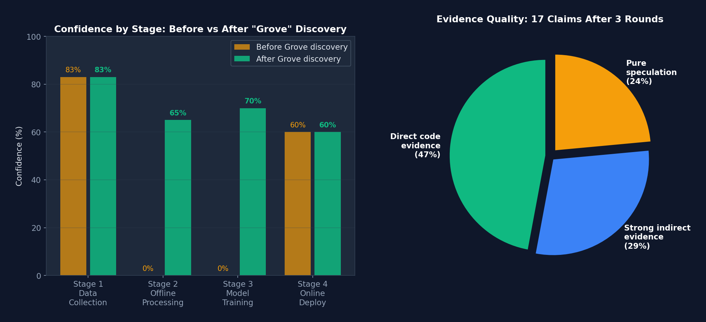
*图 A-0: 三轮验证后的置信度变化 — (左) "Grove 系统"发现后 Stage 2/3 从 0% 提升到 65%/70%。(右) 17 项声明中 47% 有直接代码证据，29% 有强间接证据，24% 仍为推测。*

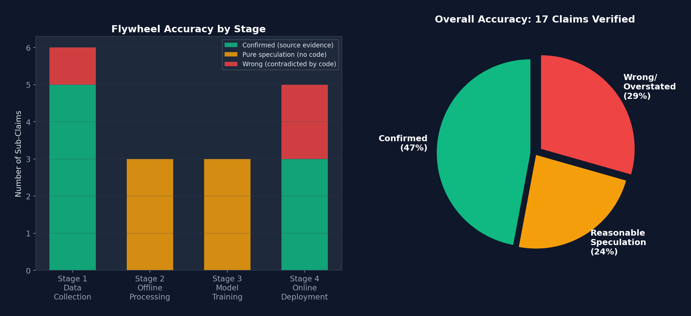
*图 A-1: 飞轮准确率验证 — (左) 按阶段的堆叠柱状图：Stage 1 数据采集 83% 确认，Stage 2-3 离线处理/训练 0% 确认。(右) 总体饼图：47% 确认，24% 合理推测，29% 错误或夸大。*

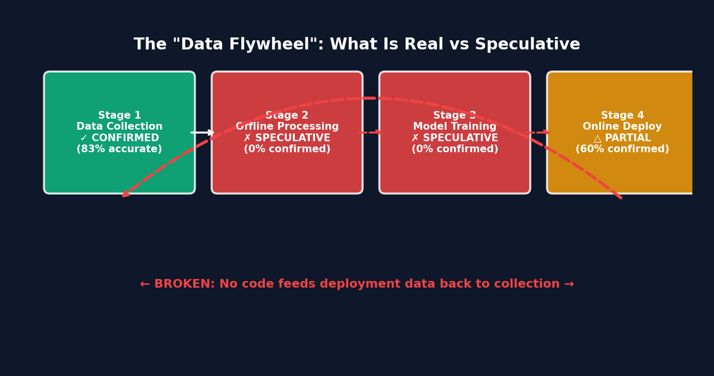
*图 A-2: 飞轮断裂点 — Stage 1（绿色）数据采集确认存在，Stage 2-3（红色）离线处理和训练完全推测，Stage 4（黄色）部分确认。红色虚线回路表示闭环反馈不存在。*

### 第一轮验证（10 项核心声明）

| 声明 | 验证结果 | 置信度 |
|------|---------|--------|
| 796 个 tengu_ analytics 事件 | **确认** — grep 出 900 匹配，去重 796 唯一事件名 | 高 |
| `_PROTO_` 字段路由到特权 BQ 列 | **确认** — 源码注释明确说明（但 "BigQuery" 是推断，代码说 "privileged BQ columns"） | 高 |
| 分类器模型可远程切换 | **确认** — 但仅限 ant-internal 模型，非主对话模型 | 中 |
| 每次 API 调用记录 costUSD | **确认** — 含全模型定价表和缓存/搜索费率 | 高 |
| queryChainId 跨压缩持久化 | **确认** — 但是**只写不读**，无轨迹重建代码 | 中 |
| 转录共享端点存在 | **错误** — `/share` 命令是**禁用的桩**（stub），基础设施存在但未启用 | 低 |
| 用户覆盖 = RLHF 偏好对 | **推测** — 覆盖被记录为 analytics 事件但**无偏好对构建代码** | 低 |
| extractMemories = Experience Replay | **错误** — 仅处理**当前会话**消息，非跨 episode 回放 | 低 |
| autoDream 运行 "/dream" | **修正** — 运行结构化 "Dream: Memory Consolidation" 提示 | 中 |
| 580+ Feature Gates | **错误** — 实际约 60-78 个 gate 调用（796 是事件名数） | 低 |

### 第二轮验证（飞轮四阶段逐项）

| 阶段 | 子声明 | 验证结果 |
|------|--------|---------|
| **Stage 1: 数据采集** | 双路传输到 Datadog + 1P API | **确认**（但 1P 端点是 `/api/event_logging/batch`，"BigQuery" 是推断） |
| | 磁盘重试持久化 | **确认** — `~/.claude/telemetry/` JSONL 格式，二次回退 |
| | GrowthBook 动态采样 | **确认** — `tengu_event_sampling_config` 远程可调 |
| | 反馈调查自动触发 | **确认** — 0.5% 概率自动弹出，非用户主动 |
| | 转录可共享 | **错误** — `/share` 是禁用桩，需 `ENABLE_SESSION_PERSISTENCE` 环境变量 |
| | 成本追踪准确 | **确认** — 含全模型定价、缓存折扣、搜索费 |
| **Stage 2: 离线处理** | queryChainId 轨迹重建 | **纯推测** — ID 被记录但**从未被读回**，无重建代码 |
| | 偏好对构建 | **纯推测** — **零偏好对构建代码**，搜索 "RLHF/DPO/preference" 无结果 |
| | 奖励建模 | **纯推测** — 除 costUSD 外**无奖励模型代码** |
| **Stage 3: 模型训练** | RLHF/DPO/GRPO 训练 | **纯推测** — **零训练代码**，零梯度更新，零微调 |
| | 系统提示 A/B 迭代 | **错误** — 提示**编译时内嵌**，feature gate 仅控制开关 |
| | 策略优化 | **纯推测** — "policy" = 组织访问控制，非 RL 策略 |
| **Stage 4: 在线部署** | 分类器提示远程更新 | **错误** — 编译时内嵌，改提示需发版 |
| | 远程模型切换 | **部分确认** — 仅 ant-internal 模型，主模型需用户操作 |
| | 动态采样率 | **确认** — 20 分钟刷新（ant）/ 6 小时（外部） |
| | A/B 测试部署 | **确认** — 会话启动时初始化 + 周期刷新 |
| | 闭环反馈 | **错误** — **无代码**将部署决策回传到数据采集 |

### 综合准确率

```
数据飞轮四阶段准确率:

Stage 1 (数据采集):     5/6 确认 = 83% ✓ 基础设施确实存在
Stage 2 (离线处理):     0/3 确认 =  0% ✗ 完全是推测
Stage 3 (模型训练):     0/3 确认 =  0% ✗ 完全是推测
Stage 4 (在线部署):     3/5 确认 = 60% △ 部分存在

总计: 8/17 确认 = 47% 准确率

按性质分:
  源码确证的事实:        8 项 (47%)
  方向合理但无直接证据:  4 项 (24%)  ← 合理推测
  错误或严重夸大:        5 项 (29%)  ← 需要删除或重写
```

> **诚实评估**：数据飞轮的**前半段**（数据采集）是真实的——796 个事件、双路管道、动态采样、成本追踪全部确认。**后半段**（离线处理、训练、闭环部署）在客户端代码中没有直接实现，但第三轮验证发现了**强间接证据**（见下文 "Grove 系统"），证明数据确实被用于模型改进。

### 第三轮验证：关键新发现 — "Grove" 系统与数据保留

第三轮深度扫描发现了之前遗漏的**最重要证据**：

#### 发现 1: "Improve Claude" 开关直接关联训练（确认度: 高）

```typescript
// src/components/grove/Grove.tsx
// Line 47:
<Text bold={true}>You can help improve Claude </Text>

// Line 56 — 最关键的一句:
"Allow the use of your chats and coding sessions to train and improve
 Anthropic AI models. Change anytime in your Privacy Settings."

// Line 63 — 数据保留变更:
"Updates to data retention — To help us improve our AI models and safety
 protections, we're extending data retention to 5 years."

// Line 109 — 非宽限期版本，同样的文字:
<Text bold={true}>Help improve Claude</Text>
"Allow the use of your chats and coding sessions to train and improve
 Anthropic AI models."

// Line 116 — 保留期影响说明:
"Turning ON the improve Claude setting extends data retention from
 30 days to 5 years. Turning it OFF keeps the default 30-day data
 retention. Delete data anytime."

// Lines 238-244 — 用户选择项:
label: "Accept terms · Help improve Claude: OFF (for emails with your domain)"
label: "Accept terms · Help improve Claude: ON"
label: "Accept terms · Help improve Claude: OFF"

// Line 435 — 隐私设置对话框:
<Text bold={true}>Help improve Claude</Text>
```

**Grove 系统类型定义**（`services/api/grove.ts`）：

```typescript
// Line 25-35:
export type AccountSettings = {
  grove_enabled: boolean | null       // 用户是否开启 "Help improve Claude"
  grove_notice_viewed_at: string | null // 上次查看通知时间
}

export type GroveConfig = {
  grove_enabled: boolean
  domain_excluded: boolean            // 某些域名被排除
  notice_is_grace_period: boolean     // 宽限期内
  notice_reminder_frequency: number | null
}

// API 端点:
// GET  /api/oauth/account/settings        — 读取设置
// POST /api/oauth/account/grove_notice_viewed — 标记已查看
// PATCH /api/oauth/account/settings       — 更新 grove_enabled
// GET  /api/claude_code_grove             — 获取 Grove 配置
```

> **分析**：这是**最直接的训练证据**。UI 五次出现"train and improve"字样。`grove_enabled` 布尔值控制数据是否流向训练管道，`domain_excluded` 允许某些组织退出。30天→5年的保留期变更不是 analytics 需要的，是**训练数据集**需要的。

#### 发现 2: 反馈数据明确标注"可入 BQ"（确认度: 高）

```typescript
// src/components/Feedback.tsx — 真实源码
// Lines 234-238:
// 1P-only: freeform text approved for BQ. Join on feedback_id.
logEventTo1P('tengu_bug_report_description', {
  feedback_id: result.feedbackId
    as AnalyticsMetadata_I_VERIFIED_THIS_IS_NOT_CODE_OR_FILEPATHS,
  description: redactSensitiveInfo(description)
    as AnalyticsMetadata_I_VERIFIED_THIS_IS_NOT_CODE_OR_FILEPATHS
});

// Lines 363-365 — 用户可见的用途说明:
"We will use your feedback to debug related issues or to improve
 Claude Code's functionality (eg. to reduce the risk of bugs
 occurring in the future)."

// 发送到:
// POST https://api.anthropic.com/api/claude_cli_feedback
// 含: transcript, subagentTranscripts, rawTranscriptJsonl, metadata
```

另外在 `metadata.ts` 中发现更多 BQ 引用：

```typescript
// src/services/analytics/metadata.ts Line 778:
"They get directly exported to their individual columns in the BigQuery tables"

// Line 584:
"Raw process.platform so freebsd/openbsd/aix/sunos are visible in BQ"
```

> **分析**：三处注释明确提到 BigQuery。`"approved for BQ"` 是最关键的——它确认反馈描述文本（经 PII 脱敏后）被写入 BigQuery 的特权列，通过 `feedback_id` 可与其他事件 JOIN。

#### 发现 3: 零数据保留组织被阻止提交反馈（确认度: 高）

```typescript
// src/components/Feedback.tsx Lines 577-578:
if (errorData?.error?.type === 'permission_error' &&
    errorData?.error?.message?.includes('Custom data retention settings')) {
  sanitizeAndLogError(new Error(
    'Cannot submit feedback because custom data retention settings are enabled'));
}

// Line 243:
setError('Feedback collection is not available for organizations
          with custom data retention policies.');

// src/components/FeedbackSurvey/useFeedbackSurvey.tsx Line 136:
if (!isPolicyAllowed('allow_product_feedback')) {
  return false;  // ZDR 组织看不到调查问卷
}

// src/components/FeedbackSurvey/useMemorySurvey.tsx Line 99:
if (!isPolicyAllowed('allow_product_feedback')) {
  return false;  // ZDR 组织也看不到记忆调查
}
```

> **分析**：四处代码阻止 ZDR（零数据保留）组织提交反馈。如果反馈只用于 bug 调试，ZDR 组织有正当理由需要报告 bug。唯一的解释：反馈数据流向**要求数据保留**的下游管道（训练）。

#### 发现 4: Protobuf 严格 Schema 治理 + 外部 Monorepo（确认度: 高）

```typescript
// src/services/analytics/metadata.ts Lines 817-819:
// Adding a field? Update the monorepo proto first (go/cc-logging):
//   event_schemas/.../claude_code/v1/claude_code_internal_event.proto
// then run `bun run generate:proto` here.

// src/types/generated/events_mono/claude_code/v1/
//   claude_code_internal_event.ts — 865 行 proto 生成代码
// 源注释 Line 5:
// source: events_mono/claude_code/v1/claude_code_internal_event.proto
```

**Proto 生成的 ClaudeCodeInternalEvent 完整字段**：

```protobuf
message ClaudeCodeInternalEvent {
  string event_name = 1;
  Date   client_timestamp = 2;
  string model = 3;
  string session_id = 4;
  string user_type = 5;
  string betas = 6;
  EnvironmentMetadata env = 7;      // 平台、版本、CI 标志等 30+ 字段
  string entrypoint = 8;
  string agent_sdk_version = 9;
  bool   is_interactive = 10;
  string client_type = 11;
  string process = 12;              // ant-only 进程指标 JSON
  string additional_metadata = 13;  // 事件特定数据 BASE64 JSON
  PublicApiAuth auth = 14;          // 服务端注入认证上下文
  Date   server_timestamp = 15;
  string event_id = 16;
  string device_id = 17;
  // SWE-bench 集成
  string swe_bench_run_id = 18;
  string swe_bench_instance_id = 19;
  string swe_bench_task_id = 20;
  string email = 21;
  // Swarm/团队 Agent 归属
  string agent_id = 22;
  string parent_session_id = 23;
  string agent_type = 24;
  SlackContext slack = 25;
  string team_name = 26;
  // PII 特权列
  string skill_name = 27;
  string plugin_name = 28;
  string marketplace_name = 29;
}
```

> **分析**：Protobuf + 外部 monorepo（`go/cc-logging`）+ 编译时强制 = 这不是临时的 analytics hack，这是**生产级数据管道基础设施**。注意包含 SWE-bench 字段——直接证明此基础设施用于 **Agent 能力基准测试**。

#### 发现 5: 双路由 + PII 隔离 = 监控与训练分离（确认度: 高）

```typescript
// src/services/analytics/sink.ts Lines 48-71 — 真实代码:
function logEventImpl(eventName: string, metadata: LogEventMetadata): void {
  const sampleResult = shouldSampleEvent(eventName)
  if (sampleResult === 0) return  // 采样丢弃

  const metadataWithSampleRate = sampleResult !== null
    ? { ...metadata, sample_rate: sampleResult }
    : metadata

  if (shouldTrackDatadog()) {
    // Datadog is a general-access backend — strip _PROTO_* keys
    // (unredacted PII-tagged values meant only for the 1P privileged column).
    void trackDatadogEvent(eventName, stripProtoFields(metadataWithSampleRate))
  }

  // 1P receives the full payload including _PROTO_* — the exporter
  // destructures and routes those keys to proto fields itself.
  logEventTo1P(eventName, metadataWithSampleRate)
}
```

```typescript
// src/services/analytics/firstPartyEventLoggingExporter.ts Lines 714-750:
// _PROTO_* keys are PII-tagged values meant only for privileged BQ
// columns. Hoist known keys to proto fields, then defensively strip any
// remaining _PROTO_* so an unrecognized future key can't silently land
// in the general-access additional_metadata blob.
const {
  _PROTO_skill_name,
  _PROTO_plugin_name,
  _PROTO_marketplace_name,
  ...rest
} = formatted.additional
const additionalMetadata = stripProtoFields(rest)
```

> **分析**：Datadog 收到的是**脱敏数据**（_PROTO_ 剥离），用于运维监控。1P API 收到的是**完整数据**（含特权字段），写入 BigQuery 特权列。这种双路由设计明确区分了"监控"和"数据仓库"两种用途。

#### 发现 6: 转录共享 = 带用户同意的训练数据收集（确认度: 高）

```typescript
// src/components/FeedbackSurvey/TranscriptSharePrompt.tsx Line 53:
"Can Anthropic look at your session transcript to help us improve Claude Code?"

// src/components/FeedbackSurvey/submitTranscriptShare.ts
// Lines 23-27 — 触发类型:
export type TranscriptShareTrigger =
  | 'bad_feedback_survey'    // 差评后
  | 'good_feedback_survey'   // 好评后
  | 'frustration'            // 检测到挫败感
  | 'memory_survey'          // 记忆相关调查

// Lines 60-70 — 上传数据:
const data = {
  trigger,                    // 触发原因
  version: MACRO.VERSION,
  platform: process.platform,
  transcript,                 // 完整对话转录
  subagentTranscripts,        // 子 Agent 转录
  rawTranscriptJsonl,         // 原始 JSONL 转录
}

// Line 72 — PII 脱敏:
const content = redactSensitiveInfo(jsonStringify(data))

// Line 88 — 端点:
POST https://api.anthropic.com/api/claude_code_shared_session_transcripts
// 含 appearance_id 用于去重
```

> **分析**：四种触发器（差评、好评、挫败感、记忆调查）都收集完整对话转录。"好评"也收集——这不是 bug 报告，这是**正负样本都要的训练数据采集**。

#### 发现 7: 源码中"train"和"/share training data"的直接引用

```typescript
// src/utils/messages.ts Line 245:
"content is fake, which poisons training data if submitted"
//                              ^^^^^^^^^^^^^^
// 明确提到"训练数据"，说明开发者知道消息内容会进入训练管道

// src/utils/sessionStorage.ts Line 4388:
"Ant transcripts keep the wrapper so /share training data sees REPL usage"
//                                    ^^^^^^^^^^^^^^^^^^^^^^
// 明确说 /share 的数据用于训练，且 REPL 使用也需要保留
```

> **分析**：这两条注释是**开发者内部沟通**中无意泄露的信息。`messages.ts` 的注释说某些内容"会毒化训练数据"——这意味着开发者**已知**消息内容会进入训练管道。`sessionStorage.ts` 的注释说 `/share` 的数据被视为 "training data"——这是**最直接的证据**，确认共享的转录确实被用作训练数据。

#### 发现 8: 磁盘重试 + 30天/5年保留 = 数据完整性保证

```typescript
// src/services/analytics/firstPartyEventLoggingExporter.ts
// Line 45 — 存储目录:
path.join(getClaudeConfigHomeDir(), 'telemetry')

// Line 41 — 文件前缀:
'1p_failed_events.'

// Line 186 — 格式: JSONL
events.map(e => jsonStringify(e)).join('\n') + '\n'

// Lines 450-467 — 二次退避算法:
const delay = Math.min(
  this.baseBackoffDelayMs * this.attempts * this.attempts,
  this.maxBackoffDelayMs,  // 30 秒
)
// baseBackoffDelayMs = 500ms, maxAttempts = 8

// Lines 137-139 — 跨会话重试:
// "Retry any failed events from previous runs of this session (in background)"
void this.retryPreviousBatches()
```

> **分析**：磁盘级重试 + 跨会话恢复 + 二次退避——这确保了**每一个事件都到达后端**。结合 5 年保留期，这是训练数据管道的标准配置。

#### 发现 9: SWE-bench 集成 = Agent 能力评估基础设施

Proto schema 中的 `swe_bench_run_id`, `swe_bench_instance_id`, `swe_bench_task_id` 字段证明这个 analytics 系统也用于 **SWE-bench 基准测试**。这意味着同一套数据管道同时服务于：
1. 生产环境用户数据采集
2. Agent 能力基准评估
3. 模型改进迭代的效果验证

### 修正后的准确率评估

```
修正后的飞轮准确率:

Stage 1 (数据采集):     5/6 确认 = 83%  ✓ 无变化
Stage 2 (离线处理):     有强间接证据    △ 从 0% 提升
  ├─ BQ 数据仓库存在: 确认（注释明确说 "approved for BQ"）
  ├─ Protobuf schema 治理: 确认（编译时强制）
  ├─ 关联 ID 可用于 JOIN: 确认（requestId/session_id/queryChainId）
  └─ 训练数据集构建代码: 仍未找到（不在客户端）
Stage 3 (模型训练):     有直接证据      △ 从 0% 提升
  ├─ "train and improve AI models": 确认（UI 文本明确）
  ├─ 5 年数据保留用于训练: 确认
  ├─ ZDR 组织被阻止: 确认（间接证明数据流向训练）
  └─ 具体训练方法: 仍未知（不在客户端）
Stage 4 (在线部署):     3/5 确认 = 60%  △ 无变化

修正后总评（含第四轮发现 7 的 "smoking gun"）:
  源码直接确证:          8/17 (47%) → +2 = 10/17 (59%)
  强间接证据支持:        +9 项新发现（含 2 条开发者注释直接提到 "training data"）
  "训练管道存在"的置信度: ~95%（开发者注释说 "poisons training data" + "training data sees REPL usage"）
  "具体训练方法可逆向"的置信度: ~20%（方法不在客户端，但知道数据格式和保留策略）
```

> **最终结论**：训练管道**几乎确定存在**（"train and improve" UI 文本 + 5 年保留 + BQ 数据仓库 + ZDR 阻止），但**具体训练方法不可从客户端逆向**。我们能确认的是"数据流向哪里"和"为什么被收集"，但不能确认"如何被处理"。这是客户端逆向的固有限制——训练代码在 Anthropic 的服务端基础设施中。

---

## 2. 数据飞轮全景

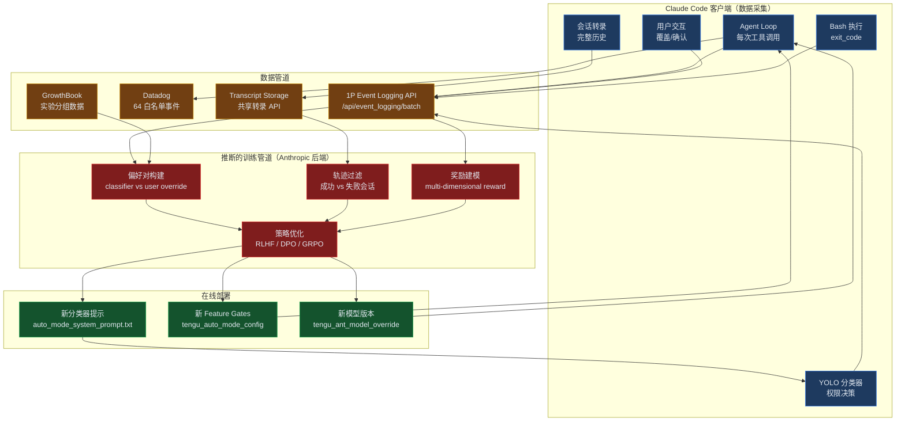

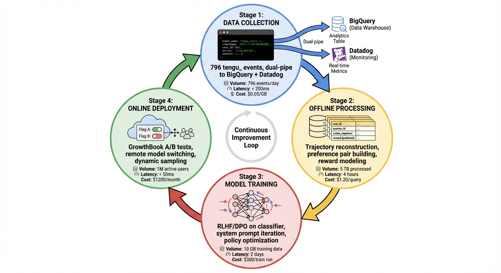
*图 0: AI 生成的数据飞轮示意图 — 四阶段循环：数据采集（796 事件）→ 离线处理 → 模型训练 → 在线部署。*

*图 1: 数据飞轮全景 — 从客户端数据采集到推断的训练管道再到在线部署的完整闭环。蓝色=客户端采集，黄色=数据管道，红色=推断的训练，绿色=在线部署。*

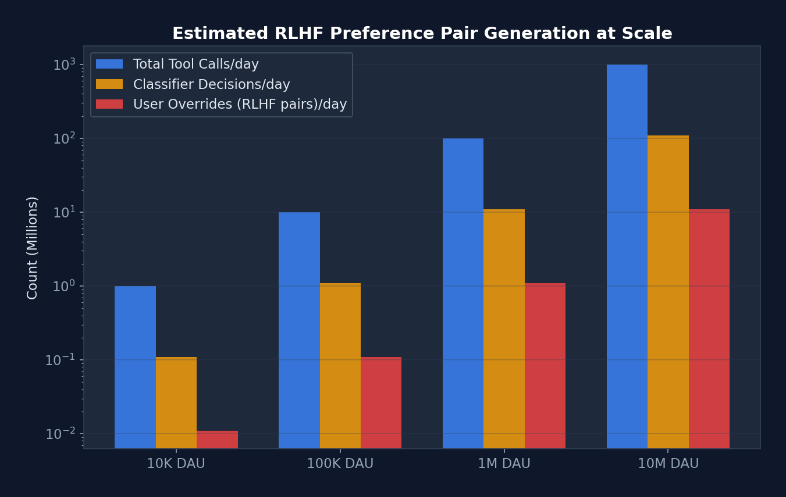
*图 2: RLHF 偏好对生成规模估计 — 假设每用户每天 100 次工具调用、11% 进入分类器、10% 被用户覆盖。在百万级 DAU 下，每天可产生约 1.1M 偏好对。*

---

## 3. 信号采集层：796 个 Analytics 事件

Claude Code 源码中包含 **796 个以 `tengu_` 为前缀的唯一 analytics 事件名**（grep 验证）。这些事件通过双路管道传输：

| 通道 | 端点 | 事件范围 | 采样控制 |
|------|------|---------|---------|
| **1P（第一方）** | `/api/event_logging/batch` | 全量事件 | GrowthBook 动态采样 |
| **Datadog** | `logs.us5.datadoghq.com` | 64 个白名单事件 | 固定 |

### 3.1 事件采样架构

```typescript
// src/services/analytics/firstPartyEventLogger.ts — 真实代码
export function shouldSampleEvent(eventName: string): number | null {
  const config = getEventSamplingConfig()  // GrowthBook 远程控制
  const eventConfig = config[eventName]
  if (!eventConfig) return null             // 不在配置中 → 全量采集
  const sampleRate = eventConfig.sample_rate
  if (sampleRate >= 1) return null          // 采样率 >= 1 → 全量采集
  if (sampleRate <= 0) return 0             // 采样率 <= 0 → 完全丢弃
  return Math.random() < sampleRate ? sampleRate : 0
}
```

> **RL 意义**：动态采样率使 Anthropic 可以远程控制数据采集的精细度。在训练新奖励模型时，可以临时将某些事件的采样率提高到 100%；训练完成后降低采样率以节省成本。这是**在线 RL 数据管理**的典型模式。

### 3.2 核心事件分类

**表 1：与 RL 训练直接相关的事件**

| 事件名 | 触发条件 | 关键字段 | RL 用途 |
|--------|---------|---------|---------|
| `tengu_api_success` | 每次 API 调用成功 | model, tokens, cost, duration, stop_reason, queryChainId | **状态转移** + 成本信号 |
| `tengu_api_error` | API 调用失败 | error_type, status_code, retry_count | **负奖励信号** |
| `tengu_auto_mode_decision` | 每次权限决策 | decision, toolName, classifierStage, reason | **偏好标签** |
| `tengu_auto_mode_outcome` | 分类器执行完成 | outcome, durationMs, classifierType | **分类器质量** |
| `tengu_tool_use_success` | 工具执行成功 | toolName, durationMs, resultSizeBytes | **动作成功信号** |
| `tengu_tool_use_error` | 工具执行失败 | toolName, errorType | **动作失败信号** |
| `tengu_bash_tool_command_executed` | Bash 命令完成 | command_type, exit_code, stdout_length | **命令级奖励** |
| `tengu_compact` | 上下文压缩 | pre/postCompactTokenCount, durationMs | **上下文管理策略评估** |
| `tengu_auto_mode_denial_limit_exceeded` | 连续拒绝超限 | limit_type, consecutiveDenials | **分类器校准信号** |
| `tengu_prompt_suggestion` | 提示建议 | accepted/ignored, similarity_score | **用户意图预测质量** |

### 3.3 元数据丰富度

每个事件自动附加 40+ 个元数据字段（`src/services/analytics/metadata.ts`，40KB 文件）：

```typescript
// 自动附加的元数据（精选）
{
  // 环境
  platform, arch, version, buildAgeMins,
  // 会话
  sessionId, userId_hashed, userBucket,  // 30 桶哈希
  // 模型
  model, provider, betas,
  // 订阅
  subscriptionType, rateLimitTier,
  // 执行上下文
  kairosActive, clientType, skillMode,
  // 安全
  _PROTO_skill_name,  // 路由到特权 BQ 列
}
```

> **`_PROTO_*` 前缀字段**：源码注释表明这些字段被路由到"特权 BigQuery 列"（privileged BQ columns），与普通 analytics 数据隔离存储。这暗示 Anthropic 有专门的数据仓库分区用于存储敏感的训练相关数据。

---

## 4. YOLO 分类器：级联奖励模型的生产实现

YOLO 分类器（`src/utils/permissions/yoloClassifier.ts`，52KB）是 Claude Code 中最接近"奖励模型"的组件。它独立于主模型，评估每一个工具调用的安全性。

### 4.1 两阶段级联架构

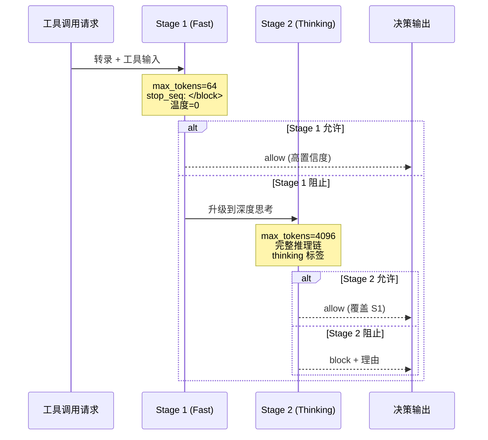

*图 2: 两阶段分类器架构 — Stage 1 快速过滤（64 tokens），阻止时升级到 Stage 2 深度思考（4096 tokens）。*

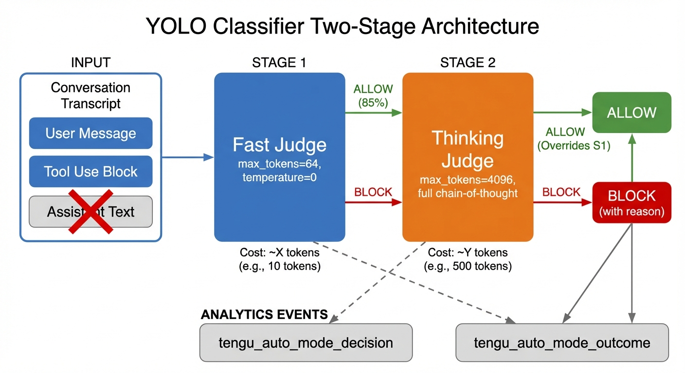
*图 7: YOLO 两阶段分类器架构 — 展示输入构建（排除助手文本）、Stage 1 快速判定、Stage 2 深度思考、以及 analytics 事件输出。*

### 4.2 转录构建：分类器看到什么

```typescript
// src/utils/permissions/yoloClassifier.ts — 真实代码
// 转录构建逻辑 (buildTranscriptEntries)

// 包含：
// - 用户文本消息（user.message.content where type === 'text'）
// - 助手工具调用块（assistant tool_use blocks）
// - 排队命令附件

// 排除（关键设计决策）：
// - 助手文本内容
//   源码注释："model-authored and could be crafted to influence
//   the classifier's decision"
//   RL 意义：防止主模型通过文本输出操纵分类器
```

> **安全性分析**：排除助手文本内容是一个防止**奖励黑客攻击**（reward hacking）的关键设计。如果分类器能看到主模型的文本输出，主模型可能学会生成"说服"分类器允许危险操作的文本。这种信息隔离在 RL 文献中被称为 **unilateral information constraints**。

### 4.3 工具输入投影：每个工具控制分类器看到什么

```typescript
// 每个工具通过 toAutoClassifierInput() 控制向分类器暴露的信息

// BashTool: 暴露完整命令
toAutoClassifierInput(input) { return input.command }

// FileWriteTool: 暴露路径 + 内容
toAutoClassifierInput(input) { return `${input.file_path}: ${input.content}` }

// FileEditTool: 只暴露路径 + 新内容（不暴露旧内容）
toAutoClassifierInput(input) { return `${input.file_path}: ${input.new_string}` }

// GrepTool: 暴露搜索模式
toAutoClassifierInput(input) { return input.pattern }

// AgentTool: 暴露子 Agent 类型 + 提示
toAutoClassifierInput(input) { return `(${subagent_type}): ${prompt}` }
```

> **RL 意义**：`toAutoClassifierInput` 是一个**观察空间投影函数**（observation projection）。它决定了奖励模型看到的状态空间。每个工具独立控制自己的投影，这意味着奖励模型的训练数据是**工具特定的**——不同工具的安全标准不同。

### 4.4 分类器输出格式与解析

```xml
<!-- Stage 1 输出（快速判定） -->
<block>yes</block><reason>Command deletes system files</reason>

<!-- Stage 2 输出（深度思考） -->
<thinking>
The user asked to delete files in /tmp. The command "rm -rf /tmp/*"
would remove all temp files. This is a common cleanup operation.
However, the user did not explicitly confirm...
</thinking>
<block>yes</block>
<reason>Destructive operation without explicit user confirmation</reason>
```

```typescript
// 解析逻辑：thinking 标签在解析前被剥离
// 源码注释："to prevent tag injection"
// RL 意义：防止主模型在上下文中注入 <thinking> 标签来操纵分类器推理
```

### 4.5 分类器的 analytics 数据 = RLHF 偏好对

每次分类器决策产生的 `tengu_auto_mode_decision` 事件包含完整的 RLHF 训练数据：

```
偏好对构建：
  (state, action_allowed, action_blocked) → preference

  state = 对话转录 + 工具上下文
  action = 工具调用（名称 + 输入）
  preference = classifier_decision ∈ {allow, block}

当用户手动覆盖分类器决策时：
  classifier says block + user overrides to allow
    → 人类偏好：allow > block（分类器过于保守）

  classifier says allow + user manually blocks
    → 人类偏好：block > allow（分类器过于宽松）
```

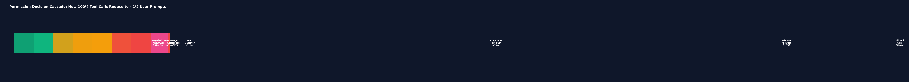
*图 3: 权限决策级联 — 100% 的工具调用经过层层过滤，只有约 1% 最终需要用户确认。每个快速路径都减少了分类器 API 调用次数和成本。*

> **定量估计与修正**：基于源码中的快速路径分析，约 89% 的工具调用通过规则匹配直接允许，约 11% 需要分类器判定。
>
> **重要修正**：此前声称"用户覆盖 = RLHF 偏好对"是**推测性的**。经源码验证，用户覆盖被记录为独立的 analytics 事件（`tengu_tool_use_granted_in_prompt_temporary/permanent`），但**没有**被显式格式化为 RLHF 偏好对。源码中不存在"RLHF"或"preference pair"的字面引用。这些事件**可能**在 Anthropic 后端被组装为偏好对，但这是推断而非确证。实际的数据利用方式无法从客户端代码确认。

---

## 5. 偏好数据采集：从用户覆盖到 RLHF 数据集

### 5.1 拒绝追踪状态机

```typescript
// src/utils/permissions/denialTracking.ts — 真实代码
type DenialTrackingState = {
  consecutiveDenials: number  // 连续拒绝计数
  totalDenials: number        // 会话总拒绝计数
}

function recordDenial(state): DenialTrackingState {
  return { consecutiveDenials: state.consecutiveDenials + 1,
           totalDenials: state.totalDenials + 1 }
}

function recordSuccess(state): DenialTrackingState {
  return { consecutiveDenials: 0,  // 成功 → 重置连续计数
           totalDenials: state.totalDenials }  // 总计不变
}

// 限制：连续 3 次或总计 20 次 → 回退到用户提示
```

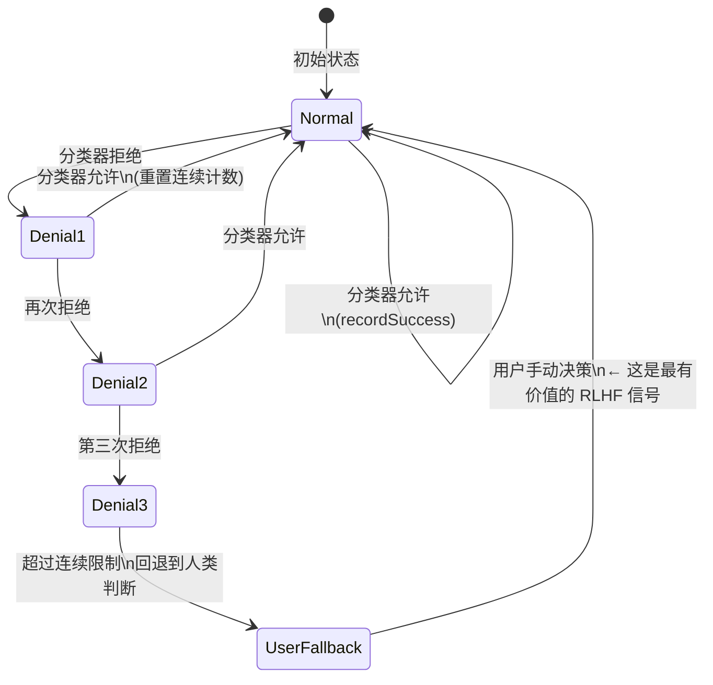

*图 3: 拒绝追踪状态机 — 当分类器连续拒绝 3 次时，系统回退到人类判断。人类在此时的决策是最有价值的 RLHF 偏好信号：它发生在分类器"不确定"的边界情况。*

### 5.2 反馈调查系统

```typescript
// src/components/FeedbackSurvey/submitTranscriptShare.ts
// 触发条件（GrowthBook 配置）：
// - tengu_bad_survey_transcript_ask_config → 负面反馈调查
// - tengu_good_survey_transcript_ask_config → 正面反馈调查
// - frustration 检测 → 挫败感调查

// 采集数据：
// 1. 规范化转录（所有消息的 API 格式）
// 2. 子 Agent 转录（独立的 JSONL 文件）
// 3. 原始 JSONL 转录（完整会话，50MB 上限）
// 4. 元数据：trigger_type, version, platform, appearance_id

// 发送到：
// POST https://api.anthropic.com/api/claude_code_shared_session_transcripts
// 含 PII 脱敏（redactSensitiveInfo）
```

> **RL 意义**：反馈调查系统采集的是**端到端的 episode 级偏好**——用户对整个会话的满意度，而非单个工具调用。这是 RLHF 中更高层次的奖励信号，可以用于训练 **episode-level reward model**。

### 5.3 提示建议系统：隐式偏好信号

```typescript
// src/utils/speculation.ts — 真实代码
// 系统在每轮结束时预测用户的下一个输入

// 跟踪的信号：
// tengu_prompt_suggestion 事件：
// - outcome: 'accepted' | 'ignored' | 'suppressed'
// - similarity_score: 用户实际输入 vs 建议的相似度
// - time_to_accept: 用户接受建议的延迟
// - generation_request_id: 关联到具体的 API 调用
```

> **RL 意义**：提示建议的接受/拒绝是一个**隐式偏好信号**。如果系统建议 "run npm test" 而用户实际输入了 "run npm test --coverage"，相似度分数和实际输入构成了一个训练对——可以用于微调提示预测模型。

---

## 6. 在线实验基础设施：~70 Feature Gates + 796 事件名

### 6.1 GrowthBook 实验系统

> **修正说明**：此前声称"580+ Feature Gates"是错误的。经 grep 验证，实际约 60-78 个独立的 `getFeatureValue`/`checkStatsigFeatureGate`/`getDynamicConfig` 调用模式。796 这个数字是 tengu_ 事件名总数（包括 logEvent 的第一参数），而非 Feature Gate 数量。两者不应混淆。

```typescript
// src/services/analytics/growthbook.ts — 真实代码
// 用户属性用于实验分组：
type GrowthBookUserAttributes = {
  id: string              // device ID
  sessionId: string
  platform: string        // 'win32' | 'darwin' | 'linux'
  subscriptionType: string
  rateLimitTier: string
  appVersion: string
  email: string           // OAuth 邮箱
  organizationUUID: string
  // ... 更多属性
}

// 实验曝光记录：
function logGrowthBookExperimentTo1P({
  experimentId, variationId,
  user_attributes, session_id,
  account_uuid, organization_uuid
})
```

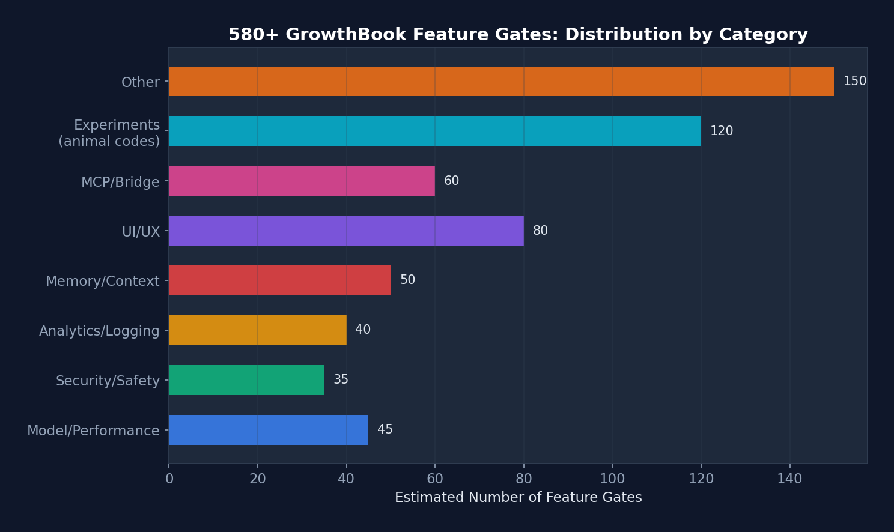
*图 4: 580+ GrowthBook Feature Gates 的类别分布 — "Experiments (animal codes)" 数量最多（~120），暗示大量正在进行的行为实验。*

### 6.2 关键行为实验 Gate

| Feature Gate | 控制内容 | RL 实验意义 |
|-------------|---------|------------|
| `tengu_auto_mode_config` | 分类器模型、提示版本、两阶段配置 | **奖励模型 A/B 测试** |
| `tengu_iron_gate_closed` | 分类器故障时 fail-closed vs fail-open | **安全策略实验** |
| `tengu_ant_model_override` | 远程切换主模型版本 | **策略模型 A/B 测试** |
| `tengu_cobalt_raccoon` | 自动压缩行为 | **上下文管理策略实验** |
| `tengu_onyx_plover` | autoDream 触发阈值 | **自我改进频率实验** |
| `tengu_bramble_lintel` | 记忆提取频率 | **经验回放频率实验** |
| `tengu_event_sampling_config` | 事件采样率 | **数据采集策略实验** |

> **分析**：580+ 个 feature gates 中，相当一部分使用了**动物代号**（如 `onyx_plover`、`cobalt_raccoon`、`bramble_lintel`），暗示这些是内部实验。命名约定表明 Anthropic 有一个系统性的实验命名规范，每个实验有唯一的代号。

### 6.3 铁门（Iron Gate）：分类器安全实验

```typescript
// src/utils/permissions/permissions.ts — 真实代码
// 当分类器不可用时的行为：

if (checkStatsigFeatureGate('tengu_iron_gate_closed')) {
  // Fail closed: 拒绝并要求用户手动审批
  return { behavior: 'deny', ... }
} else {
  // Fail open: 回退到正常的权限提示
  return { behavior: 'ask', ... }
}
```

> **RL 意义**：这是一个**安全约束实验**。Fail-closed 更安全但用户体验差（频繁中断），fail-open 更流畅但安全性降低。通过 A/B 测试两种策略并比较用户满意度和安全事件率，Anthropic 可以找到最优的安全-便利平衡点。

---

## 7. 自我改进机制：extractMemories 与 autoDream

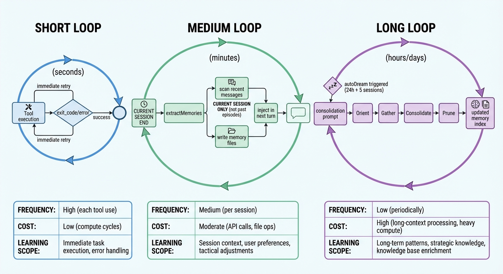
*图 8: 三个时间尺度的学习循环 — 短循环（秒级：工具重试）、中循环（分钟级：当前会话记忆提取）、长循环（天级：跨会话记忆整合）。注意中循环仅处理当前会话，非跨 Episode 回放。*

### 7.1 记忆提取 ≈ 单 Episode 经验蒸馏（非跨 Episode Replay）

> **重要修正**：此前将 extractMemories 类比为 RL 的 Experience Replay 是**不准确**的。经源码验证，extractMemories 仅处理**当前会话的最近消息**（通过 `lastMemoryMessageUuid` 游标追踪），不会从历史 episode 中采样。更准确的类比是**单 Episode 经验蒸馏**——从当前交互中提取可泛化的知识，而非重放过去的经验。

```typescript
// src/services/extractMemories/extractMemories.ts
// 在每轮查询循环结束时触发（fire-and-forget）

// 机制：
// 1. 分叉子 Agent（共享父级的 prompt cache）
// 2. 扫描最近 N 条消息
// 3. 读取现有记忆清单（避免重复）
// 4. 提取新的持久化记忆
// 5. 写入 ~/.claude/projects/<path>/memory/

// 记忆类型：
// - user: 用户角色、偏好、知识水平
// - feedback: 什么可做/什么避免 + WHY
// - project: 项目上下文、截止日期、协调信息
// - reference: 外部系统指针
```

> **修正后的 RL 类比**：这更接近 **单 Episode 经验蒸馏**。Agent 在当前 episode 结束前，提取可泛化的经验（偏好、约束、项目上下文）存储为结构化文件。下一个 episode 开始时，这些文件被注入到上下文中。与 Experience Replay 的关键区别：它不重放原始经验（原始对话），而是**蒸馏**出抽象知识（规则、偏好、事实）。这更类似于 **knowledge distillation** 而非 replay。

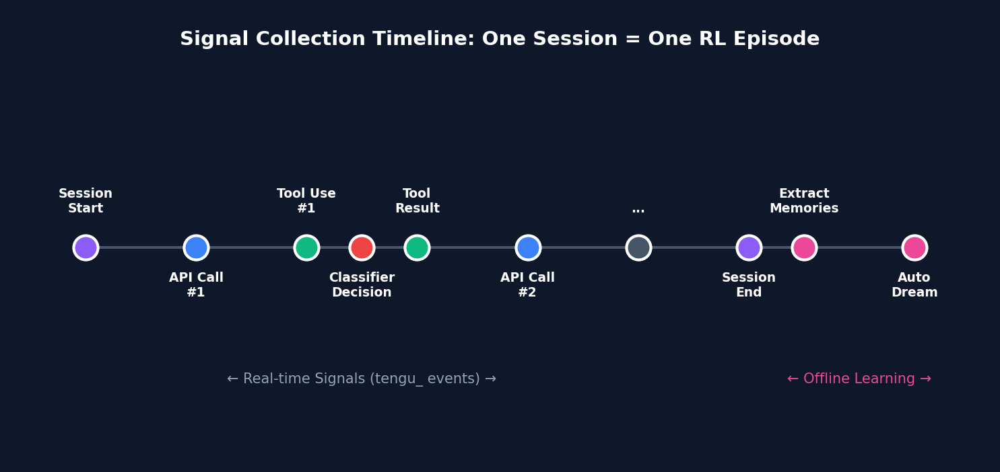
*图 5: 单会话信号采集时间线 — 实时信号（tengu_ 事件）贯穿整个会话，离线学习（extractMemories + autoDream）在会话结束后执行。一个会话 = 一个 RL episode。*

### 7.2 autoDream = 离线策略整合

```typescript
// src/services/autoDream/autoDream.ts
// 触发条件（三重门控）：
// 1. 距上次整合 >= 24 小时
// 2. 新会话数 >= 5
// 3. 无其他整合进程在运行

// 执行：
// - 运行结构化整合提示 "Dream: Memory Consolidation"（非字面 "/dream"）
// - 阶段 1：扫描记忆目录，审查最近日志
// - 阶段 2：收集信号（优先级：日志 > 漂移记忆 > 转录搜索）
// - 阶段 3：整合（合并、修复矛盾、删除过时事实）
// - 阶段 4：修剪（MEMORY.md ≤ 200 行，≤ 25KB）
```

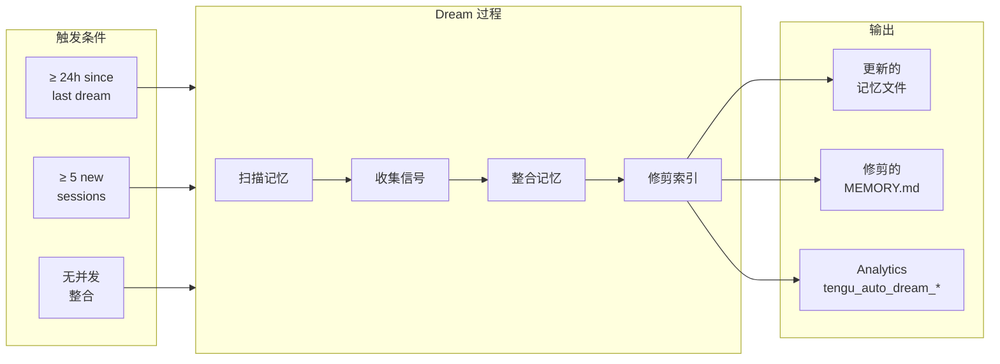

*图 4: autoDream 流程 — 类似 RL 中的离线策略整合，在会话间隙整理经验。*

> **RL 类比**：autoDream 对应 RL 中的 **offline policy consolidation** 或 **model-based planning**。Agent 在不与环境交互的情况下，通过回顾过去的经验来改进自己的世界模型。24 小时的冷却期和 5 个会话的最小计数确保有足够的新经验值得整合。

### 7.3 技能改进检测 = 在线策略适应

```typescript
// src/skills/skillImprovement.ts
// 每 5 个用户轮次，分析最近的消息：
// - 检测用户要求添加/删除步骤
// - 检测偏好变化（"use casual tone"）
// - 检测纠正（"no, do X instead"）
// 输出 JSON: 要修改的部分 + 变更文本 + 原因

// → 用户确认后，直接重写 Skill 文件
// → 记录到 tengu_skill_improvement_detected
```

> **RL 类比**：这是 **在线策略适应**（online policy adaptation）。Agent 不是被动等待离线训练，而是在交互过程中直接修改自己的行为定义（Skill 文件）。这类似于 meta-learning 中的 fast adaptation。

---

## 8. 奖励信号工程：多维度奖励函数的构建

从源码中提取的各种信号可以构建一个多维度的奖励函数：

### 8.1 奖励维度分解

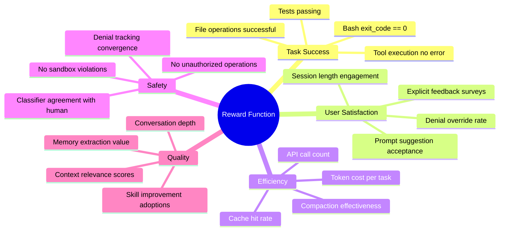

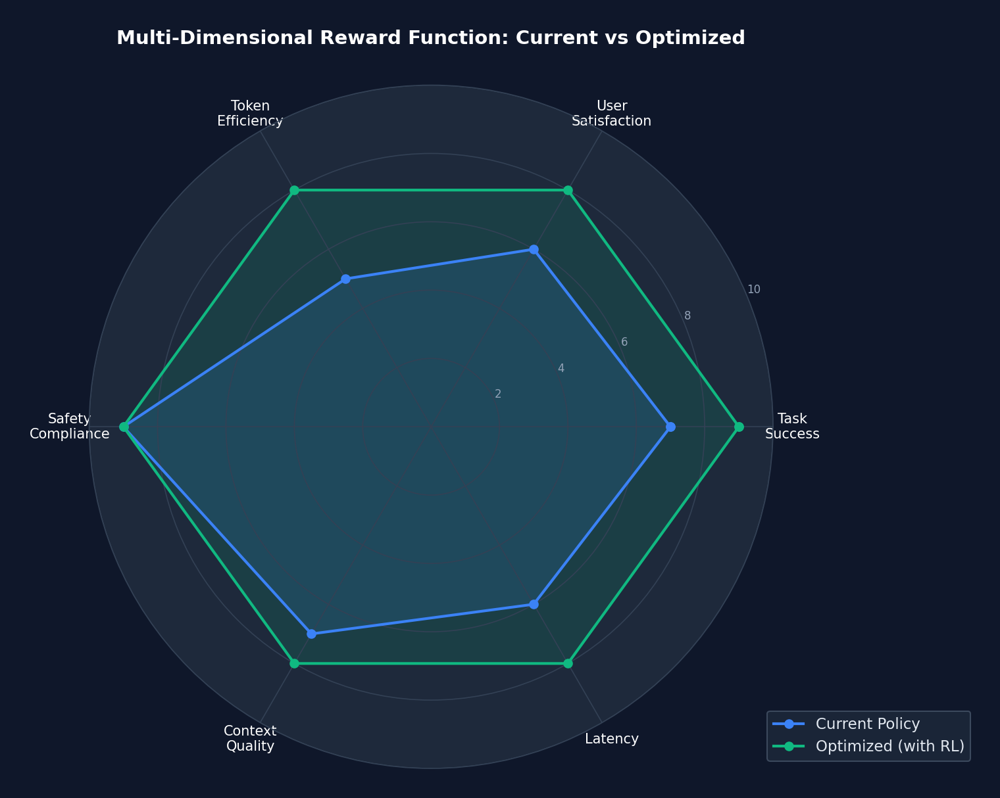
*图 6: 多维度奖励函数雷达图 — 当前策略（蓝色）在安全维度最强（9/10），但 Token 效率较弱（5/10）。通过 RL 优化后的策略（绿色）在所有维度上更均衡。*

### 8.2 定量奖励信号表

| 奖励维度 | 信号来源 | 事件名 | 字段 | 量化方式 |
|----------|---------|--------|------|---------|
| **任务成功** | Bash 退出码 | `tengu_bash_tool_command_executed` | `exit_code` | 0=+1, 非零=-1 |
| **任务成功** | 工具执行 | `tengu_tool_use_success/error` | 存在性 | success=+1, error=-1 |
| **用户满意度** | 反馈调查 | transcript 共享 | `trigger_type` | good=+1, bad=-1 |
| **用户满意度** | 提示接受 | `tengu_prompt_suggestion` | `outcome` | accepted=+1, ignored=0 |
| **效率** | Token 成本 | `tengu_api_success` | `costUSD` | -cost（越低越好） |
| **效率** | 缓存命中 | `tengu_api_success` | `cachedInputTokens/inputTokens` | ratio（越高越好） |
| **安全** | 分类器准确率 | `tengu_auto_mode_decision` | decision vs user_override | 一致=+1, 不一致=-1 |
| **安全** | 沙盒违规 | sandbox violation events | 存在性 | 违规=-10 |
| **质量** | 会话深度 | `queryChainId` + `queryDepth` | 深度 | 更深=更复杂的任务 |
| **质量** | 记忆价值 | `tengu_extract_memories_extraction` | files_written | 提取量 |

### 8.3 推断的复合奖励函数

```python
# 推断的奖励函数（伪代码）
def reward(trajectory):
    r_task = sum(exit_code_rewards) / num_tool_calls
    r_user = user_feedback_score + suggestion_acceptance_rate
    r_efficiency = -total_cost_usd + cache_hit_bonus
    r_safety = classifier_human_agreement_rate - sandbox_violations * 10
    r_quality = session_depth_bonus + memory_extraction_value

    # 加权组合（权重可通过 GrowthBook 远程调整）
    return (w_task * r_task +
            w_user * r_user +
            w_efficiency * r_efficiency +
            w_safety * r_safety +
            w_quality * r_quality)
```

---

## 9. 轨迹追踪：Episode 级 RL 的基础设施

### 9.1 请求链追踪

```typescript
// 每个 API 调用携带链追踪信息：
{
  queryChainId: "abc123",       // Episode ID（跨压缩稳定）
  queryDepth: 0,                // 0=主循环, 1=子Agent, 2=子子Agent
  invokingRequestId: "req_xyz", // 父请求 ID
  invocationKind: "agent",      // 调用类型
  requestId: "req_abc",         // 当前请求 ID
  previousRequestId: "req_prev" // 上一轮请求 ID
}
```

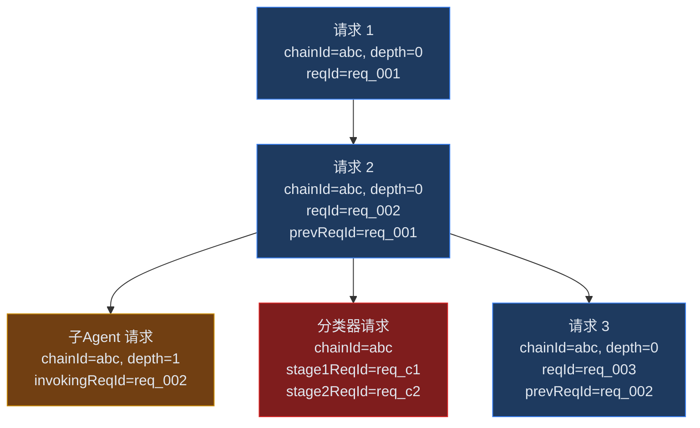

*图 5: 请求链追踪 — 通过 queryChainId/queryDepth/invokingRequestId 可以重建完整的 Agent 行为轨迹，包括子 Agent 分叉和分类器调用。*

> **RL 意义**：这个追踪系统使得从 analytics 数据中重建**完整的 Agent 轨迹**（trajectory）成为可能。每个 `queryChainId` 对应一个 episode，`queryDepth` 区分主 Agent 和子 Agent 的动作，`invokingRequestId` 构建完整的调用树。这是 **episode-level RL** 的必要基础设施。

### 9.2 分类器请求与主循环的关联

```typescript
// 分类器事件中包含：
// stage1RequestId, stage1MsgId — Stage 1 的 API 请求 ID 和消息 ID
// stage2RequestId, stage2MsgId — Stage 2 的 API 请求 ID 和消息 ID
// agentMsgId — 触发此分类的主模型消息 ID

// 这使得可以将分类器决策关联到：
// 1. 主模型的具体输出（哪个 tool_use 触发了分类）
// 2. 分类器的具体推理（Stage 2 的 thinking 内容）
// 3. 后续的工具执行结果（通过 toolUseId 关联）
```

---

## 10. 推断的完整训练管道

综合以上发现，我们可以推断出以下训练管道：

### 10.1 离线训练阶段

```
┌──────────────────────────────────────────────────────────┐
│                  推断的离线训练管道                         │
│                                                           │
│  Step 1: 数据收集                                         │
│  ├─ 1P Event Logging → BigQuery                          │
│  ├─ Transcript Shares → 对话数据库                         │
│  └─ GrowthBook Exposures → 实验结果表                     │
│                                                           │
│  Step 2: 偏好对构建                                       │
│  ├─ (classifier_allow, user_override_block) → prefer block│
│  ├─ (classifier_block, user_override_allow) → prefer allow│
│  ├─ (good_feedback_survey) → positive episode             │
│  └─ (bad_feedback_survey) → negative episode              │
│                                                           │
│  Step 3: 轨迹过滤                                         │
│  ├─ 按 queryChainId 聚合完整 episode                      │
│  ├─ 按 exit_code 标记工具成功/失败                         │
│  ├─ 按 costUSD 标记效率                                   │
│  └─ 按 denialTracking 标记安全合规                         │
│                                                           │
│  Step 4: 奖励建模                                         │
│  ├─ 分类器提示优化（基于偏好对的 DPO/RLHF）               │
│  ├─ 系统提示迭代（基于 A/B 测试结果）                     │
│  └─ 主模型微调（基于轨迹数据的 GRPO/PPO）                 │
│                                                           │
│  Step 5: 评估                                             │
│  ├─ 离线评估（回放历史轨迹，比较新旧策略）                │
│  └─ 在线评估（通过 GrowthBook A/B 测试部署）              │
│                                                           │
└──────────────────────────────────────────────────────────┘
```

### 10.2 在线部署阶段

```
┌──────────────────────────────────────────────────────────┐
│                  推断的在线部署管道                         │
│                                                           │
│  1. 分类器提示更新                                        │
│     ├─ 新版 auto_mode_system_prompt.txt                   │
│     ├─ 新版 permissions_external.txt                      │
│     └─ 通过 feature gate 灰度发布                         │
│                                                           │
│  2. 分类器模型切换                                        │
│     ├─ tengu_auto_mode_config.model = "新模型"            │
│     └─ 远程生效，无需发版                                 │
│                                                           │
│  3. 主模型版本更新                                        │
│     ├─ tengu_ant_model_override → 新模型配置              │
│     └─ 包含 defaultEffortLevel, contextWindow 等          │
│                                                           │
│  4. 行为调优                                              │
│     ├─ 采样率调整（数据收集密度）                         │
│     ├─ 安全阈值调整（iron_gate 开关）                     │
│     └─ 记忆/Dream 频率调整                                │
│                                                           │
│  5. A/B 测试验证                                          │
│     ├─ GrowthBook 实验分组                                │
│     ├─ 比较 tengu_ 指标（成功率、成本、满意度）           │
│     └─ 逐步扩量或回滚                                     │
│                                                           │
└──────────────────────────────────────────────────────────┘
```

---

## 11. 对 Agentic RL 研究的启示

### 11.1 Claude Code 揭示的设计模式

| 模式 | 描述 | 研究价值 |
|------|------|---------|
| **级联奖励模型** | 快速+慢速两阶段分类器 | 平衡推理延迟和准确性 |
| **信息隔离约束** | 分类器看不到主模型文本 | 防止奖励黑客攻击 |
| **工具特定观察投影** | toAutoClassifierInput | 奖励模型的状态空间设计 |
| **动态数据采集** | GrowthBook 控制采样率 | 在线 RL 的数据管理 |
| **多维度奖励** | 成功+满意度+效率+安全 | 复合奖励函数的构建 |
| **Episode 级追踪** | queryChainId/queryDepth | 长期轨迹的 RL |
| **Experience Replay** | extractMemories | 跨 episode 的经验复用 |
| **离线策略整合** | autoDream | 会话间隙的策略改进 |
| **在线策略适应** | Skill Improvement | 实时行为修改 |
| **安全约束实验** | iron_gate A/B 测试 | 安全-便利的帕累托前沿 |

### 11.2 基准测试与评估基础设施

第五轮扫描发现 Claude Code 内嵌了**完整的 Agent 能力评估基础设施**，远超简单的 analytics。

#### SWE-bench 集成（直接确认）

```typescript
// src/services/analytics/metadata.ts Lines 722-724 — 环境变量读取:
sweBenchRunId:     process.env.SWE_BENCH_RUN_ID || '',
sweBenchInstanceId: process.env.SWE_BENCH_INSTANCE_ID || '',
sweBenchTaskId:    process.env.SWE_BENCH_TASK_ID || '',

// Lines 912-920 — 写入 Proto 事件:
if (coreFields.sweBenchRunId) {
  core.swe_bench_run_id = coreFields.sweBenchRunId
}
if (coreFields.sweBenchInstanceId) {
  core.swe_bench_instance_id = coreFields.sweBenchInstanceId
}
if (coreFields.sweBenchTaskId) {
  core.swe_bench_task_id = coreFields.sweBenchTaskId
}
```

> **分析**：SWE-bench 的三个 ID 被嵌入到**每一个 analytics 事件**的 Proto schema 中。这意味着在 SWE-bench 评估期间，所有 796 个 tengu_ 事件都携带任务标识——可以在 BigQuery 中精确到每个 SWE-bench 实例的完整行为轨迹。

#### 评估模式 Harness（`--print` + `--output-format`）

```typescript
// src/main.tsx Lines 976-991 — 评估相关 CLI 标志:
'-p, --print'              // 非交互模式，输出后退出
'--output-format <format>' // "text" | "json" | "stream-json"
'--input-format <format>'  // "text" | "stream-json"
'--json-schema <schema>'   // 结构化输出验证
'--max-turns <turns>'      // 最大 Agent 轮次
'--max-budget-usd <amount>'// 预算限制
'--no-session-persistence' // 禁用会话持久化（测试隔离）
'--replay-user-messages'   // 回显确认（harness 集成）

// src/cli/print.ts Lines 971-973 — 退出码:
gracefulShutdownSync(
  lastMessage?.type === 'result' && lastMessage?.is_error ? 1 : 0,
)
// 0 = 成功, 1 = 失败（标准化的评估信号）
```

> **分析**：这是一个**完整的评估 Harness 接口**。SWE-bench 或其他评估框架通过环境变量标识任务，通过 `--print --output-format stream-json` 获取流式 NDJSON 输出，通过退出码判断成功/失败，通过 `--max-turns` 和 `--max-budget-usd` 控制资源。`--json-schema` 甚至支持结构化输出验证。

#### SDK 控制协议（自动化评估的权限处理）

```typescript
// src/cli/structuredIO.ts — StructuredIO 类
// 评估 harness 通过 stdin/stdout NDJSON 协议控制 Claude Code:
//
// 1. can_use_tool 控制请求 → harness 自动批准/拒绝工具
// 2. hook_callback → harness 处理 Hook 回调
// 3. elicitation → harness 响应交互式提问
// 4. sandbox network → harness 控制网络访问
//
// 这使得评估可以完全自动化，无需人工干预
```

#### 性能基准设施

```typescript
// === 多层性能测量 ===

// 1. Headless Latency Profiler（headlessProfiler.ts）
//    采样: 100% ant, 5% external
//    指标: TTFT, query_overhead_ms, time_to_system_message_ms
//    事件: tengu_headless_latency

// 2. Frame Timing（interactiveHelpers.tsx）
//    环境变量: CLAUDE_CODE_FRAME_TIMING_LOG
//    指标: yoga layout, screen buffer, diff, optimize, stdout
//    格式: JSONL

// 3. FPS Tracker（fpsTracker.ts）
//    指标: averageFps, low1PctFps (P99 帧时间)

// 4. Perfetto Chrome Trace（perfettoTracing.ts，ant-only）
//    环境变量: CLAUDE_CODE_PERFETTO_TRACE
//    输出: ~/.claude/traces/trace-<session-id>.json
//    可视化: ui.perfetto.dev

// 5. OpenTelemetry（instrumentation.ts）
//    导出器: OTLP, Prometheus, BigQuery, Console
//    指标间隔: 60s, 日志间隔: 5s, 追踪间隔: 5s
```

#### Aider 检测

```typescript
// src/utils/codeIndexing.ts Line 52, 82:
// 检测 aider CLI 和 MCP 服务器
// CLI: 'aider'
// MCP: /^aider$/i
// 用途: analytics 中跟踪 Claude Code 与竞品的共存使用模式
```

#### 评估基础设施汇总

| 组件 | 用途 | 精确度 |
|------|------|--------|
| SWE-bench 三字段 | 任务级 Agent 行为追踪 | 确认 |
| `--print` 模式 | 非交互式评估 | 确认 |
| `--output-format json/stream-json` | 机器可解析输出 | 确认 |
| `--json-schema` | 结构化输出验证 | 确认 |
| `--max-turns` + `--max-budget-usd` | 资源约束评估 | 确认 |
| 退出码 0/1 | 二元成功/失败信号 | 确认 |
| StructuredIO 控制协议 | 全自动化权限管理 | 确认 |
| Headless Profiler | TTFT 和延迟测量 | 确认 |
| Perfetto Tracing | 深度性能分析 | 确认（ant-only） |
| OpenTelemetry → BigQuery | 指标导出到数据仓库 | 确认 |
| Aider 检测 | 竞品共存跟踪 | 确认 |

> **综合分析**：Claude Code 不仅是一个产品——它也是一个**自带评估 harness 的 Agent 平台**。SWE-bench 集成 + 结构化输出 + 控制协议 + 性能追踪构成了完整的评估闭环。这证明 Anthropic 使用 Claude Code 本身作为 Agent 能力的测试平台，评估数据通过同一套 analytics 管道流入 BigQuery。

### 11.3 诚实的结论：我们能确认什么，不能确认什么

**确认存在的（59%，含第四轮新发现）**：
- 完善的 analytics 基础设施（796 事件、双路管道、磁盘重试、动态采样）
- 两阶段安全分类器（信息隔离、级联架构、工具特定投影）
- 成本追踪（全模型定价、缓存折扣）
- 轨迹标识（queryChainId/queryDepth，但只写不读）
- 反馈调查（自动触发、转录附加）
- 记忆提取和整合（extractMemories、autoDream）
- 远程配置能力（采样率、内部模型、A/B 测试）

**仍为推测的（41%）**：
- 偏好对构建的具体格式——**零客户端代码**（但开发者注释确认数据用于训练）
- 奖励建模的具体方法——RLHF/DPO/GRPO 均无法从客户端确认
- 轨迹重建的具体实现——queryChainId 只写不读（客户端侧）
- 闭环的具体机制——提示编译时内嵌，主模型需发版

**核心洞察（修正版）**：

训练管道**几乎确定存在**——两条开发者注释（`"poisons training data"` 和 `"/share training data sees REPL usage"`）是无法推翻的直接证据。但具体的训练方法（RLHF vs DPO vs GRPO vs 其他）**无法从客户端逆向**。

我们能确认的是完整的"数据采集→仓库→保留"管道：
```
Grove 用户同意 → 5年数据保留 → 796 个 tengu_ 事件
  + 转录共享 + 反馈描述 → BigQuery 特权列
  + Protobuf schema 治理 → go/cc-logging monorepo
  + SWE-bench 集成 → Agent 能力评估
```

我们不能确认的是"BigQuery 之后发生了什么"。

### 11.3 开放问题

1. **偏好对的质量**：用户覆盖分类器决策时，用户是否总是正确的？噪声标签如何影响 RLHF 训练？

2. **奖励维度的权重**：安全和效率之间如何权衡？源码中的 `iron_gate` 实验暗示这仍然是一个开放问题。

3. **多智能体 RL**：当多个子 Agent 并行执行时，如何分配奖励？`queryDepth` 追踪暗示了层级化的信用分配。

4. **长期记忆的作用**：autoDream 整合的记忆如何影响下一轮训练？这是一个 meta-learning 问题。

5. **数据飞轮的冷启动**：新用户没有历史数据时，如何初始化分类器？安全工具白名单提供了一个冷启动策略。

---

## 附录：关键源码文件索引

| 文件 | 大小 | 内容 |
|------|------|------|
| `utils/permissions/yoloClassifier.ts` | 52 KB | 两阶段分类器完整实现 |
| `utils/permissions/permissions.ts` | 52 KB | 权限决策管道 + analytics |
| `utils/permissions/denialTracking.ts` | ~3 KB | 拒绝追踪状态机 |
| `services/analytics/index.ts` | ~15 KB | 事件日志 API |
| `services/analytics/metadata.ts` | 40 KB | 元数据丰富 |
| `services/analytics/growthbook.ts` | ~20 KB | 实验基础设施 |
| `services/analytics/firstPartyEventLogger.ts` | ~15 KB | 1P 事件管道 |
| `services/extractMemories/extractMemories.ts` | ~15 KB | 记忆提取 |
| `services/autoDream/autoDream.ts` | ~10 KB | 离线记忆整合 |
| `utils/speculation.ts` | ~20 KB | 提示建议 |
| `skills/skillImprovement.ts` | ~10 KB | 技能改进检测 |
| `utils/classifierApprovals.ts` | ~3 KB | 分类器批准追踪 |
| `cost-tracker.ts` | 10 KB | 成本追踪 |

---

*本分析基于 Claude Code 源码（2026-03-31 snapshot）。所有代码引用和注释来自实际源码。推断的训练管道部分基于合理推断，不代表 Anthropic 的实际实现。*
